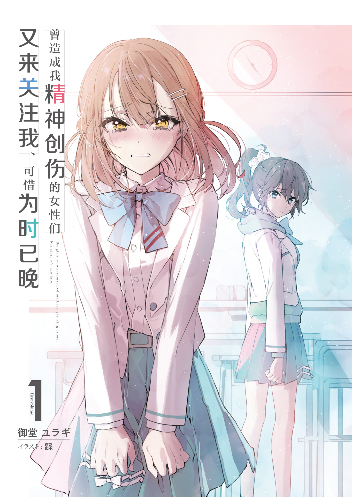
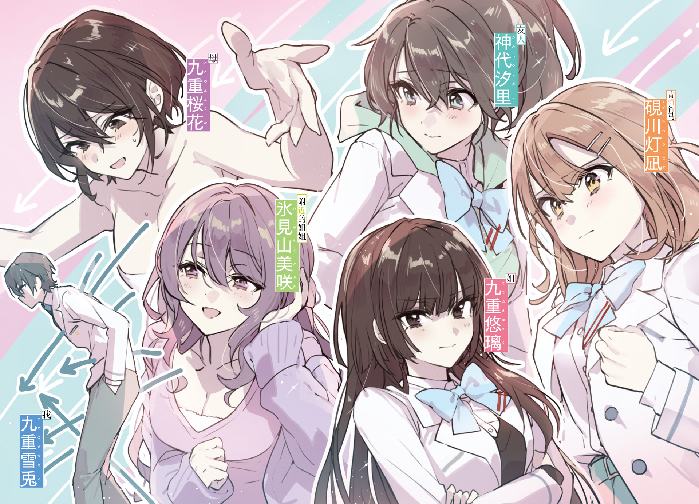
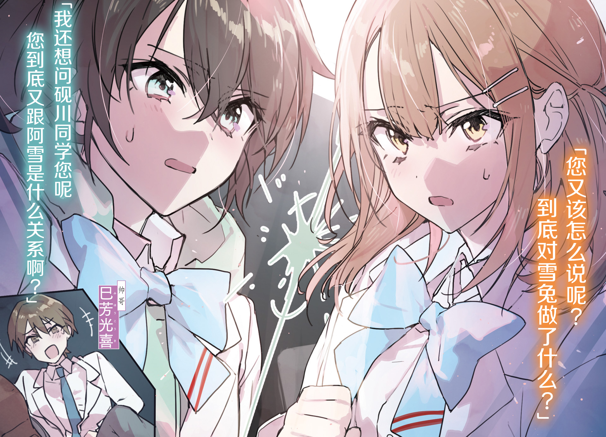
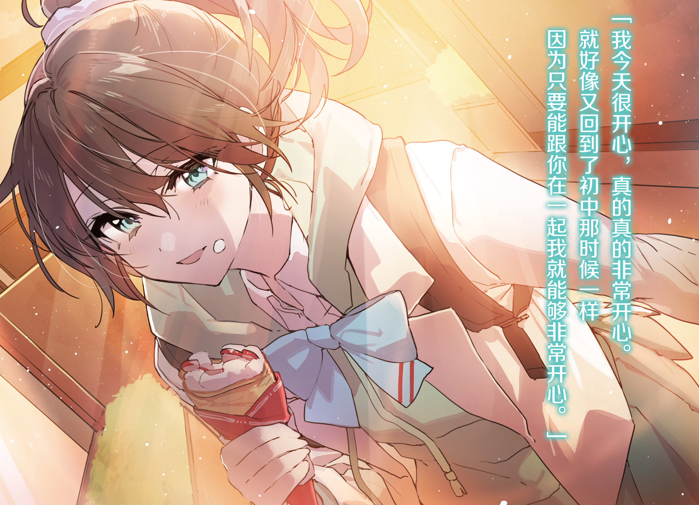
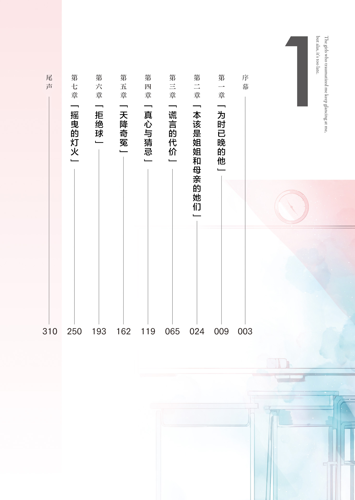

## 序幕

「我已经决定和学长交往了。」

黄昏映照下的天空为她晕上了一抹红色，而她带着些许犹豫说出了这样一句毫无歧义的话。完全无法理解她那映照着绯色夕阳的瞳孔中蕴含着何种感情的我，只好通过她的话语拼凑出这样的现实：

从青梅竹马的口中听到的这句话让我明白，一切都不过是我的误会罢了。

她叫砚川灯凪（Suzurikawa Hinagi），是我从幼儿园就相识的，两小无猜的青梅竹马。

为什么她要把这件事告诉我？大概我只能认为这是她身为我青梅竹马的义务了。不，不对。这应该是她才会做出的警告——我不要再继续纠缠她了。

我搞不清她的想法。应该说，不论什么时候，我都无法理解任何人的想法。

大概正因如此——不知从何时开始，她对我说出的话语，总是带有些许刻薄的成分。

我本不想让我们之间的关系沦落到这样的地步。

其实我们之间也并未有过像是青梅竹马的故事中常见的，传说一般的童话故事。

诸如幼时约定之类的内容——哪怕它们真的存在，也不过是一时的鬼迷心窍，最终都如泡沫一般消散无踪。

不过对我而言，她始终是那个特别的人。

毫无疑问的是，多亏了她，我才能在这样险恶的环境中坚持下来。

虽然最近我们之间也产生了不少龃龉，却还是保持着和过去一样亲密的关系——在我看来便是如此。至少我是带着这样的想法一直过到了今天。

升上初中之后，灯凪出落得越发漂亮。

性格本就外向开朗的她，自从学会了梳妆打扮，在学校内便成了相当受欢迎的人。

看着这样的灯凪，我在今年——也就是初中二年级，下定决心要让我们原本是青梅竹马的关系更进一步。

我的打算，是在每年都会两人一起前去游玩的夏日祭上向她表白。

我一直以为，自己和灯凪之间是两情相悦的关系。

一定是因为如此，我才像个小丑一般，误以为她会接受我的表白吧。

然而这天真的想法脆弱到不堪一击——说到底，也只是我的一厢情愿。

我只不过是将她对我投射而来的感情，误以为是「好感」罢了。

我的确为有人「喜欢」我而感到高兴。

哎呀，什么嘛，原来那根本就不是「好感」吗——

我的心中有什么东西轰然落地——此时我也终于理解了她话语中的含义。

大概我早已领悟到，这样的一天终将到来。

她向我投射而来的感情，化为阴影笼罩在我的内心上空。

这并非是对异性的好感，非要说的话，只不过算是同情，又或者该说是怜悯吧。

被强塞在我面前的事实，便是我只不过是是她的青梅竹马这一点而已。

「哼，跟你的孽缘总算是结束了，今年夏天可别想和往常一样让我陪你了。」

「这样吗，恭喜你了。」

我的青梅竹马残忍的对刚失恋的我絮叨着。

她这像是在伤口上撒盐一般故意说给我听的言辞，让我越发气不打一出来。有了男朋友就没法和我在一起了？其实你根本不想和我在一起吧？

脑子一片空白的我，完全想不出该对她说些什么才好。

于是到最后，脱口而出的只有一句直率的祝福——宛如想掩盖束缚着我的丑陋感情一般的言语。然而，听到我这番话的的灯凪一瞬间露出愤怒的表情：

「——切！学长可跟你不一样，又帅又可靠，能被他表白真是太好了！」

灯凪所说的这位学长是一周前向她告白的足球部的三年级学生。和我不一样，灯凪很受欢迎，因此经常被别人表白，可她之前从来没接受过。也许正是这样的灯凪让我感到放心，让我沉浸在了她不会离开我的安逸幻想之中。

不过，倒也没必要拿他和我比较，顺便数落我一通吧？

虽然我的确和灯凪不般配，可到底是什么时候被她讨厌到了这种程度呢？

大概对她而言，我已经成了一个赖在青梅竹马位置上的陌生人吧。

没错，我这不是早看透了吗？我只不过是个不再被人需要的碍事家伙。

毕竟不论何时不论何人都讲着这样的说辞，而最明白这一点的明明就是我自己。可为什么，为什么我还会对他人心存期待呢？

意图向她告白的激动心情，如今已经失去了宣泄之处。

一想到那一边怀着不断膨胀的感情一边磕磕碰碰的日子在今天迎来终点，内心就感到有些落寞，却又自觉获得了解脱。

本如同不断打气下鼓起来的气球一般紧绷的心情，在被扎破之后也瘪了下来。这样就告一段落了。反正我的真心和想说出来的话都无法让她接受的话，在最后由我说给她听也算是好聚好散吧。

「灯凪，其实我本打算在今年的夏日祭上对你告白来着。」

「……诶？」

从去年的那一天起我就找到了答案。我从她拒绝了我的手的那一天起，就已经彻底明白。

然而我却装作毫无察觉，对此视而不见，试图自圆其说，才落得一味沉溺在名为青梅竹马的关系之中的结果。

「我一直都喜欢着你，也一直注视着你，同时也曾为出落得越来越漂亮的你感到自豪，所以我今年想要迈出这一步。可不知道是太晚了呢，还是从一开始你眼里就没有我呢？」

「你这是……在骗我……的吧……？那我，到底为了什么才……」

灯凪动摇地相当厉害——她的目光如同寻求我真正的意图一般茫然摇晃着，应该是因为心情非常不爽吧——因为居然会被我以如此眼光审视，而产生了不快与厌恶的感觉。

「我一直以为你对我抱有好感，一厢情愿的以为咱俩是两情相悦的关系。明明不会是这样才对。」

「才，才不是这样！其实我也——」

「我们两人的想法并不相同。」

事到如今我也不清楚，我们之间从何时开始互相错过。一直以来都是平行线吗？还是说从哪里分道扬镳了呢？不过现在再想这些问题，也已经无济于事。

「为什么啊……那样我可——！？」

「抱歉了呢。既然要这样结束了，至少我也想在最后传达一点自己的心意。对你来讲大概是添了麻烦吧，希望你可以谅解。」

「最，最后指的是……什么啊……？不要这样……你到底想讲些什么啊！？」

灯凪的脸颊已是再无一丝血色的苍白模样。

「永别了，灯凪。我们之间青梅竹马的关系就在今天解除吧，希望你和学长能够幸福——」

晚霞将游乐设施染成一片昏红。我的内心中正自嘲着，过去经常一起玩耍的这个公园最终成为分手的场所，到底是怎样讽刺的事实。明明在小时候我们经常在沙地里一起建造城堡，绕着它跑来跑去直到太阳西沉——而且我还能从中感受到，我们之间坚固的牵绊。

到最后，我们之间的关系就如同空中楼阁一般不堪一击，不费吹灰之力便灰飞烟灭。

不过这样也好。如果捅破了这层窗户纸就没办法再和过去一样摆出青梅竹马的样子了，可即使如此——我还是打算带着这一觉悟向她表白。

现在也没有这个必要了。我已经不想留在这里。

如今我只想消失无踪——就像那一天一样，从所有人的面前消失——就这样，我向家的方向跑去。

「等，等等啊！雪兔，求求你让我把话——」

人类的感情真是难懂。为什么我会如此愚蠢呢？

如果不把灯凪对我的这份感情当作「好感」的话，我大概一辈子都无法理解何为「好感」了吧。

&nbsp;

——就这样，少年的内心又有一部分坏掉了。
