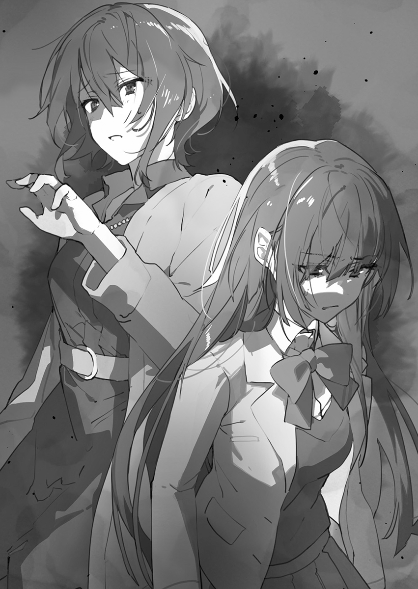

## 第二章 本该是姐姐和母亲的她们

很抱歉一上来就这么开门见山，但我一回到家里马上就被人审问了——本人正是嫌疑人九重雪兔。

「你为什么要说那些话呢？」

虽然今天我家的餐桌也一如往常的被一股紧张的氛围笼罩着，不过审讯者的眼神相比之前更要恐怖几分。她就是坐在被告——也就是我面前的，我的老姐九重悠璃（Kokonoe Yuuri）小姐。

她的心情似乎差的要命。看样子我要未经审判就被定罪了，好歹有个人救一下行不行？我已经没办法了。

「我不知道您指的到底是哪一点……」

平心而论，就算是从我这个弟弟的角度看来老姐也是个不输老妈的大美女。

她那精雕细琢的五官配上乌黑秀丽的及腰长发，就是个标准得不能再标准的温婉美人。再加上与散发出的气场相称的锐利眼神，就算说她已经达到了女神的级别也毫不夸张。

总之就每天对着她三跪九叩好了。作为弟弟能抽到这样SSR的姐姐可真是走运，一定是因为我上辈子积了什么德吧，不过下辈子肯定就没这种好事了。

读二年级的老姐比我大一岁，跟我同样就读于逍遥高中。而且听说她现在声望高到已经预定了下一任学生会长的位置，加上这份美貌，在学校里算是最有名的那批人之一（细节我也不太清楚）。虽然对于我这种不争气的弟弟来说有这样一位姐姐是挺让人自豪的，不过在高中这种等级严明的地方肯定不会认为我跟她是姐弟关系吧，这就有点刺痛人了。不如说，这反倒是个好消息？

说实话我一直认为我跟老妈老姐她们压根就不是一个人种。

可自从过去，我抱着只是解决自己疑问的态度向老妈提出『九重雪兔是在桥下捡到的』这一假说把她弄得嚎啕大哭后，这一话题在我心中就成为了绝对不可言说的禁忌。

「你啊，交到朋友了吗？」

可悲的是对于我这种神经质的胆小鬼而言，在跟我说话的老姐背后那光晕也太过耀眼了。

而且从她身上好像还散播着一股看不见的气场一样，让我完全无法直视老姐用她那大眼睛直勾勾的看向我的眼神，只能东瞄西瞟的避开它。哦，应该是那个吧，所谓灵气一样的东西。

顺便老姐在家总是穿着让一线天若隐若现的大号T恤配超短裤也是现在这样让我不知道眼睛该往哪看的原因之一。

「……朋友……朋友，指的是……？」

「弄不清这个概念就有点过头了，打住打住。」

完了，有我这么个废物弟弟在的话都不知道老姐能不能体面过完自己的高中生活了。

虽然温柔的老姐在这个世界里是个如雷贯耳的人物，可搭上我这么个恶名昭彰的弟弟之后肯定也是会影响她的风评吧。不妙，以后得万事小心才行了。

「巳芳他不算是你的朋友吗？」

「悠璃小姐您还认识巳芳啊？」

从老姐口中听到爽朗帅哥的名字着实让我大吃一惊。

原来这家伙这么有名的吗？想了想他长得帅性格好，倒也不奇怪了。

说不定老姐好的是姐弟恋这口啊，她终于也迎来了人生的春天吗！

「难不成，您，对他，有——好感？」

「你说啥？」

一股冰冷而锐利的目光瞬间打了过来——那是仿佛马上就要宣判我有罪一般的眼神。我只得低下自己的头，顺便瞄了老姐一眼，发现她一脸的愤懑。糟了，这下肯定是踩到雷区了。

悠璃使用了瞪眼！雪兔的防御力下降了！

「当当当当，当我什么都没说！」

我已经被吓得手足无措，本能察觉到再惹她生气就真没命了。

「所以，为什么会在自我介绍中说那些话呢！？」

「在此之前我想知道您为什么了解的这么清楚呢……？」

「回答我的问题。」

「明白。」

对于老姐而言我这弟弟就是这么一个可以随意揉捏的东西吧，而且听她的说法好像亲眼目睹了教室中的这一幕一样。不妙啊，难道说从一开学班上就有老姐安插的间谍监视着我了吗？这下我的未来该何去何从呢？

「是因为砚川同学和神代同学她们吗？」

「……对此我无可奉告。」

「有罪，判处死刑。」

「骗你的，不对我没骗你，的确是这回事！」

老姐下达了一个让司法界也会震惊的任性判决。审判员制度也于事无补。

「奇怪？为什么悠璃小姐会认识神代她呢——」

「因为关于你的事情我无所不知啊，这不是很正常吗。」

什么……竟然说很正常！我震惊了！没想到本世纪最大的冲击在今年四月份就已经产生，照这个势头来看我已经不敢想象自己的未来了。

到现在聊的全是些我从来没提到过的事情，看来老姐确实已经把我班上的同学尽数收入麾下了，比我这种连名字都基本没记住的人还要清楚。够厉害的啊……

对老姐这么聪明伶俐的人来说，估计也就小事一桩吧。

但不管怎么说老姐知道有神代这么个人可太让我震惊了。

身为我青梅竹马的砚川，老姐是见过好几次面没错，但是她跟神代应该完全没有过接触才对。

她特意拿这两个人来说事，还是让我心中有了些许反应。

「悠璃小姐抱歉，我得去做功课了。」

饭后我赶紧收拾了一下餐具便仓皇离开。

再这样下去的话，搞不好真的要被送上断头台了——现如今我的求生欲已经压倒了一切。

「雪兔你真的没问题吗？再这样下去你——」

「别担心，我真的没事。」

虽然连我自己都受不了这么失礼的举动，但我还是直接打断了老姐的话。我一溜烟的跑回了自己的房间，出于歉意之后还是给老姐添点香油钱吧。

老姐她刚才到底想说什么呢？难不成是在担心我吗？不，这一点绝不可能。

回到昏暗的房间之后我也没有点灯，就这样顺势躺在了床上。

——因为，老姐她一直都讨厌我。

&nbsp;

「说到底，为什么他老是遇到这些糟心的事啊……」

啊啊……真是的！我气得胡乱的挠着自己的头发。本以为他上了高中之后情况会有所好转，结果没想到反而恶化了，我真是对他班里那罪魁祸首恨得咬牙切齿。

我走向弟弟的房间，想说什么却又开不了口，对于这样的自己真是又气又无奈。会变成这样大概也是因为我刚才不经思考，聊到些他不想提及的东西了吧。

为什么我脑子会这么的不灵光，神经这么大条啊。虽然我一直被身边的人吹捧，可事实上面对自己的弟弟却又完全地无能为力，丝毫不能为他做些什么。

我跟弟弟还有母亲一起住在这个公寓里，父母很早就离婚了，所以这个家里只有我们三个人。母亲的收入很高，所以当时没有在抚养权问题上过多纠缠，现在家里也过得幸福充裕。不过在这外表之下隐藏了其他的严重问题。

弟弟他明明很期待开学日来着，可现在这样不就又跟以前一模一样了吗！隐约可见的期待消失无踪，反倒是要担心的事情一个接着一个。

我想让弟弟的高中生活过得轻松愉快一些，可现在这样的话也没戏了。说不清道不明的焦虑根本停不下来。之前我在查看弟弟班上成员名单时看到了那个最糟糕的组合，心情瞬间变得阴暗起来。

砚川灯凪和神代汐里。

明明喜欢着我弟弟却背叛并抛弃了他的蠢娘们和让我弟弟所有努力付诸东流的臭婊子，我绝对不会原谅她们的，同时我也希望她们不要再接近我弟弟了！

可事有不巧，他偏偏跟这俩人分在了一个班里，真是太可怜了。想要做点什么也做不了，只能等到下学年重新分班——现在的我对此可以说是完全无能为力。

想到这里不由得自嘲，事到如今自己居然还摆出一副姐姐的样子在担心他。我之所以这么讨厌她们，说到底也不过是同性相斥罢了。我非常讨厌自己，所以也自然会讨厌跟自己蛇鼠一窝的她们。

这时我回想起弟弟离开时的表情。跟那时候一模一样，我又一次伤害了他。我的弟弟总是用一种带着胆怯的目光看着我。

一看到他马上将眼神瞥过去的样子，我就能看穿雪兔在想些什么。

他时常都在查探我的情绪，可是除了必要的交流以外却不愿跟我说一句话。

这根本不该是正常的姐弟关系。然而，这一切也只是我咎由自取。我一直想让时间来抹平一切，可我们之间的关系非但没能缓和，反而越来越差。在计划落空后，本就痛苦的现实更是雪上加霜。

自那天起，弟弟就再也没叫过我一声「姐姐」，而是用「悠璃小姐」来称呼我。

不过像我这样的姐姐，根本就没资格对弟弟指手画脚。

——因为，弟弟他一直都讨厌我。

&nbsp;

「我回来了。」

老妈——九重樱花（Kokonoe Ouka）现在刚回到家里。已经是晚上八点多了。

还真是一如往常的工作繁忙啊。老妈她这么晚回来也是常有的事，每次遇到这种情况我都得自己做晚饭。

老姐她……不太擅长家务这个方面。俗话说得好上帝给你关了扇窗就会另外打开扇门，对美女而言不会做饭这种小问题反而会更惹人爱吧。

「欢迎回来。」

「啊，嗯，抱，抱歉啊又让你做晚饭了。」

「没事，顺手的事。」

虽然我认为老妈为了这个家而努力工作已经很辛苦了所以根本没必要为这种事抱歉，不过她平时确实是包揽了家务事来着。这时候分担出来一点不也挺好吗？我可不是在给自己揽活啊，说的是一回到家就一脸懒相的老姐，你难道不该分点事情吗？

「雪兔……你在学校里还好吗？」

「嗯，也就那样吧。」

「这样啊，那就好。」

一种莫名而又尴尬的沉默笼罩住了我俩。老姐老妈她们大概是担心我在学校惹了什么麻烦所以才一直在追问我在校内的情况吧。现在看来我第一天就被老师关照了。

虽然想要反问我就这么不值得信任吗，可想到自己初中时惹了这么多事，也只能当成搬起石头砸自己的脚了。

「我可是打算在学校里老老实实过日子的，应该没引起什么麻烦吧，大概。」

「不是那样的，我不是这个意思——」

「我已经做好晚饭了，如果不介意的话就热一下再吃吧。那我就先回房间了。」

「……那个……」

我并不知道，在我回到房间的路上，老妈那寂寞的眼神一直注视着我的背影。

◇

「喂，好歹把那张帅脸收一收吧，你这个爽朗帅哥。」

「可算等到你来学校了啊」

「啥意思？是不是发生什么事了？」

「算是吧，总之现在我有很多问题想问你来着——」

一大早我就跟比我先一步到教室的光喜有一句没一句的聊着，而此时有个精神饱满的家伙加入了对话中。对于我这种阴暗角色来说，一大早就能充满朝气的阳光角色百分百是我的天敌。这么快就来折磨我，那肯定就是我的宿敌樱井香奈没错了

「九重同学！早上好！」

「是樱井同学啊，早上好。很抱歉昨天没能成行，怎么样，玩得开心吗？」

「啊哈哈，一开始大家气氛还挺融洽，一团和乐来着。」

「嗯？意思是之后发生什么事情了？」

一提到这个伊丽莎白就跟光喜先前一样变得含糊其辞起来。从她这话里有话含糊不清的样子推测，大概是发生了什么麻烦事吧。我一点都不想被搅和进去，但我那阴暗的大脑无意中突然察觉到了真相。

嗯，原来如此啊，看来昨天是发生修罗场了吧？

根据我的推测来看事情是这样的，大家在玩的时候突然有女生向爽朗帅哥表白了，而产生了危机感的其他女生也告白了，接着俩人就这么撕了起来。之后大家就这么不欢而散了于是乎事情拖到了今天。

这段推理实在是太过于完美让我不由得想要自夸一番。在下正是人称令和福尔摩斯的九重雪兔是也。说起来真是，一开学就让我这从未迎来过桃花期的母胎单身狗听到这么刺激的花边新闻啊。

「那个，九重同学，我想问问，你是不是跟砚川同学还有神代同学她们是熟人啊？」

「嗯，你说认识的话确实是认识没错。」

怪了，怎么伊丽莎白提起这俩人了！？明明昨天老姐才说出这俩人的名字扰乱了我的心绪来着。不会是在我不知道的时候这个世界上掀起了什么关于砚川和神代的热潮吧？那这样的话，我唯一能做的就是彻底的无视掉这一潮流了。

「如果不介意的话，可以给我们详细的说一下吗？」

「也没啥好说的啊，就只是认识而已。砚川以前就住我家旁边所以跟我是青梅竹马，神代的话只是在初中社团活动时有过交流而已。」

「我还真不知道咱们班的两大班花和九重同学原来是这样的关系啊。」

「我也搞不懂她们怎么这么快就被分到高种姓了呢……」

「没有没有，不过照那情况看来，也确实是这样没错——」

看样子这两位大美女的地位差不多就是婆罗门或者刹帝利那一类的吧，至少跟我不会是一类人。之后想让高种姓的两位跟我搭话也是癞蛤蟆想吃天鹅肉吧，不过反过来说我正好能落得个清闲，所以也算不上什么问题。

「好了，快回到自己的座位去吧，问题学生——」

在小百合老师走进教室后这个话题也就戛然而止告一段落了，我也暂时松了一口气。诶，不对啊，什么叫问题学生啊？别告诉我这就是我以后的绰号了吧！？

&nbsp;

于是在这我得再重复一遍了。

从很久以前开始我的女人缘就不好。

到现在这个岁数说是被桃花煞压得翻不了身也不为过。

先是跟老妈关系生疏，又被老姐给讨厌了；想对自以为是两情相悦的青梅竹马告白结果别人先交到男朋友把我给甩了；之后正在伤心的时候又被人假告白涮了一顿，总之老是让我遇到一大顿乱七八糟的烦心事。

除此之外，还发生过本来是我对迷路的小女孩或者差点被人掳走的小女孩伸出援手，到头来却被孩子的家长报警铐走的事。我从小时候开始就不断的被卷入各种各样的麻烦事中，来来回回重复了无数次之后，我的感情系统也就彻底崩溃了。

硬要归根究底的话肯定是这么一回事，事实就是我肯定是从异世界转生而来的人。作为勇者的我肯定在异世界无恶不作，所以到最后遭了报应被复仇鬼给杀掉之后，转生到现在这个世界来了。这样的话我这乱七八糟的异性缘也能用自己身上背负着上辈子那沉重的业障来解释——一切都合理起来了。

我非常不擅长与人深交。不如说在此之前，我也无法察知对方的感情或者与之共情。倒也不是我不想再受伤或者害怕再受伤，就只是单纯地无法理解他人的感情。

反正事到如今也懒得再跟别人打什么交道了，那就只要装出一副很好相处的样子就行，这么做反而不会给人添麻烦。能让大家都过得开心，可以说这就是我的处世之术。

在知道那帮家伙也在这个班之后，我在高中里唯一的使命，就是作为一名阴暗角色，极力的减少与班上同学的接触，最好就像洞里发出暗淡光芒的发光苔藓一样普普通通平安过完高中生活。可在自我介绍时还是一时气不过，结果不知道怎么的就被同桌的爽朗帅哥给盯上了。

这样下去的话真的不妙啊！我的阴暗孤单角色计划说不定就这么落空了。

不过我手上还有最后的底牌，说到阴暗角色的话——

「雪兔你想参加什么社团啊？」

哼哼哼，终于等到我想要的话题了，我可真是个罪孽深重的男人啊。

放学后我跟磨磨唧唧的光喜聊到了社团活动这么个话题。逍遥高中虽然在体育运动这方面并不拔尖，但几个运动社团还是挺活跃的。话是这么说，不过最值得庆幸的是学校并不强制所有人都必须加入社团，宽松的校风也是这所学校吸引人的地方之一。

「那你又是怎么想的呢？」

「已经有好几个社团过来拉人了，不过我现在还在考虑中。」

「切！你这种阳光角色可真是。听好了，作为阴暗角色是没有一个社团会适合我的。」

「阿雪！」

现在这个班里会直呼我名字的不是只有同桌的爽朗帅哥一个人吗？我这么想着回头一看，意外发现是那个我绝不想扯上关系的人。

「是神代啊。」

神代她的表情突然阴沉了下来，怎么了？是有什么不顺心的事吗？

老姐也经常这样突然一下心情就不好了，翻脸比翻书还快。都说女人心海底针，要我这种不受异性欢迎的人去理解女性那细微的心理变化也太强人所难了吧？

「你还是在用姓氏称呼我呢。」

「我们还没亲密到直呼其名的程度吧。」

「也是……没错呢……」

这家伙突然说些什么呢？我也不可能自来熟到直呼女生的名字啊。能被允许这么做的，只有巳芳这种帅哥而已。

「阿雪你会加入篮球部的是吧？那我就当男子部的经理好了！所以说这次咱俩就一起——」

原来想说篮球的事啊，我现在还挺怀念初中那三年热衷于篮球的时光来着，不过到最后留下的都是一些讨厌的回忆罢了。我没有获得任何成绩，也没能完成自己所定下的目标，只记得自己给队伍添了不少麻烦。那时候明明是为了让自己能够向前迈进而努力的，可最后一事无成还是在原地踏步罢了。

「神代，我现在已经不打篮球了。」

「诶？你在骗我吧？因为你是那么——」

「都已经结束了，我已经没有打球的动力了。」

「可你不是一直都在篮球上努力吗！」

「你也应该是最清楚结果如何的人吧。」

听到这个后她的脸痛苦地扭成一团，平时开朗的神代现在一脸快要哭出来的表情。而我也并没有移开自己的视线反而直勾勾的看着她，这样的话她也会知道我说的都是认真的了吧。

「**神代，你到底打算同情我到什么时候**？」

「阿雪对不起！不是的！我不是这个意思——」

「而且作为阴暗角色的我怎么可能打篮球呢。无论古今中外，最适合我这种阴暗家伙的就是回家部了吧！那我就回去了，再见，你就作为经理好好加油干吧」

「——等等！」

无视掉神代的呼喊我径直朝着玄关走去。摆出一副吊儿郎当的样子，无视沉迷社团活动的学生们而过着悠闲自在的回家部生活——这才是我期待的青春的样子。初中时候沉迷社团活动让我在放学后完全没得玩，现在看来真是白费了自己的青春。

就算从这个角度出发，我在高中也得放学后就溜走好好的享受校园生活才行。更何况我现在就算拿到球也没什么感触，那时候所有的热情和拼劲都找不回来了，所以也没法再像以前那样去面对了。

「像以前那样……吗……」

&nbsp;

昨天KTV中的那一幕又重演了一遍，可现在是在教室里的众目睽睽之下，这一下就炸开锅了

（这可不是什么都没有过吧九重同学！不管是昨天还是今天都是这种修罗场啊！？）

现在班上的同学纷纷看向神代那边。可当事人却紧咬住嘴唇呆呆的望着教室门口，完全没有注意到教室里边的动静

「那个，我说神代同学，你是想要当男子篮球部的经理是吧？这可太好了，我也正好想加入篮球部来着。」

「抱歉，我要再考虑一下。」

「啊？」

大概是因为对神代有意思吧，满脸堆笑的伊藤想要向神代搭话，结果吃了个闭门羹。现在这样摆明就不是搭讪的时机。

（明明不该嘲笑他的……噗噗噗，伊藤同学你可真可怜啊……）

（诶诶诶诶！？啥意思啊，难不成神代是为了九重才想当这个社团经理的吗？）

「雪兔成了回家部还真遗憾啊。虽然我是喜欢运动没错，不过初中时社团活动也参加够了，那从今天开始我也成为回家部的一员吧。」

只有完全不顾气氛的巳芳一个人在那嘟囔着。

◇

「为什么神要对我布下这样的试炼呢？」

我现在正茫然自失地看着黑板。昨晚因为环保意识突如其来的爆发，我转职成为了日本环保少年。因此作为力所能及的第一步，就是把文具里所有的自动铅笔都换成了传统的木质铅笔，以减少塑料的使用。当时我还满心欢喜的沉浸在喜悦中，可是等上课之后我才发现一个问题。

自己根本就没削笔啊。喂，你们谁有卷笔刀吗？现在我手上有完全没削过的三根全新铅笔，真的是无能为力了。没削过的铅笔就跟找不到人接盘的虚拟货币一样分文不值。唯一的用途大概就是用手转笔玩吧。

所以直到午休前我一个字的笔记都没能写下来。有人又要问了，你去借支笔来用不就好了吗？可是这对于我这种阴暗角色来说有点过于困难，而且要是借别人的自动笔用的话也算不上觉醒环保意识了——于是我接下来非得去买个卷笔刀才行。

可我刚站起身就被人给叫住了。

「雪兔，要不要跟我一起吃午饭？」

「莫想。」

虽然不假思索就用京都腔回答了，但其实我跟京都之间没有任何关系，甚至可以说是完全没有交叉点了。

虽然以前曾经去过一次京都，但看着人山人海的外国游客反而产生了「这里是日本吗？」的疑问。

也别再说这些无关紧要的事了，其实我一下就听出叫我的人是谁。我是绝对不会认错声音的，毕竟我俩已经相知相伴这么多年了——她就是砚川灯凪，一想到这个名字就让我脑仁剧烈得疼了起来。

「砚川，别过来跟我搭话了。」

「为，为什么啊？我们不是在一个班吗，而且我们不是青梅竹马吗！」

「现在跟以前不一样，那都是过去的事了。」

「你为什么要说这种话呢？这只是雪兔你单方面的想法吧？」

砚川灯凪是我的青梅竹马，也是我曾经喜欢过的人，也是那个我曾经尴尬到误以为是两情相悦的人。而我就是那个想要告白，却在告白之前就被人甩掉的可怜小丑。

「跟其他人一起吃吧砚川，我的话就算了，毕竟这样对你男朋友的话不太好。」

「————你！」

这句话一下就让教室炸开了锅。完了，虽然砚川有男朋友这一点在初中算是人尽皆知，但现在是高中就没人知道了。搞不好因为我的大意已经算是泄露了砚川的隐私。

「你就连跟我一起吃饭都不愿意吗……？」

「砚川，我这是为你好。设身处地的想，如果我的女朋友跟别的男人这么亲密我心里也会不爽的。只是班上一个同学的话还好说，但是青梅竹马的话可就不好解释了。换做是你的话也不想看到自己的男朋友跟其他女人卿卿我我吧？」

「所以都说了那是——！」

这也正是我需要跟砚川解除青梅竹马这层关系的原因。虽然这个世界上大概还没有因为自己女朋友跟班上同学一起吃饭就心生嫉妒的小心眼，但要是把同学换成身为青梅竹马的异性，可就是另外一回事了。

从砚川选择了其他人开始我就不能再和她距离太近了。

要是看到女朋友跟异性的青梅竹马这么亲近，男朋友心里一定会很不安吧。

而且砚川好像是真的真的很喜欢她的这个男朋友，因为两个人不止是在交往，连**那档子事**也已经做过了，这就是两人热恋的证据啊。

既然如此，那我能做的也就只有跟她保持距离，尽可能不要成为她的阻碍。可不知道为什么砚川她却注意不到这么简单的事情——明明我们已经不可能再维持以前那样的关系了。

「抱歉，我现在得去福利社买东西了。」

我希望自己曾经喜欢过的砚川她能获得幸福，而我也并不希望抱着如此朴实愿望的自己成为她幸福路上的绊脚石。站在她身边的人并不是我，因此我这个失恋后没了容身之处的可悲男人不应该再接近她。

而现在的我到底又是怎样想的呢？我现在还是喜欢着砚川她吗？

大概我能理解这一想法的那一天——永远都不会再有了。

&emsp;

九重雪兔的劲爆发言彻底引爆了整个教室。

「啥？原来砚川同学已经有男朋友了？」

「这么漂亮的大美女果然是有男朋友了啊……」

「哎，明明我都看上了。」

「是谁啊？是咱们学校的人吗？」

「啊对了，说起来砚川同学她确实是在初中的时候——」

信息在班上的同学间口口相传——将其刹住的，则是砚川本人。

「——别说了！对不起，求求你们……不要再提起那些事情了……」

一声如同哀嚎般的尖叫撕裂了教室内的气氛，这也意味着发出声音的人有着绝不允许他人提起此事这一顽固的拒绝意图。看着砚川那憔悴的表情，大家都明白了她想要否认这一切。

「抱，抱歉了，砚川同学……」

教室内突然又变得鸦雀无声，一股让人喘不过气的沉默氛围笼罩着这大家本该开心喧闹着度过的午休时间。

「都是我不好……这全都是因为我才……」

没有人听到砚川这声小小的嘟囔。

◆

我到底为什么会买两个红豆面包呢？一般来说都会买两个味道不一样的吧？这就是所谓因为年轻所犯下的错误吧，这种未解之谜意外的就发生在生活当中啊。学校食堂里已经坐满了人，于是我到外面去想要找一个不被人打搅的安静之处，接着就发现了符合这一条件的紧急楼梯。这不就是为我这样的阴暗男所量身打造的场地吗？这里挺好，就这吧。

「——请你跟我交往吧，相马同学。」

看来有人在我这好不容易找到的桃花源里告白啊，原来这里是告白的场所吗？虽然我的乌托邦就这么飞速崩塌了，不过我还是第一次撞见有人告白所以感觉还挺稀罕的。话是这么说，别人的恋情发展如何又关我屁事。总之，我还是当成什么都没看到一样一屁股坐在了台阶上。

嗯，果然不应该买两个甜的面包啊。顺便一说，我一个星期有两天要到福利社或者食堂去解决午饭。老妈她实在是太忙，可要是我每天做的话也太麻烦，最终妥协之后就成了每周自己做三天便当这样的结果。当然，这三天里我也会做老姐的那一份。那剩下的两天让老姐做便当不就好了——在我这样向她提议后，老姐就塞给了我五千日元，而且眼神还躲躲闪闪的，看来这算是买通我的行为吧。

不过嘛，要是硬让不擅长烹饪的老姐来做的话只会落得所有人都难堪的结果，因此这样也好。

「那个……请问，你是不是找我们有事啊？」

不知为何，刚才告白的男生向我搭话。看他的样子，好像是高年级的。

「诶？不好意思我们现在应该是第一次见面吧？我能有什么事找你啊？」

「那个……你是……」

听不清他在嘟嘟囔囔些什么东西，说到底这一切就跟我没关系啊？

为什么要觉得是我找他有什么事呢，你有必要在关键的告白时刻把我给卷进来吗？

「那你，为什么会出现在这呢？」

「啊，你问这个啊！我只是想找个能一个人静一静的地方不知怎么就到这来了。我这种阴暗角色你直接当成空气无视掉就行了。我的口风就像卷起来的巴西三带犰狳那样严实。好了，你们请继续吧。」

虽然这男生一脸不解的歪着头，但好像是接受了我的说辞——不如说正因为毫无关系才怎样都好，要是不接受的话我就麻烦了。

「那个……说回来，相马同学可以给我一个答复吗？」

学长和学姐一边紧张的进行着对话，一边时不时的偷瞄我这边两眼。不知道我这存在感稀薄得跟空气中氦的比例一般的人到底有什么值得在意的，所以才说小心眼的人惹人烦啊。

「抱，抱歉。」（偷瞄）

「能告诉我拒绝的理由吗？」（偷瞄）

因为嘴里的面包馅实在是太甜了，现在我的身体正强烈的渴求着水分，不过现在手上只有牛奶啊。其实我是还想要长得更高一点啦。

「那个，是因为，我还不太了解你。」（偷瞄）

「那我们要不要试着交往一下来加深了解呢？还是说你已经有喜欢的人了？」（偷瞄）

「不是因为那个，总之很抱歉。」（偷瞄）

「哈，我明白了，我放弃，不过还是很感谢你能过来。」（偷瞄）

看上去结束了呢。学长已经离开，这里终于恢复了一片寂静。可就算是高年级学生我也无法原谅你们来打搅我这好不容易才发现的休息处。

随后，那个学姐不知为何在我旁边坐了下来。不是，你能不能也赶紧滚啊？

「哎，遇到这种事情还真是让人困扰啊。」

「处于现在进行时的困扰当中的人是我才对吧。」

「啊哈哈，你啊，到底是为什么来着的？你不会是也想跟我告白吧？」

「学姐你还真是够自恋的啊。」

「刚才那家伙我也不怎么熟啊。这种明明都不怎么了解对方却来告白的人，还真是不知道说什么好。」

「喂喂，别搁那讲些没人想听的内容。」

「你这家伙真的是我学弟吗？你说话能不能客气点？不知道要尊重一下学姐吗？」

「相比两个红豆面包的谜团，您这边我我可没半点兴趣。」

「我竟然输给了红豆面包……？」

赶紧滚犊子吧！这女的不管怎么看都有点不对劲啊。为什么要对着一个刚认识又毫无关系的学弟袒露心境啊，不会是错当我是什么墙壁之类的了吧。

「你听我说说话不也挺好的吗。反正都跑到这地方来了，你也是那种没有朋友的阴暗角色吧？」

「学姐你这自我表现欲有点过了啊！」

「抱，抱歉，你生气了？」

「没有，我反而觉得自我表现欲爆棚的学姐是个好人啊，因为我身边的人都不愿意承认我是个阴暗角色，遇到你我反而很感动啊。」

「嗯~，听你这么说突然间我也不想承认了。」

「别这样啊，自我表现欲爆棚的学姐。」

「话说，能不能别这么叫我了！？从我出生到现在就没这么尴尬过啊！？」

「那自我表现欲学姐这个称呼如何？」

「不是让你只去掉爆棚两个字啊！你这人到底怎么回事？」

「那我到底该怎么称呼你——啊，果然没什么兴趣，就这么着吧。」

「不爽！总觉得不爽的要命！」

总觉得这人现在跟刚才那个学长还在的时候比起来给人的感觉不一样了，之前还觉得她挺文静的，现在看来其实是个相当开朗的人啊。

「我叫相马镜花（Souma Kyouka），现在在读高二，请多关照了。」

「我到底为什么不买一个奶油面包呢……」

「听我说话啦！拜托你比起面包还是多关注一下我吧！？」

「诶诶……」

「你就这么不情愿吗！？好了，告诉我，告诉我你的名字吧？」

「我叫九重雪兔。」

「原来你姓九重啊，说起来我们高二也有个姓九重的人来着。」

「啊，那是我老姐。」

「诶！原来你是那个九重悠璃的弟弟啊？」

「我倒觉得有必要做个DNA鉴定。」

「要讲笑话也别拿自己开涮行吗？自虐到有点太吓人都笑不出来了。」

「明白。」

我倒不觉得哪里自虐了。不过她是有可能会跟老姐讲这些事的，为了自己的安全还是小心为妙吧。

「哼~。我说你啊，之后还会到这来吗？」

「平时大概都会在教室里面吃吧，一个星期可能会过来一两次的样子。」

「这样啊，那我也偶尔过来这边吧。」

「又多了件麻烦事啊……啊别介意，不是想赶你走的意思。」

「就算不是想赶我走，也不能说这种伤人的话吧！？」

「是这样吗……又学到一点了。」

「刚才我心情还挺差的，不过跟你聊完之后就开心放松了不少，谢谢你。」

「那你能给聊天费用结个账吗？」

「啊哈哈，我知道了啦。那下次就给你带个奶油面包来吧。」

「真是女神啊……从现在开始我就叫你女神学姐吧。」

「能别这样不！？我总感觉你是那种开不得玩笑真会这么叫我的人，心里有点发怵啊。」

「因为我的人生本来就像是个玩笑了。」

「都说了这种笑话我笑不出来啊！」

结果到最后我就这样跟学姐一直聊到了午休结束，看来我的阴暗角色计划又泡汤了。我明明只是想过上平静的校园生活而已，到底什么时候才能达成这个目标呢？

◇

在我脑中对单反相机和中画幅无反相机进行一番比较后，最终单反相机以5:4的比分取得了优胜。但我必须得说句公道话，这是因为对于非职业摄影师来说，相机的轻便性比性能要更加重要。老妈她虽然是个追求性价比的人，不过之前因为一时兴起想要给自己的孩子拍照（哎，大概是为了老姐这个美女买的吧，我就是顺带的），也在几年前买了一部全画幅单反数码相机。

用一句话来评价的话就是——这玩意太他妈的沉了，沉到让人怀疑组上镜头之后有几斤重的程度。为什么不选择APS-C画幅相机呢？为什么不买一个轻便的半画幅相机呢？你这整了一个不好摆弄更不便携的全画幅单反数码相机放家里吃灰是准备当传家宝吗？

而且算上单焦点镜头在内还额外购买了五个镜头，简直就是浪费钱。

「之后我要居家办公了，也就是说每周去一次公司就行，待在家里的时间就变多了呢。」

老妈——九重樱花小姐她突然抛出这样一句话，说话的时候还喜形于色难掩满脸的笑意，很少看到她心情这么好啊。

这也算是社会形势的变化吧，如今学校的临时停课多了起来，这段时间每天都过得不太平。听到老妈这么说我也不知道该怎么回应，总之为了表示听到了还是随口附和一声：

「哦。」

「工作量也减少了，这下就有更多时间来陪你们了，我挺开心的。」

「嗯，真不错啊。那今后老妈你能帮我们做便当吗？」

「没问题哦，抱歉啊，之前一直都麻烦你。」

「毕竟你要忙工作嘛，就不用为这个道歉了。」

我真搞不懂老姐和老妈娘俩在说什么，怪了啊，为什么我突然就感觉自己的台词被抢了呢？我家的便当一直是由我负责的，「就不用为这个道歉了」这种话应该由我来说才对吧。

但我并不会对这种小事斤斤计较，毕竟我是个心胸比濑户内海更宽阔的男人。总之让悠璃姐做饭的话最后只会让大家都难受，也只能看看她能不能借此机会跟老妈学学怎么做家务事了。这就是所谓的新娘修行吧，不过老姐这种美女本来也就不愁嫁啊……应该说抛开性格不谈算是美女才对。咦，怪了，哪来的杀气？

「我问你，刚才是不是在心里编排别人呢？」

「皇天在上，我敢保证绝无此事。」

说起来老妈在家的时间多了以后我也没什么事好做了。以后就跟马戏团里被训好的熊一样，老老实实听她发号施令就行。

&emsp;

在一个发生了如上对话的周六，正为家电卖场中贩售的半画幅无反相机性能性能提升之大感到惊讶的我，在回家的路上突遇骤雨。

不是说今天没有雨吗！就当我在心中咒骂天气预报无能的时候发现，有个提着大行李箱的女性一脸困恼的站在我家的公寓楼下。

「请问您有什么需要帮忙的吗？」

遇到这么突然的雨，肯定会被淋湿，而她带着这些个行李就更不方便了。

她看上去是一位比老妈年轻一些的温柔女性——我之前没见过这个人啊。

「那个，请问您是？」

「我就住这儿，请问你是有什么麻烦吗？」

「啊，是这样啊！那我们从今往后就是邻居了呢。」

「从今往后……邻居吗？」

「我的名字是冰见山美咲（Himiyama Misaki），刚刚搬到这边来。今后就请多关照了。」

「你好，我叫九重雪兔，请问您这是遇到什么麻烦了吗？」

「咦……？不好意思我没听清，能请您再说一遍吗？」

「此地有一少年（本人）名曰九重雪兔。」

「为什么突然变成文言文了啊……九重雪兔君……你到底……？」

【rkl译注：雪兔此处的自我介绍neta了竹取物语。】

「您认识我吗？」

「那个……其实我是……」

虽然冰见山小姐想要说些什么来着，不过此时雨也变得越来越大了。

「还是先离开这再说吧。」

终究不能一直呆在这个地方。虽然需要我帮忙的事可以说是很显而易见了，不过出于礼貌还是先问一句比较好。可不能忽略这些细节，这也是为了双方能够构建和谐的关系。虽然提起行李的她马上用温柔的笑脸回应了我，也不知道她到底能不能了解我这一番苦心。

「我倒不是那个意思啊。」

「雨这么大，咱们还是走快点吧，我来帮你拿。」

「行李有点多呢。虽然我很高兴你能这么说，不过突然下这么大的雨，你还是赶紧回家比较好吧？挺不好意思让你帮忙来着。」

「您别介意，这也是为了我们双方能构建和谐的关系（以下略）」

「虽然很在意你省略的那些话……不过我也确实为这个发愁。那我就拜托您了？」

「瞧好吧您嘞。」

「哎呀哎呀真是的，噗。您这用词还真够有历史的了。」

「麻吉万字！？因为我是JK啊。」

「JK指的是女高中生才对吧？」

就在我们为这些代沟问题纠缠不清时，不知不觉已经到了冰见山小姐的家门口，那是一栋建在我家正对面靠右手边的单身公寓。

「抱歉让你被雨淋湿了，请稍等一下我马上拿毛巾来。」

「啊，不用了不用了」

「这可不行，还是到我家来坐会吧？」

虽说突然发生了被邀请到独居女性家中做客这样让人脸红心跳的事件把我的紧张感给拉满了，不过冰见山小姐的家里好像因为刚搬过来的缘故到处堆放着纸箱，压根就没有让人介意的那种物件在，这下我松了口气。不是，那个，你懂的，我好歹也是个大老爷们对不对？等会，我这跟谁解释呢？

「不好意思啊，我这行李什么的都还没整理好，你就先坐那边吧。饮料的话，红茶和咖啡你喝哪种？」

「啊谢谢，我喝咖啡就行。冰见山小姐你是这星期刚搬来的吗？」

「没错，之前还因为附近没有认识的人心里有些不安来着，不过这么快就遇见了你，我还真是走运。」

她帮我泡好了咖啡。不过等会，她怎么坐我边上了？正常来说不是坐我对面吗？虽说岁数比我大上不少，不过冰见山小姐确实也是个大美女。感觉有股甜美的味道直往我鼻孔里飘，难道说这就是成熟女性的荷尔蒙吗！？

不过我的钢铁之魂可不会因为这么点小事就动摇——够厉害啊我。

「请问您一个人住这吗？」

「我以前倒是有过未婚夫，不过因为他是旅馆的继承人而我的不孕症又没能治好，所以长辈不同意就分手了。说是无论如何都想要个孩子来着……」

嗯嗯？她怎么突然就说到这么沉重的事情啊？我跟她应该是初次见面才对啊。我这不会是会散发出什么奇怪的气场吧？说起来不久之前跟女神学姐（名字忘了）也发生过类似的事情啊……

「也对呢。如果那时候有了孩子的话，说不准也就不会像这样一个人生活了。」

「shi zhe yang a。」

背后冷汗直流的我被吓得结结巴巴，连个完整的词都说不出来。我所积累的人生经验正大声警告自己这下好像真的大事不妙了，如果不马上跑路的话就会有生命危险，不，是贞操危险才对！

「而且我本想从事教师工作的，可在遇到挫折后也就放弃了。」

「要是遇见冰见山小姐这样的班主任，当学生的应该都会很开心的吧。」

「你真的这样认为吗？」

「嗯？」

「真是这样吗？」

我说小姐您别一个劲朝我这边拱啊！她用那泛着紫色的瞳孔直直地看向我，可我总能感觉到她那有些飘忽的眼神里带着一丝不安。

「……起码我是这么想的。」

「是吗，谢谢你能这么说。那如果你愿意的话，可不可以跟我交个朋友呢？」

「那，那当然……可以。」

要是被她察觉到我回答得这么结结巴巴的可就不妙了，没有恋爱经验的我压根就不是她这种身经百战之人的一合之敌。但是这味道也太香了吧！为什么要凑得这么近跟我说话啊？是因为喜欢我吗？我没办法不去在意这个啊！

「啊对了，作为刚搬来的邻居，我之后得去你家登门拜访一下才行，嗯，是得和你爸妈打个招呼。」

「好，好像也不用在意这种事情的吧？你看，都说城市就是一个水泥森林，跟乡下又不一样，大家作为邻居却互不相识才是常态，邻里之间也没什么交际，正因为能从这种烦恼中解放出来，才是现代人的——」

「这可不行，而且刚才不是你说的要让双方能构建和谐的关系吗？」

「您说的是，我无话可说了。」

「我会带着荞麦面来的。」

「我知道了。」

我确实不擅长应付年长的人。

&emsp;

「哎呀，是谁啊？」

从那个危险周六捡回一条命的第二天，也就是周日的傍晚七点，我家的门铃响了起来。因为今天是周日所以老妈也在家，不过她这宽松罩衫配紧身裤的打扮有点晃眼，让我都不知道该把眼睛往哪放了。你看，这臀部都——啊，不知道为什么老姐的眼神有些恐怖吓得我赶紧打断了那个想法。

嗯，换个说法，老妈的身材真是出众啊，这就是平时时刻注意保持身形比例的成果吗？

「我去开门。」

来访者正是冰见山小姐。虽然她是说过之后会登门拜访，不过仅仅时隔一天就到来的她还是让我浑身冒出事感不妙的汗水。

「晚上好雪兔君。」

「才一天没见呢，冰见山小姐。」

看来在我不知道的时候我们之间的距离就已经被拉得这么近了。到底是在什么时候我俩变成了这种能这么亲昵称呼对方的关系呢？这就是典型的捏造事实啊。

「谢谢你，之前多亏有你帮忙呢。不过今天我只是来打个招呼而已，之后会再正式向您表示感谢的？」

「不，不用这么在意吧。」

「这么说可不行——」

「是谁啊雪兔……啊，请问您是哪位？」

「她是刚搬来这边的冰见山小姐。」

「哦，是这样吗？」

老妈出来接待她了，真是帮了我个大忙。虽然我想立马就离开这，不过考虑到得解释一下我俩认识的经过，就不得不站在原地了。

而且感觉冰见山小姐也抓着我不撒手，不对啊，为什么会抓着我的手啊！？

「今后就请您多关照了。」

「我才是，也请您多关照。如果今后您遇到什么困难的话，随时随地都可以来找我。」

「那我就先谢过了，再见了雪兔君。」

「好的，冰见山小姐您也多保重。」

冰见山小姐突然凑到我耳边低声说道：

「等你想到要我报答的方式不管是什么都可以告诉我哦。」

「——什，什么都可以吗！？您要这么说的话那我可就要当真了啊……」

「只要是你想要的，不管是什么都可以。」

就只是稍微帮她搬了下行李这种滴水之恩，可这也太涌泉相报了吧。这到底是怎么回事啊！

「可别把我给看扁了啊，您要是再这么惯着我的话，我可就抱上来了啊。」

就算是冰见山小姐，在被我提出这种要求之后，肯定也会感觉很恶心，然后跟我保持一定距离的吧。

「可以啊。来，过来嘛。」

我刚吹的牛皮马上就被人给戳破了，因为她丝毫没有犹豫地就伸出手来抱住了我。

「不是不是，我说笑的，我开玩笑的啊！等等，这怎么做到这么软和和的啊！要无法自拔了。」

「你，你干什么呢！」

虽说被这突如其来的一幕给吓到了的老妈不断地试图把我俩给分开，不过人不可貌相，没想到冰见山小姐拥抱别人的力度，简称抱力还挺惊人的。

「啊啊~我已经不想再理会这纷繁俗世中的事务了。」

「雪兔你别这么一脸陶醉的样了！给我正经一点！」

可我现在根本做不出任何回应，毕竟我现在已经是电阻为零的超导体了。

「嗯，总算满足了。」

在被她如此上下其手之后，冰见山小姐终于松开了我，不知为何，她的心情比来的时候好了不少。

她轻轻摸了摸我的脑袋说：

「不好意思，你实在是太可爱了所以一不小心就把你当小孩子对待了，你不喜欢这样吧。」

「啊那个，怎么说呢，之前没怎么被这样对待过所以感觉挺新鲜的，就感觉像是妈妈一样呢。抱歉，我这么说有些失礼了吧。」

「唔呼呼，是这样吗？你这么说我很开心哦。」

「那再好不过，我还怕您因此心情不适呢。」

「才没这种事。如果想撒娇的话，随时都可以说哦。毕竟我能做到的也就只有这些了。」

「我这边姑且也算是个高中生了……冰见山小姐？」

那略带忧伤的表情，实在是让人印象深刻。

「那就再见了，雪兔君。樱花小姐也是，请恕我就此失陪。」

「好的，晚安。」

冰见山小姐就这么回去了——我可总算是撑过来了。从今往后就算住得很近，也不可能特别频繁的碰面吧——这样我也可以放心了。

老妈则带着原因不明的不安神色，注视着她的身影。

&emsp;

「哈啊……」

我为了让头脑冷静一下来到了阳台，接着就长叹出一口气。凉爽的风轻柔得抚摸着我的脸颊，从空中落下的雨滴润湿了我的周围。

冰见山美咲小姐，一位性格温和好说话的女性。她本身应该是是个好人没错，我跟她今后也会有所交流吧。

不过，让我现在心中如同这片天空一般暗云笼罩的，是另外一件事。

「真羡慕她……啊。」

艳慕，憧憬，向往。这一切交织在一起，纠缠出复杂的感情。

他们在最后的对话中亲密得如同一对母子一般，这就是我想要成为的关系。如果我也能像那样进行交流会有多幸福啊，如果我也能像那样快乐地聊天，一定会比现在更全面的了解儿子他的点点滴滴吧。

可现在已经连这种事都做不了了，现在的我们只是一种随便应付，说些无关紧要之事的亲子关系。没办法改善，或者说根本不知道怎么去改善，这一直是我的一块心病。

那台为了跟孩子们合影，为了拍下他们的过去见证他们成长的相机也放在家里吃灰。上次一块出游是多久之前的事来着？家里就我们母子三人，可我还是没能维护好我们三人之间的关系。

雪兔的那句话至今仍萦绕在我脑中。说什么「之前没怎么被这样对待过」「像是妈妈一样」，那这样的话我到底又算是什么呢？

我是不是空有母亲这个名头罢了呢？想要回忆起儿子上次对我撒娇是什么时候，可就算我绞尽脑汁也想不起来，也是，那孩子就没对我撒过娇啊。

不去关注他，也从来没嘘寒问暖过，做出这种混账事的不就是过去愚蠢的自己吗。

不知何时起，我就把这当成了理所当然的事，因为我儿子他从来就没有向我索求过什么。而他的眼神就仿佛看破了尘世一般，从来没有期待过什么，从来没有渴望过什么，他已经放下了一切的一切。

因为我的缘故，他才会变成现在这样，但等到我察觉时已经来不及了。这之后的一切都是因我而起——我就是元凶。

然后我们之间的关系也变得淡漠，他就这样沿着一条扭曲的路径长大，一步步的走向崩溃。这一路上他伤害了不少人，自己也被弄得遍体鳞伤，但他甚至连这一点都没有察觉依然我行我素。不知道再这么下去他会变成什么样，说不定现在才去思考这些已经是马后炮了。

我摇了摇头，现在我的心中充满了不安。如果现在我坦率面对自己的心中所想的话，就会发现那其中满是丑陋的嫉妒。因为看到冰见山小姐抚摸他的那一瞬，我的脑子里就只剩下嫉妒了，或许还要加上一丝隐藏在角落的恐惧感。

**难道说，她是想抢走我的儿子吗**？

是的，我不得不承认自己有这样一种预感。但这不可能，不会这样的，从血缘上来说他毫无疑问是我重要的儿子没错，可是仅凭血缘关系就称得上是母亲吗？对此我也保持着疑问。不如说血缘是我作为母亲唯一的证明了。

说不定他从来就没有把我当成是自己的母亲吧。不然的话他会那么认真的跟我提出，「自己是在桥下被捡到的」这个猜测吗？

那孩子一定没有感受到过母爱吧，一定是这样没错。不管再怎么找出辩解的理由，我也无法原谅自己过去的所作所为。

因为我本该给他的爱，让他能感受到的爱是严重不足的。我并没有培养出与他之间的感情，他本应被感情浇灌的心灵也因干涸而枯萎了，结果就成了现在这副模样。

如果是她——是冰见山美咲小姐的话，能够给予他所需要的爱吗？明明我才只见过她一面，但不知为何却能感觉到她眼神中饱含着的深情。而且不知道为什么总是黏着我儿子不放——这明明是我想做的——这让我无法接受。

而且如果不需要我亲自对我儿子倾注爱意的话，那我对他来说不就是明日黄花了吗。

不要，我不想变成这样啊——！

漠然般的恐惧，在我的内心翻滚。

我是为什么才努力工作的呢？难道不是为了我的家人们吗？我不想就这么放手，作为母亲的我不想就这么被抛弃。现在一股感情正在我的心中激荡，我必须维系住这个三口之家，这样一味的后悔下去是不行的。

在不需要每天去公司报道的情况下，工作轻松了不少。让我觉得幸运的是，变成居家办公后我在家的时间大大地增加了。这说不定是我最后一根救命稻草了——不要心生怯懦，而应该去直面它，去修复我们之间的关系的最后机会。

如果错过这次机会的话，就真的追悔莫及了。我相信从现在开始都还来得及，因为事情仍有挽回的余地，我们还能够重新开始。

——但我也知道，这是一条凶险至极的道路。
