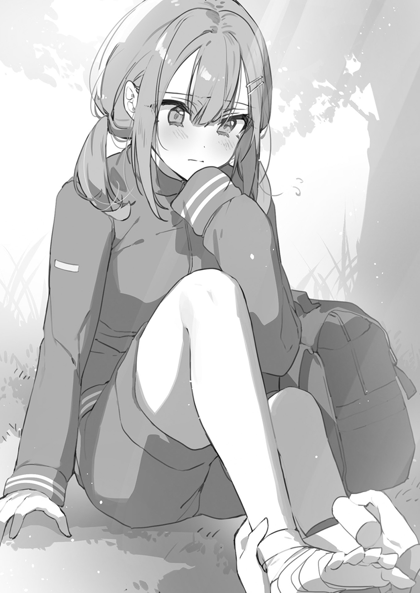

## 第三章 谎言的代价

「不要在学校里向我搭话。」

「哎，老是给我添麻烦，为什么我会有你这种人当青梅竹马啊？」

「你别再做这种事了啊，我很忙的——真是蠢得要死。」

「骗子。」

我本以为与她之前的关系还算是融洽，但是她的眼神中已经满是厌恶了。友情，亲情，牵绊——我曾毫无理由地相信这些无法用目视确认的抽象事物是存在的。

当我注意到的时候，一切都为时已晚。只是在接受这一现实之时，才意识到自己力有不逮，又在做出一番相当难看的挣扎后，落了个草草收场的结局。

我已经习惯了被他人所厌恶，这次只是正好轮到她来做这件事而已，事情就是如此简单。我一直怀揣着不切实际的幻想，认为她对我而言是个特殊的存在——其实根本就并非如此，既然她是这样想的话，那我也不能再给她添麻烦了。

希望在此之后，她能一直幸福下去——我许下了这样的愿望，不再看向她的所在之处。

&emsp;

「我对你真是失望透顶。」

「为什么要对她——！」

「你别再呆在她身边了，这样下去她不会幸福的。」

「——别再来了。」

我的耳边满是夹杂着烦闷和焦躁情绪的指责声。虽然我现在仍然对事情的缘由一无所知，但看来我在不知不觉间让她的期待落了空。不过她会对我心生失望这件事并不使我感到惊讶。

大概是因为，我一直以来都隐约的感觉事情迟早会变成现在这样吧。反正在之后我们也会变成陌路人，那我也只能接受这时隔已久的谈话成为我们之间的诀别了。到头来，我们之间的接点已然消失殆尽。

现在，已经由她重新定义了我俩之间的关系。

丧失了被称作『青梅竹马』的资格，也不再是朋友，最终变成了毫无关系的陌路人。

◇

虽说人类的文明确实是在脚踏实地的进步着，不过在此之中也会有些一成不变的东西。

比方说雨伞这一事物的出现就可以一直追溯到四千年之前，可现在的伞与当时的伞看上去也没什么不同。硬要说的话，大约发明了一百二十年的折叠伞，相比之前倒也算是有些许的进化。

为什么在拍照片的时候要喊「Cheese」，而在山间打算唤起回声的时候要喊「Yahoo」呢？那现在的话，不再被这些杂七杂八的传统束缚，来点进化不也挺好的吗？也正因为如此，为了能够促成人类的进化，我试着张口对面前的山脉呼喊道：

「Tartaros！」

【rkl译注：此处指的是希腊神话中，位于地底最深处的暗黑界Ταρταρος，西西弗斯就被关在这里。】

结果根本就没有产生任何回响。真遗憾，我的心情也随之跌落到了最低点。

放弃挑战拨动人类历史这一行为的我，转头提出了一个心中在意许久的问题：

「别再胡闹了你这爽朗帅哥！」

「我有做出什么比你刚才那奇怪举动更符合胡闹一词的行为吗？」

「那只是在挑战人类的可能性而已。好了，解释下现在这到底是怎么回事吧？」

厚厚的云层覆盖着整片阴沉的天空，仿佛在告诉我们这里不欢迎来访。

深吸一口气，倒是能感觉到夹杂着新绿的气息。展现在我们眼前的，是都市之中几乎不可能见到的广袤的大自然。根据天气预报，晚上似乎会下大雨。

低下头去，同比增长了百分之五十的帅气表情正朝我闪着。这家伙是自带闪光灯特效吗？虽然看似若无其事的他摆出一副假惺惺的态度，但这里就给他一个解释为什么会变成这样的机会好了。

「这算什么嘛？这个分组，到底算什么嘛？」

「『算什么嘛』这种话烦死人了。你是出现故障的机器人吗？」

我，光喜，砚川和神代——在班级中大概算是相性差到极点的四个人被分在了同一个组里。绝对是这个爽朗帅哥的阴谋。

【rkl：这一定是某种愉♂悦的阴谋，毕竟是把自己放在修罗场里当摄影机。】

面对这样的状况，在山路入口处等待出发的我脑子里满是问号。

我们现在是来野外学习的。所谓野外学习，就是为了增进同学之间的交流而在每年入学之后进行的远足郊游。花两个小时沿着山路爬到顶，在山顶吃完了午饭再下山。这不就是挖出个坑再填上的没事找事行为吗。

「这不对劲吧！为什么我要呆在你们这帮开朗角色的圈子里啊？所谓的阴暗角色，不是应该等大家按照自己的意愿组完队之后成为了多余的人，然后被班主任硬塞进某一队后那组人一脸不情愿的让他加入这样一种定位的吗？」

「可你本来就是班上分完剩下的那个人啊。」

虽说事实确实是如他所说的这样，但眼下最大的隐患却并不是这个男人。

「你为什么不依我的脸色行事拒绝让我加入呢？」

「我哪知道你是怎么想的啊！而且我会跟她俩分到一组也是纯属偶然罢了。」

虽然我只是和光喜以窃窃私语般的音量对喷，但还是能时不时地感受到砚川和神代的视线往这边扎个不停。真让人不舒服——就像是在说好不拘礼节的宴会上，和上司讲话结果让人心情不好的职场新人体会到的那种不舒服的感觉一样。嘛，我也没什么职场经验就是了。

我可不打算干扰她们的学校生活。如果她们能对如同掉在高速公路上的手套一般的我毫不在意，其乐融融地享受这段日子就好了。

机会难得的野外学习，她们应该顺从内心想法和关系密切的朋友们组队，而不是像这样刻意让自己心情不爽。

带路的老师吹响了口哨，我们开始了长达两小时的攀登之旅。登山道路的坡度不算陡峭，也没什么艰难或危险的场所，可以说算是一段舒适的路了。

与此相对的，则是路上的氛围简直差劲透顶。爽朗帅哥凭借着完美的对谈技巧，巧妙操纵着话题，试图让对话一刻不停。既然如此我倒也希望三个人之间能够搞好关系，但他们却老是莫名其妙地把话头往我这边丢——这个时候我就只好化身为重复输出「啊对」「也没有吧」「反过来说」的聊天BOT。「反过来说」的人倒也有不少，但也没必要「反过来说」吧？

我们就这么一路走到了目的地。在令人心情愉悦的疲劳和成就感下，从山顶眺望壮丽的景色而面容自然舒展的人为数不少。

相比之下，没什么体力的人的反应也很自然——在山顶喘了口气就一屁股坐在草坪上——属于这一类的人，看上去也占了一半左右。

哈啊……提不起兴致。说是这么说，但我也没法无视掉，只好口不对心地搭话：

「砚川你没事吧？」

「雪兔？啊……谢，谢谢你。但是，为什么？」

我把刚买来的运动饮料递给坐在稍远处的砚川。她似乎因我过来搭话一时间惊慌失措，表情不是很好。

砚川心怀疑问也算是理所当然——自入学起，我还没有向她搭过话。

虽然拉开了距离这一点无可置疑，但我还是无法理解她事到如今以青梅竹马的身份关心我的理由。否定过去，并做出选择的明明是砚川自己——正因如此我才想要踏出一步，却落得被她甩掉的结局。

我想起了刚上初中的时候，就被砚川提醒不要在学校里向她搭话的事。

大概是她觉得在新的环境中构筑新的人际关系时，被过去的关系绊住而心烦意乱吧。想要疏远我，才做了这样的提醒。所谓的人际关系，其实可能也就只有这么一回事。

不如说对她而言，我成了一个碍事者。我们之间没能找到任何出路的关系，最后走上了彻底的分别，已经画上了句点。

「随处可见的自动贩卖机还真是方便啊。」

砚川的呼吸失去了平静——不，不止如此。她做出了想要遮住脚踝的动作。紧接着她就想掩盖这一动作，但完全就是欲盖弥彰。虽然在爬到山顶的路上，横飞于我和她之间的言辞几乎算不上什么对话，但都到这地方了，再掩饰也没办法。这种程度的道理我好歹还分得清，如今也不是再讲那种话的场合。

「抱歉啊，我没考虑节奏。」

「不要在意啊，砚川同学！」

「回去的时候不好好考虑下可不行了。」

神代和光喜也是一脸担忧的神色，毕竟让砚川勉强自己了。虽然偶然之下组成了全员都是回家部的超室内组，但我如今仍没有丢掉跑步和锻炼身体的习惯。初中时加入了女篮部的神代，以及爽朗帅哥这两人也都擅长运动。大概是这一原因，导致我们在爬山的路上一直保持着相当快的节奏。

这对砚川造成了很大的负担——而且不仅是体力上的负担。如果是过去的我，早就该发现砚川在逞强了。纵使如今我们已经拉开距离，但看到一脸难受的砚川，我怎么样也绷不住。

「砚川，脱了。」

「……啊？不，不行吧，在这种地方？这种事情该换个地方——」

「你在讲什么呢，赶紧把脚露出来。」

「换个地方」是什么意思？我从背包中取出绷带，然后坐在砚川面前。大概察觉自己误会了我的意思而一脸红潮的砚川，不情愿地脱下了鞋。

「这，这样行不行？」

「不把袜子脱了的话没法缠绷带吧。」

「但，但是……」

「？啊，又没有什么气味所以不用在意。」

「这，这种话你用不着说吧！」

虽然我没什么见不得人的想法，但人果然在被异性这样的时候会觉得不好意思吧。我要深刻反省。

「没什么，是我不够细心了。是花香的味道所以没问题。」

「你这不是完全没有理解吗！」

「不是，要是我说很臭的话会不会伤害到你……」

「很，很臭吗！？」

「要在不弄坏奶油的情况下吃奶油泡芙可不简单啊。」

「别想蒙混过关！到底怎么样吗，喂！」

「我知道了我知道了。我会尽可能在不闻到的情况下憋住气处理的。」

「那不就是说我的脚很臭吗！」

「你非这么说的话我可就闻了。我闻不就行了吗！」

「对啊，给我闻啊！等等，不行不行不行！不可以闻！」

哎呀，倒也对。现在可不是沉迷于砚川的脚味的场合。

「别闹。冷静点，我稍微碰一下行不？」

「嗯……」

不知这是不是也算少女心的一部分，她一下子就老实下来了。从旁人看来，我就是个触碰女高中生的脚的变态混蛋。要是被报了警，我还是老老实实自首吧。

不过砚川看上去并没有报警的打算。Safe。我先是沿着脚底经过脚踝到脚跟的方向，然后再从小腿肚到跟腱，将绷带细心地缠好。

「雪兔技术真好啊。平常都是随身携带吗？」

「跑步的时候会随身带着。」

「果然我们还是一起加入运动部吧。」

「对我来说回家部就是运动部啊。」

这一点我完全没有搞错。身为阴暗孤独角色的我，非要说回家的话，也只有学习或者锻炼身体罢了。朋友？哈哈。

「怎么样？会不会太紧？动一下试试吧。」

「没，没有……我想应该没事。」

「这样应该能轻松一点。下山的时候慢慢走吧。」

「谢谢你。」

「要是疼的话就讲出来。我先走了。」

「等、等一下！」

我正想离去却被人叫住，旁边有人敲了下我的肩膀。转过身去的我，看到了一脸为难神色的班主任小百合老师，露出喘不过气来的样子。

这人是僵尸吗，体力到底有多差啊！

「九重……抱歉，我也想拜托你一下……」

「老师，您这个样子要是孩子参加运动会要怎么办啊？」

「我还没结婚呢！」

「到时候可就给人添麻烦了啊。哪怕最低限度，还是动一动身体比较好吧。」

「这不是因为，我总是晚上九点才能回家嘛。晚饭也都是在外面吃，最近不知道是不是陷入了亚健康状态，连肤质都不行了。根本就没有时间运动啊，我的人生已经完蛋了！这么下去，我就要枯死了！」

老师那霜打了茄子一般的样子太过真实，让我没法吐槽她。

然而要触碰身为成年人的老师，老实说我有点发怵。啊，对了！

「神代，你能帮老师缠下绷带吗？我来教你。」

「我，我来！？」

我向从远处看着我们情况的神代搭话，将工具交给了她。

「你不是说了自己是经理什么的吗？这种内容算是必备知识吧？」

「这样吗，倒也对呢。嗯，知道了，我来试试！」

一脸严肃的神代，战战兢兢地将绷带缠在老师的脚上。

「太紧了太紧了太紧了！」

「呜呜，对不起！」

「啊，发现了老师的橘皮纹【cellulite】。哦，这里也有。」

「你个混蛋！这可不是该对女性讲的内容吧！」

「好了啦，我会教您消除橘皮纹的高效按摩法的。」

「你可以期待一下调查表上的打分哦。」

「谢啦。hiahiahiahia。」

「你一脸认真地笑着的样子太吓人了。那根本就不是笑声吧。」

&emsp;

自由活动时间。砚川在从卫生间回来的我旁边坐了下来。

不知是不是对绷带有点在意，她按摩着自己的脚踝。

「这东西还挺有效的呢。第一次缠总觉得有点不可思议。」

「有没有水泡或者擦伤的情况？我这里备了创可贴，需要的话无需顾虑直说好了。」

「为什么你准备的这么周到啊……」

「不知道为什么我老是会受伤啊。所以才会时刻备好。」

「说起来雪兔你初中三年级的时候也是受了重伤呢。」

「你知道吗？」

「那是当然的吧。我一直都在看着你啊。」

一直看着？砚川对我？她这是为了什么？

「明明我都没有一直看着你呢。今天也是，明明你那么难受我却没注意到。」

「……那个啊，为什么你要帮我呢？」

仔细想想，我所知的砚川比现在更加要强，对我的态度也更加恶劣才对。这一形象如今已经烟消云散，她那全神贯注的表情，让我觉得与过去相比产生了偏差。

——宛如回到了往昔的砚川一样，但和那个时候相比，又有所不同。

「我们是同班同学吧。也就是担心的程度而已。」

「同班同学……对啊，的确如此。」

重复着这个词的砚川像是在品味它的含义。我在口袋里来回摸索着，掏出了一个东西。

「这块巧克力给你。吃掉之后就精神了。」

「诶……？谢谢。以前你也经常给我呢。」

从疲劳中恢复时，糖分是最适合的东西——和安慰剂差不多。

「平稳下来的话，马上就会好起来的。」

我正打算离开这里，却被她纤细的手抓住了。

「——抱歉，请你不要走。」

「那个东西……你还一直带着吗？」

「嗯？啊……你记得啊。」

「我对自己的记忆力还是很有自信的。」

突然，我的目光被扣在砚川的手机壳上的，粗糙的小熊挂饰吸引了。

那是我在参拜日的流动摊位买到的东西。油彩已然脱落的挂饰如今破烂不堪，完全称不上好看——因而我为砚川至今还带着这样的东西感到吃惊。

「那个时候，真开心啊……」

「和男朋友吵架了吗？」

「那是……对啦，我那个时候说想见灯织，还说自己被逍遥录取了呢。」

「说起来最近没见她呢。她精神还好吗？」

「精神倒是还好，就是在和我吵架。」

「嗯？明明关系这么好，吵架倒是挺少见的呢。」

「没有，那也是我的原因。你觉得我该怎么办？」

「只能向她道歉了吧。」

和她吵架的不是男朋友而是妹妹吗？不过在我看来若是姐妹吵架，和好倒也没那么难。毕竟我和悠璃姐从来都没吵过架。

灯织是灯凪的妹妹。身为会用「哥哥」称呼我的妹属性使用者，灯织大概也可以算作我的青梅竹马吧。我记忆中的灯织妹妹是个平常尊敬他人的温柔小孩，所以只要向她道歉的话，她一定会原谅的吧！

「她绝对不会原谅我。因为我践踏了灯织的心情。」

远眺自然风光的砚川像是想起了什么事情，而身为局外人的我什么也做不了，更没资格对姐妹之间的吵架插嘴。即使如此，我仍然能隐约感觉到砚川等待着我的回复的缘由。

「如果无法回到过去的关系，就只能从头建立新的关系了。」

「……嗯？」

「纵使回不到过去良好的姐妹关系，但建立新的的姐妹关系也取决于砚川和灯织妹妹吧。嘛，我这句话也没什么说服力，毕竟我被悠璃姐讨厌了啊。」

「呵呵，绝对不是那样哦。不过……这样吗，倒也没错。谢谢你，雪兔。」

她的表情略微柔和了一点——但也不过稍纵即逝，随后她如同下定决心一般吐了一口气，对我露出不自然的表情说道：

「一直以来都说些过分的话，真的很对不住你。我一直觉得该早点向你道歉。但是，我总觉得也许可以回到过去，像是无事发生一般两个人在一起——就这样一直得意忘形着。明明我就不能把这些事当作没发生过的。」

「砚川，你在说什么呢？」

「我知道事到如今自己又在讲些任性的话。又傲慢，又不顾他人，又丑陋，只想着自己的事。所以……对不起！」

肩膀颤抖的她不断向我道歉——这便是砚川内心的后悔之情。她不顾周围的目光集中在自己身上，就这样把自己的想法讲了出来。然而——

「那个……抱歉。我不记得自己被你说过什么过分的话。」

「……啊？」

我的内心只有困惑，搞不懂砚川为了什么事情在向我道歉。

「不如说该道歉的是我吧。砚川，对不起。我没有将你的事广为散播的打算。」

过去我向砚川搭话的时候，不小心把她有男朋友的事情传出去了。虽然不知道她本人怎么想，但至少在自己的隐私被人泄漏这点上心情不会好吧。

「我很感谢你，因为我……如果不说出来的话，自己也搞不清楚。」

「雪，雪兔你为什么要道歉啊？错的人是我啊！就算那个时候——」

我的确曾被砚川口出恶言。但她所讲的，只是单纯的事实。我不觉得这是什么过分的言语——甚至未曾感觉到自己被不公平地对待。

正因被她清晰明了地说我是个麻烦，我才能认清自己的立场。在这一点上，我对她感谢至极。比起让她带着厌恶的想法和我维持着表面关系，现在这样要正常得多。

「我不打算和你吵架。我既没有生气，也没有应该被你道歉的理由。」

我们又不是因为关系不和才变成这样的。只不过是各自选择了不同的路，导致我没有再站在她的身旁而已。对此我既不会觉得懊悔，更不会心怀愤恨。

「——你真温柔啊。所以我才……不想见你。」

重逢是一场悲剧。若未曾重逢，如今这个瞬间，就不会让她露出这样的表情。对我而言她是重要的人——这一点并未改变。正因如此——

「不要再成为她的阻碍」——我只是为她的幸福而祈祷。

因为失去了作为青梅竹马的资格，甚至连朋友都不是的我们，如今只是同班同学而已。

&emsp;

在引水路中泡了下毛巾，再将毛巾缠在绷带外面冷却患处。我在提醒砚川尽可能安静休息之后，离开了她的身旁。

「阿雪！」

神代的声音如同算好了一般传来。这让我抑郁至极。

「你，你和砚川同学谈了什么？」

「脚的味道，姐妹吵架，未来规划的咨询——就这三项。」

「那个……我完全搞不懂。」

真奇怪。明明我讲的内容没有任何错漏，可完全没能让神代听明白。

「下次大家一起去玩吧。上次阿雪你没来，要不要也一起去？我想你肯定会开心的。有什么想去的地方吗？」

「我在的话气氛会不太对头，所以还是算了吧。」

「……这，这样吗？你能考虑我就已经很开心了呢！」

性格天真烂漫的神代汐里的双肩耷拉下去的样子，让我内心生疼。

她那对所有人都毫无隔阂地对待的态度为她聚集了人气。然而如今，平常轻松愉快的她却一声不吭。让她变成这样的正是我。

从她那摇曳不定的无助眼神中，看不出一点天真烂漫的痕迹。

「我能问你一个问题吗——为什么要选择逍遥？」

「那是……因为我知道阿雪要去这所学校。」

这是最糟糕的答案。但即使如此，我本也打算做力所能及的事——在前来道歉的神代面前说出「你可以不用来了」，在她的心里打下钉子。如果我不讲的话，神代每天都会到医院来，一旦如此就会招来不必要的臆测——这是我想要避免的。更何况，包含做出判断这一点的一切，都是我自己的责任。神代根本就没有任何为此烦恼的必要。

而且若是出现她和悠璃姐在病房相遇的情况，可就麻烦大了。

我不打算和她再见面。然而，神代却追了过来。

「喂，神代。我就这么可怜吗，至于要这么被你怜悯吗？」

「我才没有这么想！我知道你讨厌我。我在学校里没能和他人讲出来，连帮你复健都没能做到。我只是想为了阿雪你做些什么，对我来说，能做到的就只有这一件事了……拜托你，让我做些什么吧！如果不这样的话……」

「哪怕这不是我所期望的事情吗？」

「我知道阿雪你不想见我。因为我只是为了自我满足而利用了阿雪。但是，我不想就那样分开……」

她那大眼睛中的泪珠，如今已经濒临落下。

「哈啊……神代，你并没有什么能做到的事。差不多该加入社团活动了。谁都会向你招手的。现在这样当个回家部可不适合你。」

「那是……对不起。但是，我还是想和阿雪在一起！」

「那样难受的事情一点意义都没有吧。」

只要我还在，神代就会一直责怪自己。我不想看到这样受苦的神代。拉开距离才是最好的解决方案，只要她在随便什么地方露出笑容就可以了。

「……阿雪你真的不会再去打篮球了吗？」

「事到如今，我已经从其中走出来了。」

原本我也只是为了摆脱自己的失恋阴影才去打的，并不是什么值得赞扬的事。

即使如此，打篮球时养成的习惯，如今倒也还在。

「不过，偶尔会去打打街头篮球。」

「真、真的吗！？」

由于不小心说出了多余的内容，我发现神代的反应一下子就变了。

「身体已经迟钝了，只是像习惯一般的东西而已。」

「什么时候！？在哪里打的？」

「公园的野球场……」

喂喂神代同学你怎么了！？用手臂擦干眼泪的她的双眼如同被快充了一样恢复了光彩，心情也恢复到了神代平常会有的样子。我们之间的对话相比方才完全不同，开始产生了一点活力——反差大到几乎要拉闸的地步。

「我，我也要去！要一起打吗？」

「如果你想的话不也行吗？」

「嗯！」

终究还是没能拒绝她。距离是不是太近了点啊！她那闪闪发光的眼睛就跟死皮赖脸要去散步的狗差不多。要是她身上长了尾巴，现在怕是要晃上天了。

相比失落的样子，还是活力十足的样子更适合神代。从那时起就一直没有改变的她，是个不折不扣的运动少女。

她一定是想赶紧动起来吧。在搜索栏输入「回家部」弹出的建议词不是只有「人渣」「后悔」这种不像样的词吗？不论怎样，神代都没有必要再和我产生什么交集，她的容身之处就不在这里。

然而，我却不论怎样也压抑不住自己的冲动，还是干了出来。

「神代，伸出手。」

「汪！」

「来，神代，接着这个。」

我从作为紧急食品而日常携带的点心中取出一个袋装糖球丢了过去，神代一溜烟地跑去接住。诶，她还真去啊？啊，回来了。

拿着糖球回来的神代脸泛红潮，露出期待着什么的样子看向我这边——这是要我做什么吗？

「不，不摸我吗？」

「神代，认真听我讲。你不是狗，是人，有点自觉行不行。」

「让我这么做的是阿雪你吧！我好不容易接住了才回来的！」

你这是在讲什么！？对女高中生摸来摸去的变态混蛋这种指责——等等，刚才我是不是也说过这样的话？事到如今实在是……

都说了，我也没办法嘛！我重新花了十秒钟观察着面前的神代。

比起过去更像个女性，而那天真烂漫的样子也并没有消失。但是，我已经停不下来了。

干就干了！干就干了行吧！

「我知道了。既然你的心情已经和狗一样了，我就代入一下饲养员的心情吧。」

「虽，虽然也不是这么一回事，但如果你肯摸的话那也……」

「神代，我已经有所觉悟了。乖——乖乖乖，乖——乖乖乖。」

「阿，阿雪！？要你摸的只有头吧！摸那里……肚子的话可不行！」

「乖——乖乖乖，乖——乖乖乖。真厉害呢～居然能接住我丢的糖球。」

「呀！摸那里的话，啊……不，不行了……停下……」

神代的身体扭动着。我要被判多少年啊？要是有酌量情形而减轻判罚的余地就好了……

「想起来自己是人类了吗？」

「wo shi ren lei.」

「嗯。这样我的牺牲也不会白费了吧。」

「阿雪！这种事情对别人做就是性骚扰了啊！」

「不，就算对你这也算是性骚扰吧。」

「你明明知道还干出来了！？」

「要是没有自觉可就糟了吧？」

「就算有自觉也很糟糕吧！」

真是优秀的匹配机制。这时，神代突然笑了出来。

「啊哈哈哈哈……抱，抱歉。怎么哭出来了……」

「花粉症吗？」

「才不是。阿雪你的手臂没关系了吗？」

「嗯。所以你也不必为此烦恼了。」

「我才不是这个意思……」

在如同即使是肿块也要碰一碰的想法之下，神代轻轻碰了碰我的手臂。对我而言，受伤是常有的事。不知该怎么形容，但说成日常也没什么问题——反正我早就习惯了疼痛。

在和神代之间的无聊对话中，我们的时间略微回到了一年之前的样子。

即使如此，相比一年之前，也出现了决定性的差异。我和神代之间的关系如今并不对等。正因如此，就算我怎么对神代性骚扰，她也不会起诉我吧。

而且，只要还是这个样子，我和神代的关系就会如同被冻结一样停滞不前。

◆

「不见了……！为什么！？丢了吗……骗人……怎么会……——！」

「怎么了，砚川同学？」

「小熊玩偶……不，不见了！」

正当我们走到山脚准备上大巴的时候，砚川开始慌慌张张地摸索自己的随身物品。她手上握着的挂饰只剩下了挂绳部分，原本吊在前面的那个粗糙的小熊玩偶已没了踪迹。

「那个吗。上去的时候还在吧？」

「对。下山的时候掉了！怎么办啊……没了那个的话……」

「只能放弃了吧？」

「才不要！……我去找找！」

「别乱来，大巴马上要出发了。」

「但是——！」

「挂饰会掉是因为到了使用寿命吧。本来不就是用不了多久的东西吗？」

「因为……因为，那是雪兔给我的最后一个……——」

「那样的东西，你男朋友不管有多少都会给你买吧。」

「别讲了！我不想再听这种话！」

砚川整个人张皇失措。她就那么在意那个粗糙的小熊吗？女孩子的喜好真是难懂。但即使这样也没法去找。由于我们是集体行动，不能为了砚川一个人就推迟所有人回家的时间。

我也不觉得这是什么很重要的东西。虽然好不容易把砚川劝上了大巴，但她却像是断了线的提线木偶一般一直低着头。

&emsp;

这也是天谴吗？因为我时隔许久，又和雪兔说上话才会这样吗？

如果真是如此，那也太残酷了。随着大巴的晃动，无可救药的焦躁感在我的心中不断积累。那个挂饰是我和他之间的联系，是证明无可替代的那段时光曾存在过的宝贵之物。

而且，也是雪兔送给我的最后一件礼物。如果现在我对他说自己想要（礼物）的话，大概他会送给我什么东西作为替代吧。但是，根本不是这样。

我内心真正期望想要的东西，如今已经拿不到了。

怎么办……我该怎么办才好……？回去之后马上再去找吧。也不是多远的地方。在天黑之前，说不准能找到。

但是，我马上就否定了自己的想法。我的身体疲劳至极，今天根本没法再动起来。而且天气也已经开始变坏了。这个状况下我独自寻找实在太过危险，但就算这样讲，我也不想把别人卷进这种事情里面。

那就明天再去？但若是这么拖下去，找到挂饰的概率也会下降吧。

找不出答案的我拖着鬼魂般的步子好不容易回到学校后，班会开始了。我的脑子根本记不得身为班主任的小百合老师讲了什么。然而，唯独那句话我没有听漏。

「喂，九重怎么了？」

「说起来，他刚才说自己身体不舒服先回去了。」

「我完全没听说啊？巳芳，真有这回事？」

「不，我也不清楚。」

「如果只是已经回去了的话倒没什么……那个问题学生，好歹跟我说一声啊。」

他的座位空着。说起来从到学校开始就没看到他的人影。明明他和我们一起坐大巴回来的，到底怎么回事？说是身体不舒服，可他也没显露出这个迹象。是不是突然肚子疼了……之后再联络一下看看吧。虽然他一定不会回复，可我还是担心他。

难以形容的不安在心中积累。不论怎样，都只有不好的预感在不断膨胀。

&emsp;

「我回来了！」

纵使我以如此夸张的语调大喊，周围也毫无反应。真是可悲的独角戏。

一小时之前还被嘈杂的学生们充斥的地方，如今只有我一个人。

虽然面对大自然会产生将来想在乡下度过慢生活的妄想，但对现代人来说还是做不到。被徒步一分钟路程内的便利店掌握生杀大权的，便是我九重雪兔。由于去的太频繁，我都快被店员起奇怪的外号了，还是眼不见心不烦吧。

「还是没法放着她那个样子不管吗。」

终究是交往了这么长时间的人，她露出那样的表情，我也做不到无视。

事到如今，纵使我们只是同班同学，若是她遇到心烦的事我也还是帮一把比较好。在这并不是针对谁的借口之下，我鼓起气势出发了。

我在脑中回想今天的行动轨迹。在山顶和砚川对话的时候，挂饰毫无疑问还在。既然如此的话应该就是掉在下山途中的什么地方了。风并没有多大，所以应该没被刮出多远，但若是被松鼠一类小动物叼了的话就彻底完蛋了，只能赶紧行动。就算以最快速度往返，到时候也过了下午五点。天空被厚重的云层覆盖，气温正在飞速下降，到日落还剩不到一个小时——

「要是一个来回还没找到的话，我就放弃了啊，砚川……」

◆

随手将书包丢在房间里的我整个人倒在了床上，以习惯的动作操控手机，浏览图片——这是我一如既往的行动模式。

里面塞满了那段令人心情舒畅的时光留下的回忆。然而，在初中二年级的时候，它便画下了休止符——如同划下了界限一般，此后的照片越来越少，心情舒畅的时光逐渐褪色，只剩下灰色的时光持续至今，拍下的照片中映出的自己，也显得如此寂寞而憔悴。

「已经回不去了吗？……我才不要啊。」

那时候的我一直都在笑。哪怕照片上的我不是在笑而是露出冷淡的表情，我也知道自己的心里有多么高兴。在我身旁的，是我最喜欢的人——不，是曾经最喜欢的人。每当我想要靠在他身上拍照片的时候，他总是露出像是困扰或是害羞的表情，但最后还是以面无表情的样子向我回应。这些真的，真的都是我非常宝贵的回忆。

——然后，如今的我失去了其中一个如此重要的回忆。

照片上的我穿着浴衣。那是每年都会和他一起前往夏祭的时候拍下的。

最初还是两家一起参加，但不知从何时开始，就只有我们两个人前往了。

在脑海中复苏的，尽是些淡然、虚幻、美丽而温柔的回忆。然而，它们全都被破坏了——是我亲自将它们破坏的。

会不会如今我还能和他像这样一起外出呢？建立更加深厚的关系，在夏祭的时候一起外出，牵手，接吻，回来之后再两个人——泪水一点点涌出，既是对愚蠢的自己，也是对已然失去的宝物。

为什么？——心怀这样的疑问，本身就是罪过吧。因为全都是我自己的错。因为我将它抛弃了。丑陋、胆小而卑劣的我无法承受这样的幸福而将其摧毁了。这样一来，我是不是已经无法像过去一样和他说话了呢？

我才不要……还想和他多说说话……像过去一样碰触他啊……——

夏祭的那一天，他想牵起我的手的时候，我因为太过害羞，抽回了手，将他的手挥开了——因为我不想让他发现自己的内心正小鹿乱撞。

是不是没有擦手心里的汗？——我拼命想着这样的内容，偷偷摸摸地用手帕擦了擦手。

然而，他没有再来牵我的手——不，不对。明明我反过来牵他的手就好了。

没有传递给他的心绪。没有说出来的话。明明想要知道真正的想法，却未能开口，落得如今拖拖拉拉的境地。如果能早点将自己的心情告诉他的话——如此这般的懊悔，在我的心中一天天累积。

站在他的面前，两脚就会发颤。看着他的眼睛，就会害怕到什么都说不出来。他的目光，总让我觉得我对他来讲已经怎么样都好了。

既不是青梅竹马，也不是朋友，甚至不是同班同学，只是没了半点兴趣的无关人士——说不准他就是这样看我的，这对我而言实在是太残酷，太恐怖了。

即使如此，我还是能从他的话中察知他对我的关切之情。虽然听起来像是在嘲讽，可我居然想要相信他还会继续珍视我这个背叛了他的人。支撑着我的内心的，就只有这种「正因如此他才会这样行动」的信念，却对它反而会加深我内心痛苦这点一无所知。

然而，我已经到极限了，再也忍受不住了。成为同班同学的时候，我还为自己大概有机会改善和他的关系而内心窃喜。然而这个过程却艰难重重，我和他之间本该不断拉近的距离，如今已变得如此遥远。

初中三年级的时候也一样——那个时候他受了重伤。我记忆中的他经常受伤，不如说他总是会被卷进什么事情之中，然后就受了伤。而他一次都没有对我讲过自己手上的缘由，只会说都是他自己不好。他对谁都没有说过任何这方面的内容。

为什么，为什么会落到那样的地步——

光是今日与他这时隔许久的对话，就让我再也控制不住自己的心情。一直压在心底的感情快要喷薄而出，宛如要掀起一阵狂风暴雨。

我抱紧膝盖，蜷起身体，轻轻摸着缠在脚上的绷带。

爬山的时候非常开心。他也有好好注意到我。不论何时，不论怎样，只要我向他求助，他绝对会来帮我。然而，唯独只有那个时候，我没有这样做。

我本该坦率地随自己的心情做的。这时，我想起了雪兔的话。

即使回不到过去的关系，说不准也可以建立新的关系。如果不在这里踏出一步——现在不踏出这一步的话，这一年就白白浪费了。

这样的机会不会再有了。如果那样的话，说不准我会再也见不到他，甚至不会得到接近他的机会了。如果我就这样胆怯着面对和他结束关系，这样真的好吗？就这样下去，真的好吗？一点都好不起来吧。

「求求你，请再给我一次机会就好。」

我握紧颤抖的手，像是向某个人许愿，又像是寻求某个人的原谅，祈祷着自己能够夺回那互相错过的时光。

我之前鼓起勇气向他道歉。但是，在这之中，我却感觉到了违和感——无法被忽视的龃龉。

只想着道歉的我，被他的话搞得脑海中一片空白。

「我想和雪兔变成怎样的关系呢？」

回想起来，我并未和他吵过架，也没被他发过火，从来都只是我在单方面的输出。

把一切都告诉他吧。至今为止都发生了什么，又为何会变成那个样子。将自己的心情毫无保留地告诉他——不再有所隐瞒，也不再怯懦不堪，将我的所有心情都传递过去。

然后，向他献上我的全部。所以，拜托了，再给我一次机会就好——

&emsp;

「且不论理由如何，这种东西根本就找不到吧……」

不，这不是找到了吗！？我松了一口气，在树荫里弯下腰。我已经跑了三个来回，就算对自己的体力有点自信，但还是有点快累趴了。下个不停的雨也在不断掠夺我的体力和体温。膝盖嘎嘎作响，双腿已经迈不开步。话说也太黑了吧——！虽然我夜视能力还不错，但好像听到哪里传来了猫头鹰的声音。真是够风雅的啊，不是野狗真好，我可不想应付那种东西。

从山脚到山顶路程的大约五分之三位置，我在路边的斜面上发现了挂在那里的吊饰——大概是掉下去的时候滚到那里的。我目不转睛地凝视吊饰，然而粗糙的小熊表情实在让我火大。她到底要珍惜这样的东西到什么时候啊……

我从砚川那里收到的东西也好，回忆也好，在那个时候已经统统抛弃掉了。如今已经什么都不剩下，明明如此，砚川还——

我打断了自己的思考。时间已经剩不下多少，再不抓紧的话，就真的回不去了。我拖着沉重的身体，准备从斜面走下来。

哈……好歹算是找到了，也还行。要是像之前那样的话，砚川怕是会狼狈不堪地一个人过来找。如今这样，不过是我的自我满足心理。享受了这么久的大自然，对我来讲暂时也差不多够了。生活在都市的现代人无法与大自然相容。之后要不要去澡堂泡一会啊……等等，喂？我的脚在湿滑的地面上滑了一下。

「完蛋了。」

身体因膝盖摇晃而失去了平衡。啊——这可糟了。要摔下去了。

缓慢流动的时间。人生的职员表短到令人悲伤。

「我啊，认识的人是不是太少了点？」

在我不禁为自己人际关系的稀薄而感到惊讶时，整个人的身体就顺着斜面滚了下去。

◇

在手提灯笼的闪光中，响起祭典音乐的旋律。吵吵嚷嚷的骚动也蕴含着愉悦，妆点着祭典的气氛。一只手拿着棉花糖的我，和她一起走在两边都是流动摊位的人行路上。

「喂，吃水果糖吧！」

不知是不是心情所致，她的脸上展露出和过去一样毫无厌倦之感的笑容。我如今已经很少见到她露出这个表情。她吐了下因吃了水果糖而略微泛红的舌头，摆出像是恶作剧一样的眼神。

名为夏祭的特别之日，说不准为她施加了回归童心的魔法吧。

「我说啊，你应该很擅长射击游戏吧。帮我拿那个！」

以白色为基调的藤色浴衣，和她那秀丽的身子十分相称。

我在她的催促下瞄准目标。她将在射击游戏摊位打下来的小熊吊饰收进荷包后，前进的脚步似乎也因为心情高昂而轻快了起来。

对我们来讲，这是每年的例行公事——我并未对以后也会继续这样有所怀疑。太阳徐徐西沉，一发烟花宛如宣告开始一般飞上天空。

「那个啊，明，明年……不对——……作为……」

低着头的她说了些什么，但却被音量不断升高的嘈杂人声盖过了。

「咚」——越发响亮的声音之下，我仰望天空。色彩斑斓的烟花，在夜空中绽放着。周围的人群传来「哦哦……」的欢呼声，我们也看的入了迷。

在人群的流动中，我和她的距离拉开了。

仓促之下，我握住她的手，只为不和她走散。

「——！」

她露出惊愕的眼神，啪的一下甩开了我的手。伸向她缩回去的手的我的右手失去了目标，在虚空中彷徨着。

「……啊……」

说不准她一直以来都在骗我。升上初中之后，她对我说的话就越来越难听。我本该再早一点注意到的。

明明她都告诉过我了。

我们之间的关系发生了变化，早就已经结束了。

被她甩开的手，感受到了她拒绝的意志。

&emsp;

「——嗯……啊……？」

身体沉的要死。地球的重力常数发生变化了吗？思路像是被遮了一层雾般不清不楚。

被汗水浸透的衬衫粘在后背上。我想抬起身体换下衣服，可是实在太麻烦，还是放弃了。没办法之下我准备拿毛巾擦擦身体，但整个人都懒得动。

模模糊糊的记忆一点点清晰起来。这么说来，我是得了感冒。

虽然搞的狼狈不堪的我好不容易回了家，但大概是雨中的乱来之举，让我一着家就倒了下去。拿体温计测了一下，结果已经过了三十八度，真是让我吓了一跳。能做的就只是洗了个澡，然后把自己摔在床上——我能回忆起的内容就到此为止。

看了一眼时钟，已经过了十二点。看样子我睡了半天多。

虽然还有点提不起劲，但身体状况总比昨天好了一些。烧也退的差不多了。

吃掉感冒药，再睡一觉的话，明天应该就能去学校了。

虽说如此，但上一次得感冒也是很久之前的事了——大概从开始锻炼身体以来，这还是第一次。

被雨淋可不是什么好事。可能是因为最近一直过着慌里慌张的日子，不知从何时起产生了精神上的压力吧。我又给家人添麻烦了。

静寂之中，只有秒针咔咔转着的声音响起。宛如节拍器般规整的声音再一次让我产生了睡意。总觉得自己做了一个十分怀念的梦。似乎很开心，又似乎很悲伤，抑或是两边都不着的内容。只不过，如今还残留着的，就只有失落感了。

放在桌子上的吊饰落入了我的视野。我把它彻底忘了。

话虽如此，这玩意大概就是让砚川沉迷到那样地步的东西。说不准其实是个稀有品吗？如果是因为这样，她急成那个样子也合乎情理了。真是如此，我得早点把它交给砚川才行。

啊，不过，马上就给她的话我可能也办不到。这样思考着的我的意识，再一次落入黑暗之中。

◆

「我有事情要问。巳芳同学，稍微麻烦你下可以吗？」

「啊，问我吗？还请稍等。」

休息时间，一个意想不到的人到教室来了。

露面的是悠璃姐——雪兔的姐姐。刚才还寂静无声的教室中，有人开始窃窃私语。我能听到有人低语「说不准是告白呢」，但就算巳芳同学很受欢迎，唯独悠璃姐一个人不可能向他告白。那个人只会因雪兔而行动。

我在一瞬间感受到了包含再清楚不过的敌意的眼神——大概神代同学也感受到了。

「悠璃姐为什么会……」

雪兔因感冒而请假了。看上去昨天他提前回去真的是因为身体不舒服。明明我下定决心今天要好好面对他，可时机实在不好。

但相比这些事情，我更担心雪兔。模糊的不安感如今又在我的心中萌生。

『究竟是怎么一回事？』

『我要问的就是这个。昨天他不是还好好的——』

走廊传来的饱含困惑的声音，证明其内容绝非什么告白。过了一会，和悠璃姐说完话的巳芳同学，一脸老实的样子走了回来。

「怎么了啊，巳芳亲？」

「不，我也不是很清楚……啊，等下。对了！难道说那家伙……砚川同学！」

巳芳同学的表情像是察觉到什么一般突然变了，他慌忙向我搭话：

「昨天雪兔好像快十点才回家。」

「为什么雪兔那么晚才回去？昨天他不是……」

「对，那家伙提前从学校溜走了，然而却直到深夜才回家。昨天晚上下了雨，然后今天他就请假了。」

这种时候我就讨厌体谅不了他人的自己——讨厌自己这产生了名为「相比我，巳芳更加理解雪兔」的嫉妒感情的狭窄气量。

「我也只是在推断。砚川同学那个时候说自己的吊饰丢了是吧。说不准雪兔是去——」

我没等他说完，就从教室里跑了出去。

「等等，请等我一下！」

坐立不安的我竭尽全力追赶过去，完全忘记了腿脚的疼痛，在不断逼迫我的焦躁感下，向打算回到二年级教室的悠璃姐喊着。

「请问……！」

「…………什么事？」

「雪兔的情况还好吗！？」

我实在是很久没和身为雪兔姐姐的悠璃姐说过话了。过去她对我都很温柔，然而如今……

「……他只是得了感冒。早上烧已经退了，应该没多久就会好。」

「太好了……我可不可以去看望他——」

「砚川同学。别再让我发火。」

「——……！？」

冰冷刺骨的无机质声音打断了我的话。

「那孩子昨天为什么那么晚才回家？做了什么的您是不是不知道啊？」

「啊……那个……」

巳芳同学说出的内容只不过是推断，并没有实际证据。面对理屈词穷的我，悠璃姐毫不掩饰内心的焦躁，怒气冲冲地说道：

「您是不是又骗了他，把他搞的那么破破烂烂的！？」

「真的很对不起！是我不好！因为我说了多余的话才会——」

哪怕可能只是我的误会和自我满足，我还是不道歉不行。

「给我适可而止一点！你到底要把他折腾到什么程度才肯满足！」

悠璃姐只是将视线投向不成样子的我，深深吐了一口气：

「哈啊……给我滚。我没时间和您争论。」

「请等一下，我也——……！」

「绝对不许过来。」

她只说了这么一句宛如唾弃的话就离开了，只有呆若木鸡的我留在原地。

&emsp;

「不妙啊，没时间了。」

锵锵——完全复活！虽然彻底复活了，我的肚子却很饿。

老妈偏偏今天要去单位，让我相当失落。虽然她说了「明明该片刻不离地照顾我的」这种吓人的内容，但真要被她这么搞，我可放松不起来。

体力相当充沛。闲的发慌……但也没什么事做。反正这样倒不如发挥一下自己的功夫做一顿丰盛的晚餐——我正如此考量的时候，传来了正门咔嚓一下打开的声音。

回来的是不是早了点？从时刻来看也不是老妈。是老姐吗？那我装睡算了。

仔细听去，从正门口传来了老姐和谁对话的声音。

「……回去。」

「——但、但是！」

「我去探望他就好。您过来也只会碍事。」

「求求你了！稍微让我看一下就好！」

「你那么在意那孩子的话，那个时候又为什么——！」

「——！」

「和您这个抛弃了我弟弟的人又有哪门子关系？」

「才，才没有……」

「再见。」

传来正门被胡乱关上的声音——老姐这脾气不好的样子让我战战兢兢。

老姐肯定会先到我的房间来，我可不能期待她有敲门的常识。她的呼吸有点急促，不知是不是着忙火燎赶回来的。

「怎么样，好点了吗？」

「烧退了不少，舒服了点……刚才是不是有人来了？」

我提心吊胆地向老姐提问。听声音似乎是她的熟人，别的我就搞不灵清了。

「……推销报纸的。」

「你撒谎的技术太不行了。」

「哈？」

「说漏嘴了。」

你个大骗子！怎么回事怎么回事，到底什么情况！？虽然我听不清你们在讲什么，但怎么听都不是那个氛围才对吧！？真要是推销报纸，才不会变成争吵。

然而就算我质问老姐，她也丝毫不会产生告诉我的打算。就算我在意到不得了的程度，一听老姐这句「哈？」，就知道她发出了不许我反驳的信号。这是我家不可动摇的规则。我这个弟弟真是辛苦。

「我买了几种能恢复体力的东西。」

老姐把运动饮料、营养食品还有果冻什么的放在桌上。怎么全是桃子味啊。虽然让我见识到了她对桃子的谜之信仰，不过还是感激一下吧，毕竟还好入口。

「脸色比早上好了不少。有什么想做的事吗？」

「没有。」

我迅速回答——我可不能劳烦老姐做什么事。

「要我给你擦汗吗？」

「刚才我自己擦过了，没关系的。」

「那要我给你煮粥吗？」

「哈哈，别勉强自己了。」

「哈？」

「对不起我得意忘形了。」

悲伤的是，我对老姐烹饪技能的信任度早就已经埋进地底了。面对残酷的现实，我只好放弃挣扎，走向厨房自己开始煮粥。虽然老姐对我说「给我也做一份」，可你根本没生病吧。

「食欲怎样？」

「肚子好像饿了。」

「睡眠欲怎样？」

「之前一直在睡，现在倒是挺清醒的。」

「性欲呢？」

「…………嗯？」

有必要问这个吗？我掩盖不住内心的动摇。等等，这不过是老姐在问诊而已。像九重悠璃这样的人，绝不会提出毫无意义的问题！

「喂，性欲怎么样啊？喂！」

「那个……」

「回答我，性欲如何？」

「大，大概有点累积吧。」

由于遭不住她的压力，我在不留神之下老老实实回答了出来。

「这样啊。感冒好了的话就乖乖等着。」

「好的。」

总觉得再被反问回来的话很可怕，所以我只能坦率地回复她。

「悠璃姐，抱歉给你添麻烦了。」 

「添麻烦……你为什么要——哈啊。要是有什么事就叫我。」

「嗯。」

喝完粥的我回到了房间里。老姐的表情看上去很寂寞，这又是为什么呢？

◆

打开之前一直没管的手机，瞬间就被通知消息挤爆了——这时我才对自己的失败有所醒悟，要是没看就好了。上面排着的全是砚川的名字，让我自然地看向吊饰。

此刻她肯定正为此而困扰着。虽然等我到了学校再给她也不算坏，但现在也没办法，赶紧行动吧。

「我稍微去一下便利店。」

一个往返也要不了多久。感冒已经完全好了。

砚川应该也在外面。不管怎么想，这样下去都睡不好。

我把上衣披在身上，向目的地急速跑去。

&emsp;

「雪兔！」

等下，我现在一身的汗所以别过来啊！纵使我想把不由分说就扑到胸前的砚川拽开，可她的力道太强了。咕啊啊啊啊……

「抱歉这都已经放学了。我还觉得明天再给你会不会比较好。」

「没有的事，那种事怎样都好！感冒的情况有没有好点？」

「好得不得了，反正也闲的无聊。」

「要是雪兔出了什么事的话，我……」

砚川哭的稀里哗啦——也不像是这样。我突然察觉到了一件事。

「难不成，你到我家来过？」

「——……对不起。」

「你为什么要道歉？是不是和悠璃姐吵架了？」

「才、才不是！也不是这么一回事……是我不好——」

被悠璃姐赶回去的就是砚川吗。

「抱歉。悠璃姐就是那种好斗的性格，估计是肚子饿了心情不爽吧。」

「呵呵，你要是对她这么讲惹她生气，我可就不管你了。」

看着她那少见的哭样，我的脑袋一阵一阵地疼。在我的记忆中，砚川的表情明明都是一脸不满，怒气冲冲的样子才对。

「喂，砚川，拿着这个糙熊回去吧。」

「——！谢，谢谢你。雪兔你是帮我去找这个了嘛？」

「反正我是个回家部，时间倒是有不少。这是你很珍惜的东西对吧？」

「嗯，谢谢……但是，别一个人做这么危险的事了啊——！」

我把做工粗糙的小熊——简称糙熊挂饰递给砚川。本以为她会对我自鸣得意的命名方式拍手喝采，然而她却无视了。真是过分啊。

「就算这样，我也不知道这东西那么贵重。」

「才不是那样呢……这时我们之间的联系啊——」

我搞不清她的话里藏着什么意思，也不打算询问详情。既然拿回了重要的东西，我也不会再期望更多的了。

接下来的一段时间里，砚川的泪水不断将我的T恤打湿。

&emsp;

「肚子饿了。」

「那，那就到我家啊！吃的东西姑且还是有的。」

「天都黑了啊。我吃顿拉面回去算了。」

都这个点了，像是送人回去这种程度那个人应该也会原谅我吧。

不仅如此，虽然我请假没去上学，现在精神还不错，但砚川应该已经累了。本来她的脚就在疼，不能让她就这么一个人回去。

话说回来，我和她上次像这样二人独处是什么时候来着？心里晃晃悠悠地冷静不下来。偏偏我对最近砚川的样子和我所知的她相比总有点不太对劲这点有所在意——这是最重要的地方。像那时候一样的不爽样子已然很少见到，现在的她像是内心的石头落了地。

「对不起呢，让你送我回家。」

「脚没关系了吗？」

「嗯，没事的……总觉得，这样的场景很让我怀念呢。以前也老是玩到很晚让家人生气。大概……我还不想回家里吧。」

走到家门口的砚川露出了略显依依惜别的样子。

「有什么烦心的事吗？没关系，谁都不会在意你脚上的味道。」

虽然我想安慰她，但她的脸却一点点涨红了。

「啥！？这个话题你还想拖多久啊！」

「难道不是在烦恼脚的味道这个问题吗？」

「我都说了不是这个吧！啊——真是的。我生气了。真这样你就过来闻啊！」

气息慌乱，露出一股子自暴自弃样子的砚川哼了一下，把还缠着绷带的脚往我这边伸。这个样子倒有点像是我所知的砚川了。

「我还真是没法理解你的嗜好啊，居然做出让人闻味道这种行为。」

「别对我做这种奇怪的误解！」

无可奈何之下，我凑过去闻了一会。还是老老实实承认吧。对，我就是个脱离正道的人。这就是盖亚吗……我突然回过神来。不，那个……

「我们这是在干啥呢……？」

「呜……还不都是你不好！怎，怎么样啊，应该不臭吧？」

「这个事单独讨论好了。之前恰巧路过的占卜师哭着请我喝了一杯咖啡，那到底是怎么一回事呢？」

「别单独讨论这个事！虽然我对这件事很在意，但能不能先维护一下我的名誉啊！」

「嗯嗯。这才像砚川平常的样子。」

「……诶……？」

「之前我还以为你性格转了一百八十度。」

砚川听到我的话有点震惊又有点沮丧，但大概是逐步理解了我的言外之意，又把头低下了一点。我本以为她会破口大骂，但这样的事并没有发生。

「……那个，雪兔啊。我，还能够改变吗？」

「你难道不讨厌我了吗？」

「……改变这个憎恨到受不了的自己吗。好过分。没法变得坦率什么的，我可真是傲慢啊。这只不过是在对人撒娇，也只会伤害到别人。」

砚川如同要将心中的悔意倾泻而出一般，不断说着宛如自嘲的内容。

「我想改变啊。从那一天起我就一直，一直在后悔着。想不必言传就让你意会，我可真是卑劣。如果不自己告诉你的话，不好好说出来的话，根本就没有意义。」

我不知道该怎样回应砚川的懊悔之心，只好保持沉默。

「谢谢你——帮我找到了。我很高兴。」

「我已经听过了。」

「雪兔为什么会帮我去找呢？明明你一直都躲着我。」

「昨天我也说过，我们又不是在吵架。有困难了就要帮，这种程度的事我还是得做的。」

不论怎样被讨厌，我被她拯救这一点都是事实——根本就没这回事。这不过是略微重了点的有借有还，没什么别的意思。

「那是因为……我们是青梅竹马吗？」

「和那无关。但是在有困难需要人去帮的时候，不说出来就没人知道。因为我已经没法留在你的身边了。」

「留下来啊……——一直留在我的身边啊！」

「那不是我的职责——」

砚川的手摸着我的脸颊，她如同把字一个一个拧出来一般慢慢吐出这样一句话：

「我已经没再和学长交往了。那之后没多久我们就分手了。」

「啊？不对，等一会儿。没多久指的是到什么时候？」

「也就交往了两周。」

「不，不，等一下。这算什么啊。那我不就是散播了假新闻……属于违背政策……和违背隐私保护法的……」

喂喂喂喂真是这样！？我可是头一次听说啊！完全没注意到。我并没有关注砚川——唯独这一点是事实。要是有窟窿我还挺想钻进去的。

「是没和你说的我不好！可是，我再也不想像这样没法和雪兔你说话了。回去吧？我们回到和那个时候一样的青梅竹马的关系好不好！」

「不行。回不去了。」

「为、为什么？已经迟了吗？来不及了吗？你喜欢神代同学吗？」

「——不是。只是我已经想不起喜欢你的时候的心情了。」

何等甜美的诱惑。即使如此，我也未曾想过回到过去的样子。不论在什么时候，过去都只有痛苦的回忆。根本就不存在什么想要回去的时间点。

「我也一直喜欢着雪兔你啊？从小时候起就一直喜欢着你！雪兔你想我告白的时候，我很高兴。我想马上回复你的！可是——」

砚川喜欢我？嗯？我幻听了？我就像是听着与己无关的事情一样听着这突如其来的告白。这算怎么一回事嘛。她气势汹汹倒出来的话让我的心里沙沙作响。刚才她不是说想要坦率一点吗？那又为什么要对我说这样的谎呢？

她为什么要伪装自己到这样的地步呢？我的头疼的越来越严重。

传来了咔嚓一下坏掉的声音。

才不会有这么凑巧的事——我的思路瞬间平静了下来。

我们之间的关系，不过是位于曾做出选择的过去的延长线上。

「我本来还没觉得你这么会骗人啊。」

「——你在……说什么……」

生病的时候说出的话也软弱无力——砚川的精神状态说不准也就是这样的情况。她大概是疲劳过度了吧。灰心丧气的她，露出了平常不论怎样都不会有的软弱表情。哪怕是我在感冒的时候也说不了多少话，以至于老姐都说过「你生病的时候看上去还正常点」。

我品味着砚川刚才说的话。她为何事到如今居然会说出这样的内容，实在是让我难以理解。所谓的青梅竹马也算是相当稀少的关系了，从外人看来这种关系相当牢固也相当特别，但正因如此才麻烦透顶。同性之间还好说，一旦异性成了青梅竹马，不论是这段关系还是互相之间的距离感，一旦其中一个人和别人交往，都只会成为阻碍。正因为这样的特性，她应该才会想要断绝这种关系才对。

「回到过去也只会重复同样的故事。从此之后，一旦你喜欢上什么人的时候，我都必然只会成为你的阻碍。」

「那样的事情才不会发生吧！」

不仅是砚川一个人。对谁而言，都是一样的。我已经习惯了。

「再说了，『你一直喜欢着我』？说这样的谎又会怎么样？你不是因为喜欢才和学长交往的吗？还是说，你明明不喜欢，却还是和学长交往了？」

砚川毫无疑问在说谎。如果她真的说自己一直喜欢着我的话，那又为什么会和学长交往？为什么那个时候没说出来？那可是我直到那时的人生中仅有的一个愿望，是我想要伸手触碰的未来。

然而，那个未来却从我的手中如沙粒一般滑落，一如既往地没能在我心中留下任何东西。砚川肯定喜欢那个学长，喜欢到和他交往乃至连**那种事**都做了的地步。明明如此，砚川现在却说「一直喜欢着我」，这种话只可能是谎言。如果她说是从「和学长分手之后」的话倒也不至于不能理解，但既然说「从过去以来一直都是」，那真是一点可信度都没有。

一开始就是两情相悦？那种事根本就不可能。

因为那个时候我无疑是被她甩掉并失恋了。

我回想起了如此重逢之前，砚川对我说的最后一句话——『骗子』。

眼神中流露出憎恶的她，挤出这样一个词后，就从我的视野中消失了。

「不论你因为怎样的理由讨厌我，我都不会在意。但是，我可没对你说过谎——唯独这一点希望你相信我。那我就回去了，你可要和灯织妹妹和好啊。」

&emsp;

愣在原地的我只能看着他远去的身影。就算我想追上他，可双脚却没有动，只有上半身往前弯了一下，差一点就摔倒了。

他的真心到底怎样，我觉得自己终于能略窥一斑。雪兔说的是对的。悲伤向罪孽深重的自身袭来，我已经无可奈何。

听到巳芳同学说的内容时，我就有种心脏被捏紧的感觉。

雪兔因为感冒而请假没来上学。说不准他受了很重的伤——这让我恐怖万分。他会消失，会再也不见踪影，而造成这一结果的正是我。明明想否定这糟糕透顶的想象，却怎么也做不到——我感觉自己的内心被彻底冻结了。

我低下视线。重要的联系。却没有传到他的心里。连碰都没能碰到。

那一年的夏祭上，我甩开了他的手。

心情欢快的我，当时根本就没看到他露出了怎样的表情。雪兔大概是觉得自己被我拒绝了。要不是这样，那时也没法传递过去。

事到如今我才注意到——光是理解这一点，就花了这么长的时间。

是这样了。不论是想要牵起我的手，还是向我告白，他一直都是先行一步。那我又做了什么呢？我就只是和一味等待喂食的雏鸟一样，仅仅是被动面对着他，那我又有哪怕一次为他做些什么，或是告诉他什么吗？

没错，我才是那个骗子。我说出的谎言，不仅让他，更让我备受折磨。而改掉这个谎言却非常简单。

然而，我却恐惧着一件事——搞懂我自己的真心，为什么要说出这样的谎言。

自己的内心是如此丑陋。沉迷于自我保护而试探他人；把自己置于安全的地方，而一味伤害别人。如果能坦率面对自我，能够稍作等待的话，明明就不会演变成这样的局面。

那时候的我内心焦躁不安。雪兔很受人欢迎。虽然他本人对此浑然不觉，但对所有事都带着豁达而成熟态度的他，比周围的所有人都更加像个大人。

而且更重要的是，他很温柔，不可能不受欢迎。偶尔的奇怪举动和不着边际的言语，让人没法放着不管。我知道他是个有着不协调的魅力而又喜欢着青梅竹马的男孩子。那些女生没有向他告白，是因为我在那里。所以，我才做出了那样的事。

被嫉妒缠住的我真是差劲，真是丑陋，真是污秽。

我和学长交往的流言一散播出去，马上就有别的女孩子接近他了——其中一人，便是神代汐里。

但是，雪兔开始沉迷于社团活动。毫不在意自己的态度，也从未移开视线，只是一直追逐着篮球。

那时我正因自己的谎言而束手束脚，在恶意的增幅下，落入了无法挽回的境地。我不仅动弹不得，甚至发不出悲鸣，只能被名为现实的荆棘重重束缚。

我没有说出真相，而是向他大骂『骗子』。

『那个啊，我永远都会是小雪的同伴！』

『要是小灯有什么困难，我就帮你。』

儿时的约定就像是将来要结婚一类的俏皮话。纵使如此，我还是把它当作重要的回忆藏在内心深处。他大概已经不记得了吧。即使如此，我还是没法原谅。明明说了会来帮我，可他的身边却不是正痛苦不堪的我，而是别人——这一点让我悲伤至极。

我轻轻握住了吊饰。其实我明白，他从来不会说谎——就像今天他又这样帮了我一样。

说出谎言的人，没有寻求帮助的人，背叛他的人都是我自己。

就连那个时候，如果我坦率地寻求他的帮助的话，他也一定会马上帮我解决——因为他就是能做到这一点的强者。

想改变的人是我。不改变就不行的人是我。如果能变得坦率，就不会再变成那种令人生厌的样子。如今的我被家人轻视，被吓到，被发火，而一直仰慕着雪兔的妹妹时到如今也还没有原谅我。

我明明这么喜欢他，却没有吧这份心情以言语的方式告诉他。等到我能告诉他的时候，已经传不过去，他对我的好意已然消失无踪。

该追上去的人是我。要让他再一次喜欢上我。

一味等待的我没必要存在下去。我曾和大家一样，憧憬着梦中的公主。

然而玻璃鞋已然摔成了碎片。前来帮忙的魔法使也好，还是将人载入城堡的南瓜马车也好，我都已经没有了。然而，在仍隐隐作痛的脚上，还留有即使如此也没有抛弃我的他的温柔。

绝不会放弃！我放弃不掉，也不想放弃。

若是对他展示自己丑陋的内心，一定会被他讨厌。正因如此我才难以开口，落到如今的境地。没有勇气，更没有觉悟，乃至于如今我被他定下了名为「骗子」的罪行。即使如此，我也一定要对他说出来，绝不能连这一步都不踏进去。

我终于彻底理解了。虽然为时过晚，但我也要——

如果要让一切重新再来，必须让雪兔不再讨厌我才能开始这个过程。直截了当地暴露自身的丑陋，不得到他的认同就绝不回头。不，不是回头，现在我该做的，是前进！

「对不起……」

让这成为我的最后一次道歉吧。然后，就这样被他讨厌着，再一次开始吧。

下一次，便是砚川灯凪真正的恋情——

