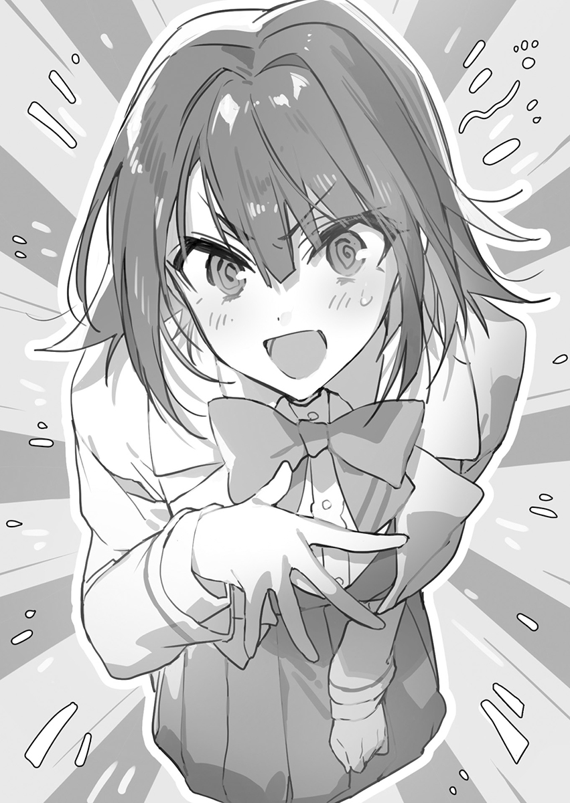

## 第五章 天降奇冤

对于社畜们来说，一大早就得去挤满载的电车算得上是一种洗礼，真是辛苦大家了。

虽然我人生的这辆列车已经晚点得一塌糊涂了，不过我今天还是搭乘电车去上学的——因为昨天我留宿在了雪华小姐的家中。

九重雪华【Kokonoe Setsuka】小姐是我老妈的妹妹，也就是我的小姨。

抱歉啊，以前好像没提过我是跟我老妈姓九重的。以前因为我的事情，雪华小姐曾经跟我老妈大吵过一架，之后她以不放心把我交给老妈为由强行把我带到她家跟她住了一个月左右的时间。

从那之后如果我不定期去她家留宿的话就会让她心里很难过的样子，遇到这种日子我就得坐电车去上学了。

雪华小姐总是很担心我，一直用仿佛要把我溺死的关心溺爱着我。虽然她如果听到我说她是个温柔的小姨的话会觉得很不错，但身为小姨，她还是显得太年轻了。

不管我想要什么她都会买给我，昨天更是变本加厉到了相当不妙的程度。真的相当不妙啊，她都快把我钢铁般坚硬的心给彻底融化了。昨晚她在我耳边轻声问道「雪兔君，你有什么想要的吗？比如小宝宝之类的」，要是在那时候我说嗯点头答应的话，那在十个月后我的身份也会发生变化了吧。好可怕，这也太可怕了吧，我只能装成没听清给糊弄过去了。

因为在抢椅子游戏中获胜的缘故，我现在正坐在满载乘客的车厢中。这让我心生出些许的优越感，旁人那嫉妒的眼神也让我心情舒畅——正当我暗自得意的时候，刚才上车的乘客被挤进了车厢内部，接着一位女士站到了我的面前。

这个人没问题吗？——看她脸色不太好的样子感觉像是身体有些不适。据说最近有老人在被人让座后因为感觉自己被当成了老年人对待反而迁怒于让座者的情况发生，不知道她会不会也这么蛮不讲理呢？算了，想这些有的没的也没用。

「请坐。」

「啊……谢谢你。」

我唰的一下就站起来把位子让给了她。你可别小瞧我，我对自己的体力那是相当有自信的。虽然我现在是隶属回家部没错，不过以前我可是对社团活动相当的投入，所以腰腿肌肉都挺结实的。反正之后大概也就十分钟的路程了，她也不需要对我客气什么。

顺带一提我现在想把手机给拿出来，因为上面的搜索记录里有一些类似「十个月后」之类的不能给别人看的词组，得赶紧删掉它们啊。

想着这些的时候，车门附近的一位女生突然映入我的眼帘。你要问我为什么会注意到她的话，那是因为我看到她像在忍受身上哪里的病痛一样低着自己的头。

话说这节车厢里身体抱恙的人也太多了吧？不过一想到是在满载车厢这种恶劣环境之中那也就不奇怪了，大概还有很多其他人身体也不舒服吧。不过我发现事情好像并没有这么简单，她是被人压在车厢上瑟瑟发抖，我想了想感觉只有一种可能。

「怎么有人大清早的精力就这么旺盛啊？」

我想有很多人在早上都敌不过自己的睡眠欲，也许在这当中还有人连自己的性欲都克制不住。虽然我自己也因为雪华小姐的事仍在苦恼，没法站在道德制高点上指手画脚，但是我可没法在这挤的跟沙丁鱼罐头一样的车厢里还能兴奋得起来。

才没有这种兴趣！我可是说真的呢？

现在可不能大吵大闹，于是我穿过人群的缝隙慢慢向她靠近，想要拉进一点距离好确认情况。

虽然我不想看到这样的情形，不过我确实没弄错。你说你一个看上去人模人样的成年人这大清早的就在这摸女高中生的屁股算是怎么回事啊，这变态也太多了吧，想到这我不由得叹了口气。

列车到站了，我顺着人流走了过去，伸手想要抓这个西装革履的上班族一个现行。

「你这家伙在干嘛？」

回过神来我的手反而被人给擒住了。

这时我恍然大悟，自己又被卷进麻烦事了。

&emsp;

我的好友三云裕美【Mikumo Yumi】刚才通过手机向我求救。

看来她又遇到色狼了。在与我汇合前这么短的时间都能遇到色狼，看来她真的很容易被这些人给盯上啊。

我们在这个车站汇合后因为有我在身边保护她倒还没事，问题在于我非常担心之前就她孤零零的一个人会不会遇到什么危险。所以她才会像现在这样联系我吧。

看着手机上收到的短短「救我……」两个字就让我气不打一处来了。

就是因为老遇到这种事情才会让裕美她出现轻度的男性恐惧症吧。电车上明明有这么多人，总不可能人人都是色狼吧，那为什么没有人伸出援手呢。我不由得抱怨起这些假装没看见发生什么一脸事不关己的乘客来。

（好了，接下来我该怎么处理呢……）

还是根据那个色狼的行为随机应变吧。如果他能好好地道个歉的话事情还有回旋的余地，但如果他态度反而强硬起来就该把他交给警察处理了。这样的话上学肯定就会迟到了，不过这也是为了伸张正义，之后请车站的工作人员或者警察向校方好好说明一下情况就行了。

电车已经到站了。裕美她总是在同一节车厢的同一个位置所以很快就能找到她。

那就让我来看看今天又是遇到个什么样的色狼吧。可别小瞧我，我可是个练家子，上肢可是相当有力的，而且更重要的是，我作为学生会长决不允许有人伤害我校的学生。现在虽然不是在校内，但也是在上学的路上。

这就是我作为学生会长义不容辞的责任，同时也是为了维护我祁堂睦月【Kedou Mutsuki】那充满正义感的自尊。

「就是你这家伙吗！」

我一把扭住那个向裕美伸出手的男人的手腕，接着想想看看他到底是个什么人模狗样却大吃了一惊，因为我发现他竟然是我校的学生。

「你这家伙在干嘛？」

&emsp;

「那个，你抓错人了……」

「别狡辩了，你作为我校的学生做出这种事情难道就不觉得羞耻吗？」

她扭住了我的胳膊把我按在了地上，虽然我能强行挣脱，不过那会让事情变得更复杂，现在还是老实点吧。这之前谁能知道事情会变成这样呢？我居然会在车厢的众目睽睽之下被指认为色狼，还被人拉出来按地上审问。我今天怎么就这么倒霉啊。

「我都亲眼看到你把手伸向裕美了，劝你还是别狡辩了。」

「还真是有眼无珠啊。」

「你说什么……？」

听到这话她一下就用全身的重量压住了我的胳膊。看着动作还挺熟练的，好像是个练家子啊。她个挺高，跟身旁那个低着头的女生不一样身上的肌肉也挺结实的。

虽然总感觉在哪见过这个人，不过我脑中的档案馆里并没有记录这个名字。虽然用运动型女生这个称呼比较好听，不过还是算了，她好像只是单纯的四肢发达头脑简单。

「如果你能老实承认并且道歉的话，我也可以酌情考虑从轻发落。」

「我可不会把不是自己的罪名揽自己身上，这跟我的正义感有所冲突。」

「色狼还讲什么正义感。」

「都说我不是色狼了。」‍‍‍‍‌‍‍‌‌‍‍‌‍‌‌

「那我就只能选择报警了。」

这下真是秀才遇到兵了。算了就这样吧，反正接下来只要好好地查证一番就能证明我的清白了。虽说她们是受害者，不过在误将我指认为犯人的情况下我实在是无法对她们的遭遇产生同情，弄到这幅田地也是她们自作自受吧。

「那你赶紧报警吧？」

「你不会以为能用学生身份来脱罪吧？你可真是蠢到家了。」

「在我看来还是您要更蠢一点」

「真是冥顽不化。那个抱歉，麻烦请您帮我报一下警。这种家伙根本配不上当我校的学生。」

「啊……好的，我明白了。」

听到这番话后车站的工作人员跑了出去。真是的，我怎么老是碰到烂桃花啊，一跟女人扯上关系准没好事。

「请等一下，你们抓错人了。」

我暂时收回之前说的那句话，看来我遇到的也不总是烂桃花啊。

&emsp;

我是真没想到犯案的居然会是我校的学生，而且是个低年级的学生。他就这么面无表情一脸麻木的看着我让我心生芥蒂，就这么毁掉了一个年轻人的未来让我良心上有些许不安。但是这个学生没有丝毫的反省，一直坚称是我抓错人了，他这种将错就错耍无赖的态度让我心中烦躁了起来。

这家伙是在我校就读的学生，如果这次放过他的话说不定裕美她会在学校里遇见这家伙，而有着男性恐惧症的裕美能忍受跟非礼自己的色狼在同一所学校上学吗？虽然这次我出手相救了，但是之后说不定还会被他袭击，我不能容忍这种情况发生。

那还是让这个学生退学吧，这种人留在我校也只会是一颗老鼠屎。在认定他不会改过自新后我决定报警。

「真是冥顽不化。那个抱歉，麻烦请您帮我报一下警。这种家伙根本配不上当我校的学生」

「啊……好的，我明白了。」

这样的话就肯定会迟到了，不过也没办法啊。就这么放任这家伙不管的话，之后不光是裕美，还有其他女性也有可能会受他所害，那更不能放过这家伙了。

为什么这世上只有这种家伙而没有人愿意对裕美伸出援手呢，想到这不禁让我心凉。

「请等一下，你们抓错人了。」

此时心中正扼腕叹息的我听到了这样的一句话。

&emsp;

「那个，请问您是？」

「刚才真是谢谢你了。」

出声的是早上那个站在我面前的女士，现在她脸色已经好了不少，看她的意思好像是在帮我。大概斧子掉进湖里的樵夫看到女神之后就是我现在这般心情吧。

「你说什么？抱歉，请问您是？」

「我就一直坐在他的跟前，他不是色狼哦。」

「坐在跟前？我可是亲眼看到这个男人把手伸向了裕美，既然你在这个车厢内那你为什么还要包庇他呢？」

「他只是自己走向了那边那个女孩子而已。」

「这不就是为了进行猥亵行为吗？」

「不是哦。请你好好的想一想，你在被色狼骚扰的时候，身边有穿着制服的学生吗？」

她开始询问那个被色狼骚扰，从刚才开始就几乎一言不发的女生。

「诶……？我，我那时……」‍‍‍‍‌‍‍‌‌‍‍‌‍‌‌

「请你好好的想清楚。他是觉得你好像被色狼骚扰了所以才靠过去的，他只有在到站前不久才靠近了你身边，肯定是为了出手救你吧。你应该还记得自己被色狼骚扰时身边站着什么样的人吧？」

「全，全都是成年人，我好害怕……。那好像是个穿着西装的人来着……」

「当时身边有穿着跟你同一个学校制服的人在吗？」

「好像没有……不对，是确定没有。」

「你说什么！？」

我说学姐你能不能就听人说话别拽着我胳膊晃来晃去了。虽然说碰到胸部的时候心里是应该要暗爽一下的，但可惜现在这状况我怎么都感觉不到自己占便宜了啊。

「哎……你们处理得也太草率了点吧。你们知不知道自己差点就这么毁了他的一生啊？不仅如此，如果事后才发现是抓错人了，那受谴责的就是冤枉人的你们了，你们以后能不能多长点心啊？」

「怎么会这样……这么说，你是想帮裕美来着……」

「对，对不起！」

「没有的事，不必这么介怀的。毕竟错的人是我嘛。」

「……哪里错了……？」

事到如今你再跟我道歉还有什么用呢。总之我好像跟往常一样又做出了错误的选择，在选择行动的那一刻我就已经犯了错，在注意到的时候我就已经失败了。

「帮助她的人是学姐才对，并不需要我的存在。」

这种时候选择事不关己高高挂起才是正确的，也是这样的挫折才最让我气馁。我自己很清楚一旦扯上关系就准没好事，但我老是会选择这个错误的选项，其结果就是——

「##要是我没有多管闲事就好了##。」

下次遇到这种事还是当没看见算了，反正你要是遇到色狼骚扰就自己喊一声说出来不就行了。一味地去依靠他人依赖他人，想让别人来保护自己，是完全解决不了问题的。至少，我就是这样活过来的。

「————啊！？」

「可以请您把手松开了吗？请您放心，我以后不会再犯同样的错误了。##再也不会多管闲事了##。正如学姐您所说的一样，这种场合并不需要我。」

我可不会在同一个地方跌倒两次。在确认了为什么会变成这样的原因之后，再遇到这种情况处理起来就很简单了，以后就算女性在被色狼骚扰也当没看见就行了，这样的话就没了祸端，自然也不会被卷进什么麻烦事里。反正必须做出改变的是你受害人自己，犯罪的是进行猥亵行为的犯罪者，这都跟我这个局外人没有任何关系。

「请，请等一下！对不起，你并没有做错什么，你的行为是——」

「够了，再见。」

我甩开纠缠着我不放的学姐的手之后转过身来给刚才那位大姐姐鞠了一躬表示感谢。

如果没有她出手相助的话，事情肯定会变得更糟糕吧，就算说她是我的救世主也不为过！

「真是太感谢您了，我可以叫您弥赛亚吗？」

「千万别这么叫我，不过多亏了你，我现在感觉好多了。我因为贫血的关系早上的时候身体都不太舒服。今天还比往常要严重一些，所以你让座给我的时候让我倍感欣慰。我真奇怪为什么要让你这样心地善良的人卷进这种麻烦事里呢。」

「您现在感觉如何？」

「还是有点不舒服啊，哎……本来接下来还要去大学上课来着，看样子只能请半天的假了。」

「我也挺不舒服的，待会去咖啡店里坐会好了。」

「哎呀，你这不是旷课了吗？那我可以陪你一起去吗？」

「我本来就是问题学生也没什么大不了的。那为了感谢您刚才的帮助，今天就算我请客好了。」

「旷课可是不对的哦。不过您明明也帮了我结果却让您破费……」

「反正你刚才已经涌泉相报了嘛。」

就这么聊着聊着，我跟大姐姐两个人来到了咖啡店里小憩一会。

顺带一提，这位大姐姐好像是叫二宫澪【Ninomiya Mio】来着。她一边说「万一之后还有什么麻烦的就请你联系我吧」一边给了我她的联系方式。看来这个世界上的女性不止会无缘无故的冤枉我，也有救我于水火的救世主，毕竟上帝给你关上了门也得给你留一扇窗啊，暂且不论别的事情，在这件事上算是圆满解决了。

「不想去学校啊……」

虽说现在心情是好了一些，不过已经过了十点，到现在这时间已经完全不想去上学了。没错，我就是逃学威龙九重雪兔。反正我就是问题学生嘛，旷这么一两节课也不要紧的。

说起来从这里搭乘电车只需要三十分钟左右就可以到临海地区了。品尝甜点是我为数不多的爱好之一，那附近好像有家每天只限量销售五十个蛋挞的网红店来着。糖分正在呼唤着我。

「好了，我决定了——」

接着我摆出了一张冷酷的笑脸朝着学校的反方向出发了。

这说不准也是青春的一部分呢。

&emsp;

我就这样翘课跑到了临海地区。这个限定版的蛋挞也太好吃了吧，这才叫限定商品嘛。已经完成最大目标的我下午也只能去上学了。

哼哼哼，不可能有人会猜到我旷课后会在这种地方摸鱼吧。

好玩的地方也太多了。我接下来是就这样去购物广场买点什么呢，还是搭乘游览车逛逛呢，像修学旅行的学生那样毫无理由的闯进电视台去玩也不错啊。孤单一人的修学旅行听起来就很有阴暗角色的感觉，好像是挺不错的。春日里的阳光耀眼，清爽的海风也让人心情愉悦。就这么满心欢喜的看着这跟每年盂兰盆节和年末那两次庆典截然不同，空无一人的国际展览场也是一种浪漫啊。

我呆呆的望向大海，看着水鸟们在那嬉戏。

据说包含钱包在内，日本的失物返还率有六成左右，那什么时候我才能寻回我的失物呢？

我对他人的「好感」遗失在了我人生中的某一时刻，直到现在也查无所踪。究竟是在什么时候呢？不管再怎么翻找也找不到答案。说了这么多其实我只是迷失了人生的道路而已。

我所遗失的对他人的「好感」究竟在何处？事到如今还有寻回它的那一天吗？在遗失了对他人的「善意」之后我就对一切都无所谓了，既不在乎他人怎么看我，也不在乎他人怎么想。既然我已经没有了「好感」，那自然也没有与之相反的「恶感」，我完全不在乎别人会不会讨厌我。我根本不在意他人对我产生什么样的感情，同时我也不会对他人产生什么感情。

空空如也的感情空白。

但是这样很奇怪啊，本来不应该是这样的，因为我曾经真的有过对某人抱有「好感」的时期。而现在我的「好感」已经遗失了，于是也没有资格再去面对任何人了。因为不管对方再向我传达什么样的感情，我都无法用同样的感情做出回应。

无论对方付出多少我都无法回应，因为我根本回应不了。无论是「好感」还是更进一步的「爱意」，或是基于「爱意」诞生的「恋爱」，这一切的一切我都已经失去了。

所以说我才不想跟其他人扯上关系。至少，在我取回失物之前我必须得维持阴暗角色这个设定。

「我是这么想的来着……」

但为什么会变成现在这样呢？与我的想法正相反，我的身边有很多人莫名其妙的就想跟我扯上关系。说实话有点麻烦，因为现在这个不完整的我只会伤害到这些人。只会让这些人变得不幸——明明我从来没有期望过会变成这样子。

我掏出手机看了一眼，发现已经收到了很多条消息。估计是因为我一言不发就旷课，有人担心才想要联系我吧。为什么不能无视我呢？为什么要跟我扯上关系呢？这样下去可不太好，就算再怎么关心我这样的人也没有意义。大概就是因为我搞不懂这些人，现在才会身处于此吧。

「哈……」

此时我的心头涌上一股低落的情绪，连下午去学校的想法都消失无踪。反正闲着也是闲着，还是去游戏厅吧。

◆

「不好意思，请问九重是在这个班吗？」

午休时间，一年级B班出现了不速之客。而来者——

「学生会长……和副会长？」

正是学生会长祁堂睦月和副会长三云裕美这两个人。祁堂作为学生会长经常在全体学生面前致辞，所以就算是对于一年级学生来说也是个熟面孔。

不过这个学生会长找一个一年级的新生又有什么事呢？这样的人也不会无缘无故就出现在一年级的教室里吧。接着樱井在众人讶异的目光中站出来回答了：

「九重同学今天请假了没来上课，请问您找他有什么事吗？」

「九重他旷课了哦——」

峯田突然插嘴道。祁堂的表情更显心烦意乱：

「你说什么？他没来上课吗？不对，有点奇怪啊，他早上不还是要来上学的吗。」

「睦月，这有点不妙啊——」

「说起来藤代老师也说他没联系过她」

「怎么办呢，说不定他之后就这么回家了——」

「发生什么事了吗学姐？」

「我也想问问怎么回事啊。之前我也联系过他了，不过根本没有任何回复。」

充满了难以理解内容的喧闹在班级中叽叽喳喳地不断扩散。

「抱歉，是一些不能告诉你们的事。我们到教师办公室去吧，裕美。」

「嗯，我们快走吧！」

两位高年级学生就这么一脸焦急的跑了出去，教室内被一股「这肯定是发生什么事了」的氛围笼罩。

「我也一起去吧。」

巳芳喃喃自语道，在他之后还有好几个人一起跑出教室，追在那两个高年级学生的后面。

&emsp;

「藤代老师！抱歉打搅你休息了，有关于九重的消息吗？」

教师办公室的门被人啪的一下猛然推开，而坐在自己位子上上吃面包的藤代也因为突然被叫到自己的名字，不由得被面包给噎住了。

「——哦，咳咳咳。怎，怎么回事啊祁堂，稀客啊。九重他怎么了吗？」

「都怪我俩！」

「等，等会，你别掐我脖子啊！冷静点，到底出了什么事了？」‍‍‍‍‌‍‍‌‌‍‍‌‍‌‌

「九重他有联系你吗？听说他今天请假没来上课。」

「啊，你说那个麻烦的家伙啊。他今天没联系过我，无故旷课了。」

「不是这样的，他早上还好好的要——！」

「你给我从头开始说清楚啊！到底发生什么事了？」

于是两个人把今天早上发生的事情一五一十的告诉了藤代小百合，听着听着藤代的表情也变得越来越严肃。

不止是她，办公室里竖起耳朵偷听的其他老师也察觉到事情不太对劲。而此时祁堂并没有注意到巳芳一行人也已经来到办公室了。

「所以他今天才没来上学吗？不过还好半路就澄清了，要是按照之前那样发展的话大概总得有人要吃处分了。」

「这全都是我的问题，他没有做错什么！」

「那是自然。如果真把九重当色狼处理了之后再还他清白的话，你们反而就成问题学生了。真是麻烦啊……」

「老师，我们该怎么办啊。你知道他现在在哪吗？」

「现在这情况的话我就不算他无故旷课了，不过他也确实没联系过我。说不定悠璃的话知道些什么——」

「九重——对啊，他原来是九重悠璃的弟弟啊！」

「那我们赶快去找她吧，睦月！」

「等会等会，你们别这么猴急啊，用广播把她叫来不就行了吗？」

事态的混乱程度开始加速。

&emsp;

糟了，这样下去的话就真的糟了——！

我上次心中这么焦躁是什么时候呢？

不对，这好像是生来第一次变成这样，现在我的心中翻腾着一股莫名的不安。

之前我通过对照学生名单上的照片和记忆得知了他是一年级B班的学生，名叫九重雪兔，于是决定在午休时去他班上向他正式的道歉。

他最后说的那些话一直在我耳边挥之不去，一种发现自己是不是犯下不得了的错误的恐惧感萦绕在这我心中。一想到自己好像彻底扭曲了他的正义感，好像做了什么无法挽回的事，我的身体就止不住颤抖。

作为学生会的会长，我应该去保护学生而不是去伤害他们。一直以来我都很重视所谓的正义，想要成为一个光明正大的人。

于是在不知不觉间我吸引了不少人聚集在我的身边，身边的人对我的评价也越来越高，到现在我还被推举到了学生会长这个位子上。但这不过只是结果论罢了，我只是始终按照自己所坚信的正义和生活方式活着而已，而这样的做结果就是我获得了现在这个地位。

可是我现在第一次感觉到自己心中的正义被人动摇了。我很惊讶，惊讶于自己的立足之处竟然会如此的脆弱；我很害怕，害怕自己所坚持的正义是不是摧毁了其他人的正义感。

他并没有做错什么，他的所作所为是正义之举。我并不认为他做了什么错事，如果换做是我遇到同样的情况，我也会毫不犹疑的拔刀相助的。

可就算如此，我还是考虑得太不周全了，听不进别人辩解的同时也没有明辨是非的慧眼，是因为我的疏失才会这样伤害到他。那我必须要偿还他才行。

不然的话，这样的我就再也不能顺应自己的正义感行动了。

我不能因为我所谓的正义去扭曲别人的正义感啊。

不知为何，我一直心绪不宁。这已经是我第二次陷入这样的心情了。

为什么我会想起那件事呢——是因为看到了他离开时的眼神吗？

他一定是因为我的缘故才没来上学，因为是我伤害了他。他现在在做什么呢？是沉浸在了悲痛之中了吗？是对这个世界感到绝望了吗？还是单纯憎恨我这么个人呢？

我好害怕，害怕看到他的脸。不过即便是这样，我还是要对他——

&emsp;

「你们到底干了什么！」

「悠璃你冷静一点！雪兔他没有联系过你吗？」

「你怎么不早点告诉我出事了啊！」‍‍‍‍‌‍‍‌‌‍‍‌‍‌‌

「你们不是结伴上学的吗？」

「只有今天他跟我不同路啊。啊啊啊啊，够了！」

面对着这愚蠢的高年级学生，我的情绪不由得激动了起来。这什么狗屁学生会长啊，我真是难以置信，这种人居然会是什么学生会长！又来了，又有人要伤害他了。就跟我一样，又有人重蹈我的覆辙了。我急忙拨通了他的电话，他应该是会接我的电话的。在几声呼叫音响起之后，我的牵挂就这么轻松的通往了远方。

「雪兔！你这家伙，你现在在哪啊！」

『我在海边啊？』

「——等会，你说什么，海边？」

身边的人开始骚动了起来。这也不奇怪，因为这根本就不是学生逃学后会去的地方。正因如此，这句话才会让大家联想到不好的事情。

「你，你不会是，想要跳海还是什么的吧！？」

我明显感受到办公室里一下就充满了紧张感。不止是他的班主任藤代，其他的老师们也纷纷屏住了呼吸关注着事态的发展。

『啊哈哈哈哈，你这笑话还挺好笑的。』

「这才不是什么玩笑啊！」

『我没能寻回我的失物，待会就会回去的。哦对了，我还给你带了纪念品回来哦。』

「别管什么纪念品了啊！你到底去哪了啊？」

『反正我就是个问题学生，做这种事也没什么大不了的吧。』

「问题学生又是怎么回事啊？这才开学没几天吧！」

「——问题学生！？不会吧，难道说我也伤害到了他吗……」

不过现在也不是在意班主任藤代小百合在那嘟嘟囔囔些什么的时候了

『果然，还是得在盂兰盆节和年末的时候来国际展览场啊。』

「你在说什么呢？总之我已经了解事情的缘由了。你真的没事吧？待会你真的会回来的吧？」

『请您忍到我高中毕业吧，在那之后我就不会给悠璃小姐您添麻烦了。』

「高中？等一下，你这是什么意思？难道说你是想——」

『马上就会回来的。在消失之前还有段时间呢。』

「——啊？雪兔你别这样！这才是你真实的想法——」

『那我现在就动身回来了。』

挂断电话后我茫然自失，难道说他现在还——

「喂，喂悠璃，你看上去心慌意乱的，你没事吧？」

「他说自己马上就会回来。」

「这，这样啊。」

「他说自己会回来的话，那明天大概就会正常来上课了。剩下的等明天再自己去问他吧，今天就这样，没事了大家散了吧。」

「悠璃，我真的很抱歉！」

「对不起！」

「我绝饶不了你们。」

我头也不回的走出了办公室，虽然在场的还有一些雪兔班上的同学，不过我现在已经听不进去她们的话了。我在脑中反复回味着我弟弟最后说出的那些话。看来我想的没错，其实从他的态度就可以察觉出来，我能预感到那一天迟早会到来。

直到现在我都能回想起那时候他说的话，那时候他的触感也留在了我的手中。那时候他带着一脸过于憔悴的表情，在不经意间说出了那句心里话。在刚才的对话中他也说出了说出了一些心里话。他在平时很少会说出自己的心里话，大概是因为今天发生的事情对他有很大的触动吧。

他说什么让我忍到他高中毕业，也就是说在三年后他毕业时就是最后的期限了。到那时就真的迟了，一切都无法挽回了。

先是他的那个青梅竹马，砚川灯凪。一开始通过跟她的交往我的弟弟在慢慢的康复，这让我放心了，想着如果是她的话是可以把我弟弟交给她的。可等我回过神来，我弟弟他又变回了原来的样子。不对，情况还更加恶化了，而且那个应该一直陪伴着他的青梅竹马也消失不见了。

为了忘掉她，雪兔开始全身心的投入到篮球当中。这次又是一个叫神代汐里的女人开始出现在了我弟弟身边。他们的关系慢慢开始变得融洽，我本来还很期待她能做些什么，但是没想到她居然在我弟弟的伤口上又撒了一把盐。

没想到现在学生会长竟然也加入到了这场对我弟弟造成精神创伤的竞赛当中，为什么他身边全是这种女人啊。

我弟弟他需要的根本就不是这样会伤害到他的人才对。没有人值得我相信，我也不会再相信任何人了。这样的话必须由我亲自来。这一次我绝不会再背叛他——

◇

虽然俗话说武士就算吃不着饭也得叼根牙签来充体面，但我并不是武士，而是一名普通的高中生而已，而且现在是令和年间不是江户年间了。不过话虽如此，我也确实想要像武士那样有气度的活着。就算人生已经闭关锁国的我仍然很敬佩这样的人，没错，神父都已经被我赶跑了。

言归正传，现在是午休时间，我站在教室外的走廊上，而学生会会长和副会长两人正跪在我的面前。诶？现在是怎么个情况啊？

「九重雪兔，我真的是非常抱歉！请您原谅我吧！」

「九重君对不起！」

她们的举动让教室内一片哗然自不必说，就连走廊上的学生们也停下了脚步隔得远远的在观望着，说明她们的行为相当的引人注目。这也太显眼了吧，不对啊，这俩人实在是太奇怪了啊！这是哪来的武士啊！难道说我在不知不觉间已经成了大名，现在要出发去参勤交代了吗。

「爱卿平身。哈哈开个玩笑，你俩这么跪着太显眼了赶紧站起来吧。」

「我向您表示由衷的歉意！对不起，我不应该那样伤害到你！」

「那个……非常感谢您那时候想要帮我！」

「是没听见我说让你们别这样了吗？」

听到这话后学生会长和副会长终于抬起头站了起来，这之前两个人完全没注意到旁边的围观者变得越来越多。

不过实话实说，高三学生跑到高一学生教室门口下跪道歉这种事确实会引人注目。这让我一下就成为了众人眼中的焦点。糟了，这么下去的话我的孤独阴暗角色计划又要泡汤了，得想办法赶紧让计划重回正轨才行。

再说了，要道歉的话总该拿个金币铺成的馒头来吧？越后屋面对你们这个态度无疑也会大为光火。

【rkl译注：越后屋是幕府时期三井家在江户日本桥骏河町经营的和服店，以现金定价贩售（而非之后收取含利息的价格）的经商思路而闻名。】

「这可不行，对我来说对你的赔礼道歉是很重要的事情！」

「那个，我想送些什么东西作为谢礼来着。」

「不用了，请回吧。」

只要被牵扯进这种事情里面到最后肯定又会是我一个人受伤，所以我用冷淡的方式拒绝了。可不知道为什么学姐们听到这话后眼神反而一亮：

「九重雪兔————上我！」

「那就请你吃些好吃的东西——睦月，你说什么呢！？」

学姐还真是口齿伶俐舌灿莲花啊。不愧是学生会长声音真是清脆悦耳。这所学校还真是安宁呢，嗯嗯，副会长这边也还不错。是啦，我是有听到她在说什么啦！我只是想逃避这个现实啊可恶！于是我决定使用主角的特权，想要当成没听到她这句话给蒙混过去。

「那个，您刚才说什么来着？」

「九重，我也是第一次。如果可以的话我希望你能戴上这个。」

看来我这个技能的熟练度不够判定失败了。学姐扭扭捏捏的递来一件东西，我定睛一看盒子上写着0.01毫米这么几个字。啊，我不（知）道啊……我不（知）道啊……。这玩意我可太眼熟了，因为雪华小姐的家里也摆着这么个玩意，而且她好像就是为了让我看见把这玩意把它给放在了一个很巧妙的显眼位置。

话说，这个橡胶是不是有点太薄了？技术的发展也太牛逼了吧！

「不过就算你不想戴我也是可以接受的。」

「我说睦月你等会！？诶，怎么回事啊！？」

副会长三云学姐开始抓住祁堂学姐用力地摇晃，但是她仍然站定了一动不动。看上去腰腿力量很不错呢，笔直的站姿也很漂亮，大概躯干部分的锻炼也没落下吧，真棒啊。

「只要你愿意的话，就算是直接来也没问题！」

「睦月你是疯了吗！？给我清醒一点啊！」

「裕美，我一直都是很清醒的。」

「清醒的时候还能说出这种话就更不行了啊！？」

说起来差不多快要期中考试了啊。我因为对自己的成绩相当有自信，所以从来不会害怕什么考试之类的东西，所以对我来说期中考试就是能早点放学的开心的奖励时间。没错，我的思绪从一开始叫跳转到别的频道了，毕竟不能再听学姐那些会让脑子变成一团浆糊的话了。

「但是根据我的调查，男人是会很高兴的啊，对方是处——」

「哇啊啊啊啊啊啊啊啊啊！」‍‍‍‍‌‍‍‌‌‍‍‌‍‌‌

「杂志上就是这么写的啊。当时如果走错一步，就可能会因为我的思虑过浅而把九重的人生给毁掉了。既然如此，要是我不赌上自己的人生就太不公平了。九重，这就是我发自真心的谢罪，所以请你收下吧！」

这就是那个啊。会长跟雪华小姐一样，都是猛禽一般的肉食者。我大概是那种只会被狩猎掉的草食动物，还是老老实实活下去吧。

「学姐你听我说，像你这样怀着一种赎罪的心态跟我做，我也是开心不起来的。」

「是，是吗……。嗯，你说的好像也有点道理。」

「没，没错啊睦月，你还是冷静一下再想想比较好吧？」

「不对啊九重，你看啊，虽然说我是抱着一种赎罪的心态没错，但是我所想的并不只有赎罪而已啊！」

「哎，这人已经废了。」

看来我端着一张脸来说教的尝试已经失败了。虽然我以前没有试过，不过想要摆脱现在这副尴尬的境地待会就只能使用那一招了。都说见食不食呼为劣蹶，但我可没到饥不择食的地步，只要有能填饱肚子的普通食物就行了。

「那我今天要去福利社买东西来着就先走一步了！」

三十六计走为上，我还是赶紧跑路比较好。败战计在兵法之中乃是处于劣势的状况下会使用的策略——从一开始我就输给她们了。

「有女色魔啊啊啊啊啊啊啊啊啊！」

我惨烈的叫喊声传遍了整条走廊。

&emsp;

为了逃离痴女的魔爪我来到了应急楼梯，这里是我最后的避风港了。身心俱疲的我长叹一口气准备坐下来，却发现此处竟然已经有人先来驾到了。还是我认识的人啊，她就是奥林匹斯十二神之一——

「阿芙罗狄忒学姐？」

「哼」

她没有理我，看上去好像是生气了。被痴女学姐纠缠后身心俱疲的我可没工夫再跟她也纠缠一番了。不过本来每个人都会有不顺心的日子，就算是老姐每个月也有那么几天一碰就炸毛，那在这种时候还是别打搅她比较好。

于是我自顾自的撕开了刚才买来的葡萄干面包和牛奶芝士面包的包装。这次的组合可是黄金搭档啊，我九重雪兔真不愧是绝不会在同一个地方跌到两次的男人啊，开吃咯。

「那个，你为什么不理我就开吃了呢？」

「因为感觉会很麻烦啊……啊，不是想赶你走的意思。」

「之前不是跟你说过，就算你没有恶意这么说也会伤人的吗？」

「就算是这样没错，但这跟我又有什么关系呢？」

「当然有啊！你还记得上次跟我是怎么说的吗？」

「我怎么说的？」

「你不是说每周都会有一两天会来这的吗！但是我怎么就没见你来呢？」

听她这么一讲我好像确实说过这样的话，不过我已经忘得一干二净了啊。记得之前也有过因为下雨所以就老实待在教室里吃的情况。不过我怕说实话她会生气所以还是随便搪塞一下好了，我就是这样一个虽然有些别扭但还是懂得察言观色的男人。

「因为有些情况啊。说起来，难道说阿芙罗狄忒学姐你每天都会到这看我来没来吗？」

「切，才不是你说的那回事，我是因为偶尔也想要一个人静一静才会到这里来的，绝对不是因为在乎你哦？」

「那你不就跟我一样是个阴暗角色吗。啊哈哈哈哈。」‍‍‍‍‌‍‍‌‌‍‍‌‍‌‌

「住口！别把我跟你混为一谈！而且我怎么感觉你叫我叫得这么别扭啊！？」

「因为你就是女神嘛。」

「到头来不是变得更绕口了吗！」

「可是，我不知道学姐你的名字啊……」

「我不是做过自我介绍了吗？我是做过自我介绍的吧？你真是该记的反而没记住啊。」

「我总感觉葡萄干面包里的葡萄干不太像葡萄啊？」

「听我说话啊！你现在再多关注我一些也不是不可以哦？毕竟我在高二的学生中还是挺受欢迎的。」

「是是是，大明星你说得对。」

「别挖苦我了！我脸皮很薄的。」

正当我听着阿芙罗狄忒学姐这不知是自虐还是自满的话时，发现有一男一女往这边走了过来。神色紧张的二人看上去也不像是朋友。

「怎么了……等等，不太妙。那两个人是往这边来了对吧？」

「和他们正常打照面不就得了？看上去他们也不是在做什么见不得人的事。」

「气氛对不上啊！肯定是想告白吧。」

「啊，说起来，阿芙罗狄忒学姐好像也在这里被告白过。」

「呵呵，对啊。我可是很受欢迎的！」

「选芝士牛奶面包这种奶制品撞车的款式，也算够有意思的。」

「你啊，是在看扁我对吧？啊，赶紧地，先藏起来！」

心绪不宁的我被学姐拽着手，带到了树荫下面。

「难不成，你认识他们中的某个人？」

「对。女生那边是我的同班同学。」

「虽然轮到自己头上就觉得麻烦到提不起劲，但这种事情还是有点让人小鹿乱撞呢！」

鬼鬼祟祟地窥视他们的我和学姐，只不过是可疑人物罢了。

对面的两人此时正在交谈着什么。虽然听不清内容，但按照我的直觉，被叫出来的应该是砚川吧。说起来，她说自己已经和学长分手了。如果这个说法属实，那么她开始新的恋情也不奇怪。

大概是告白结束了吧，两个人分开后回去了。

「哈啊……真让人紧张。那个女生看上去还挺可爱的，到底是怎么了呢？」

「学姐您一副暗地里觉得自己更可爱的样子呢。午休差不多要结束了吧。」

「看样子有必要和你真刀真枪地决一胜负了。」

随着铃声响起，我们也就此解散。完了，到最后她还是没告诉我她的名字——到底叫什么来着？既然不是阿芙罗狄忒的话那下次就叫她雅典娜好了，反正这么一圈一圈的蒙下来总是会蒙对的。因为据说你如果记不起某个人的名字了，那喊他田中或者佐藤或者铃木的话就会有两成几率能蒙对，蒙不对也不要紧，反正他在你蒙错的情况下也会告诉你他到底叫什么。这么做也符合我的处世之道啊。

&emsp;

此时，我对以暗淡目光注视着回到教室的男生和女生的那个学生的存在，尚未有任何察觉。
