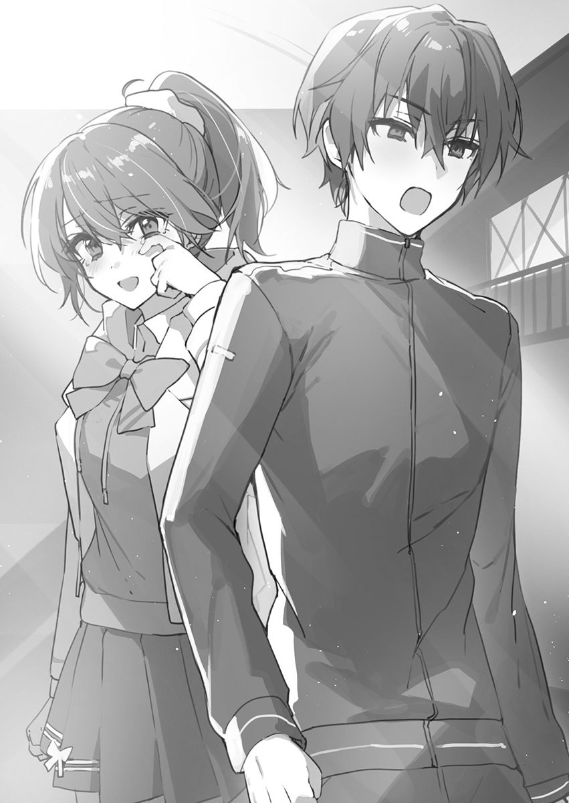

## 第六章 拒绝球

如今已经是IT社会了。明明各个省厅都进入了鼓励停止使用印章的数字时代，我却从大清早就被模拟时代的事物困扰着。干脆无视掉好了，真是麻烦。

结果那个悠闲帅哥又跑过来向我这个预感到新的麻烦事而独自苦恼着的人搭话。这家伙就没什么烦恼吗？

「雪兔你干什么呢？」

「鞋柜里被人塞了一封信……」

「哦哦？难不成是情书？」

各位注意！整个班上的视线都集中了过来。

魂淡，你这个爽朗帅哥混账！给老子去——死——啊！

「九重，你收到情书了？」

「怎么可能嘛。虽说不是自吹自擂，但我不觉得自己有多受欢迎。」

「这人脑子是不是有什么不对劲啊？」

「我也这么觉得」「我也这么想」「同意」「我一开始就确定是这样了」「嘿嘿……这可是他身上不错的地方啊……」「没事的，我会当你的同伴的！」「我也是我也是」「我投不对劲一票」「果然不对劲啊」「不是都说了嘛」「#不对劲」「人渣去死」「心理变态魂淡喵」

「你们特么的都谁啊！？」

吵死人了——！点头同意的风暴宛如疾风怒涛一般。别搁SNS上用井号发言！还有，这里是不是全是一帮住在幻想风格世界里的人啊？怎么回事怎么回事，难道你们就是这么看我的？我明明就老老实实地过着阴暗孤独角色风格的生活，可为什么就……

「所以，到底是怎么回事？」

「我不知道。不知道所以很头疼。这东西看上去像情书吗？」

被随手放进鞋柜里的东西并没有精致到可被称为情书的地步。那是一张被折成四等分的朴素活页纸，上面只写着「放学后请到自习室来」这样简单的内容。里面怎么看都没有什么梦想或希望存在。

「可这不就是女生的字迹吗？」

「我也有类似的感觉呢。虽然看上去不像是情书……」

樱井和峯田等人的看法也排除了这张纸是情书的可能性。那这又是啥？啥啊？好可怕！

「阿雪，状况这么奇怪，你还是别去了吧！」

「我也不想去啊，可怎么办呢。或者光喜你替我去？」

「为什么指着我啊。嘛，反正我时间充裕，你要是无论如何都想让我替你去的话我去看看也行。」

「你还真是个大好人啊。对我的评价变成怎么样了？」

「……有着各种缘由事因的，可不光只有你一个。」

这什么让人满怀期待的爽朗帅哥啊？虽然托他去侦察也算是个有吸引力的方案，但总把事情推给别人也不是什么好主意。总之就先快进到放学后吧！

&emsp;

「那么，请问您哪位？」

把我叫出来的学生久站在我面前。简而言之，根本就不存在告白一类泛着酸甜气息的氛围。这里只有我们两人，也很难认为她是来邀请我加入社团活动的。

「我是C班的莲村（Hasumura）。非常感谢你能到这里来。」

「需要我做自我介绍吗？」

「我对你已经很熟悉了。你应该记得吧？我们曾经读过同一所初中。」

「我们这是第一次见面吧？」

「不是的——虽然这么说，但之前我们也没有面对面讲过话。」

遗憾的是我根本回忆不起来——越来越搞不清她叫我出来到底有什么事了。

「我因为对你有所请求，才麻烦你今天来这里的。」

她狭长的眼瞳一下子眯了起来——从其中射出宛如敌意的视线。

「简单直白的说吧。我希望你能让汐里获得解脱。」

我咀嚼着莲村的话。汐里——她说的是神代吧。但「解脱」这个词还是让我感觉到了不协调。

神代是被我封印了吗？还是被我俘获了？还是我做了别的什么事？我应该没有违反国际公约。

「请问可以讲的稍微细致一点吗？解脱指的是什么意思？」

「汐里是我的挚友。都是你的不好。因为和你产生了联系，汐里才陷入了困境。就算现在，她还是……她那个痛苦的样子我实在看不下去！」

莲村悲痛的声音传到了我耳边。是挚友吗。原来如此，是这样一回事。她说到这个份上，我也算是理解了。

这个女生只是单纯在担心神代而已。怎么想都不觉得她的话里存在欺骗成分。而她那强烈的意志，就蕴藏在毅然决然的眼神之中——莲村想对我说的，就是「别再和神代扯上关系了」这句话。

「要怎么做才好呢？」

「啊？」

「就算你说要让她解脱，我也并没有强制她做什么事吧。莲村同学你应该也知道。而且我也和神代说过无数次了，可她就是不肯离开。所以，我该怎么做才好呢？」

本是莲村自己提出的想法，可她如今却陷入了困惑，迟疑的视线在我身上飘来飘去。

「说『怎么办』……难道你这样就好了吗？」

「反正我的想法也和你讲的一样，我觉得不能再被神代这么一直同情下去了。」

「才不是这样！那只是我们在挖苦汐里而已，汐里其实——」

「过去的事情怎样都无所谓了。我们说的是现在的神代对吧？」

「可，可是……你真的能这么简单就放弃掉汐里吗？」

这个问题真让我难以理解。我？放弃？谁？如果不放弃的话，说明那里有着什么才对吧。可是什么都没有。我直到如今都过着什么都没有的生活。一旦有什么想要追求的东西，最后就只会落得无可挽回的结局。我摇摇头，试图忘却轻微的头痛。

「放弃也好什么也好，从一开始我就不觉得自己能配得上她。因为我们根本就不对等。」

「汐里是追着你才选择上这所高中的。明明她对你有这么高的好感，为什么你会觉得那是假的啊？这一点你难道不是再清楚不过了吗！」

「不对，不是这样，莲村同学。」

她应该不知道我和神代之间发生了什么。不过，她是神代的挚友，那么现在就是个让她知道真相的大好机会。我将事情的摘要告诉她后，她露出了肉眼可见的狼狈神情。

「怎，怎么会是这样……」

「你希望我远离神代对吧。明白了，我会再试一次的。」

「等等！汐里才不会希望这样！为什么，才不会是这样子——」

我转过身，不再看向一脸愕然的莲村同学，就这样离开了自习室。

应该尽快将这件事明确而清晰地告诉神代。哪怕是为了各自着想，也应该早点远离她。

之前没能下定决心这么做，大概是因为那段时间让我觉得并没有那么糟糕吧。然而，那只不过是再也无法挽回的过去而已。

◇

Hi，大家好，我是跟三年级乱搞太郎哦！

我就是现在袭用了跟三年级乱搞太郎这个名号的九重雪兔。

这是不是有点太过分了！？啥叫乱搞太郎啊，难道说指的是横滨DeNA脑残粉吗。在高一就已经有这种学生了啊！可惜我并不是横滨的粉丝哦，呜呜呜……

作为连高三的学生会会长和副会长都要跪着求我当我炮友的男人，我九重雪兔现在已经成为学校里最有名的人了。这谣言也太添油加醋了吧。

也正因如此，我现在有了「跟三年级乱搞太郎」这么个外号。

先说好我可没跟人乱搞，我连套都没用过，更别说不带套跟人做了。

这套还好好地放在我书包里呢，你看，万一，我是说万一有个什么情况呢？喂，我说的是真的啦！

我之前指定的阴暗角色计划已经彻底泡汤了，光是走在走廊上都会有人在我背后嚼舌头，现在就算我的绰号是睡了三年太郎也会被他们曲解成睡了三年级太郎吧，真过分。

被大庭广众看到有人跪在我面前，还被取了个这么羞耻的绰号，要不是我过人的意志犹如迦密石般坚硬肯定会大受打击吧。从另外一个角度来看还好是我来承受住了这一切，可前途却一片晦暗。感觉自己离理想中的校园生活越来越远了。

这么下去可就糟了。本来想像被流放到边境的冒险者一样，安静而平凡地过着慢生活才对，可事态的发展却完全和我预想中的相反。

才不该是这样的。不做点什么的话……可是，我又该做点什么才行呢……

&emsp;

我现在十分的苦恼，因为不知有何目的的学生会长跑去骚扰了我的弟弟，而她做出的奇怪举动已经传遍了整个学校。据说是跪下向他谢罪来着。这倒无所谓，现在最大的问题是之后又将会如何。

我有一种预感，感觉就这么放任事态发酵的话之后肯定会产生什么大麻烦。

回到家之后不管我怎么追问，我弟弟他还是三缄其口。每次跟他说话时，他的表情都很僵硬，眼神也游离不定，就像是在极力的压制住什么，或者说就是想要压制住自己一样。我完全无法想象这是一种什么样的情绪。

他需要去考虑的东西实在是太多了，之前是青梅竹马和女同学，现在又来了个学生会长。这个学校对他来说简直就是危机四伏。

「干脆让他插班到我这个班来好了。」

「悠璃你怎么了？」

「不知道为什么那孩子的同学们都在拜他了，到底发生了什么……？」

「说起来那个雪兔是悠璃你的弟弟来着吧？他到底是怎么办到让那个学生会长给他下跪的啊？可真是个万众瞩目的未来之星啊。」

「你没胡说吧？这事有点难以置信啊」

「还有人拍下照片了呢，肯定是真事啊。」

「哈啊……。你们几个就别拿这事来说笑了。这事还挺严重的」

我必须得让我弟弟过上安稳的校园生活才行，所以我准备参与今年的学生会会长竞选。为了能让他在学校里过得舒心一些我必须改善这个学校的环境才行。虽然我能做的事情非常有限，但我还是必须要全力以赴。

他以后还会再叫我一声姐姐吗……

我会这么做就是因为有这样一个小小的渴望驱使着我。其实我跟砚川灯凪和神代汐里也没什么区别，不对，我自己也很清楚，伤他最深的人就是我自己。虽然是无可挽回的过失，但我弟弟他却对那件事绝口不提，而我也害怕被别人知道了那件事所以一直把它埋在自己的心底。

那是我犯下的，无可挽回的罪过。

现在回想起来，那时候我弟弟他会亲近我也是理所当然的事情，他大概是因为无法向母亲撒娇所以才会移情于我了吧。不过就算现在想明白了也已经于事无补了，因为我已经犯下了不可饶恕的罪行。已经为时已晚了，是我毁掉了我弟弟的人生。

是我亲手毁了他……我看着至今仍留有那时触感的这双手。直到今日，我有时仍会在梦中看到他那时的面孔，他到底在想些什么呢？他的眼神像是在说，「啊，原来这个人也是这样的啊」。

从那天以后，一切的一切都消失了，不管是那个会一直亲昵地黏着我的弟弟，还是我们之间的亲情，或是我们姐弟之间的牵绊，都已经消失殆尽了。我们之间已经没有了任何关系，所以在他看来我不过就是个陌生人而已。

他肯定不会想到，我是这么的为他担心吧。

&emsp;

——毕竟，我是差点杀掉他的那个人啊。

&emsp;

「你去死吧！我最讨厌你了！」

我松开了他握着我的那只手，就这么眼睁睁的看着他坠落下去。而他也目不转睛地死死盯着我，他的眼神仿佛在向我提问，问我「为什么会这样？」。接着他一脸困惑的表情不知不觉间一下就放松了下来，仿佛是他已经看破了一切一样——

&emsp;

◇

「九重雪兔在吗！」

又来了，我说这都是第几回了啊！我耳朵都快起茧子了。

现在的我可以说是声名大噪，且不论拒绝了一个又一个运动社团的拉人邀请，作为攻陷了那位久攻不落的学生会长的男人甚至还有人来跟我聊过恋爱话题想要讨教几招。这是开的什么国际玩笑啊，怎么还有人找我这种从未迎来受欢迎期的男人聊恋爱话题的，这不是茶壶里煮饺子——倒（道）不出来吗。

我本来就搞不清楚别人的想法，甚至连我自己的感情都是一团浆糊，又怎么可能去理解其他人的感情呢？

学姐你怎么又来一年B班的教室来找我了……我说，你谁啊？

在自己毫不知情的情况下却不断有人认识我的男人，那就是我，九重雪兔。

「我就是，you是因为什么来这个班上找我的呢？」

「原来就是你啊。我是三年级的，叫火村敏郎，是篮球部的头头。」

「总感觉没啥好事啊。哦对了，九重的话刚才去食堂了。」

「不要突然转变身份啊，你刚才不是已经自报家门了吗？」

「因为总感觉很麻烦啊。」

真不愧是篮球部的人啊，火村前辈还算是个高个。不过这所学校的篮球部也不算什么强队，所以身高也就马马虎虎达标的程度而已。本来其他学校招生时还有从外县招来的有实力的选手，那我们学校就无论如何都会跟他们存在差距了。在体育比赛中不管哪个项目都是这样，社团活动和运动竞技之间就是有着无法抹平的鸿沟。

「我是从百真学长那听说的，我真不明白你为什么没有加入篮球部啊。」

「你认识百真学长吗？」

「你不知道吗？百真学长是我们学校的校友哦？」

「我不知道哦，因为我不太喜欢对别人刨根问底的。」

「所以我才知道有你这么个人的，于是就来邀请你加入我们篮球部了。」

「如果我这么简单就会答应你的话，一开始就加入了。」

原来百真学长是这所学校的毕业生啊，想了想这种程度的巧合也是挺常见的。这大概也是学长对我的一种关心吧，亦或者只是单纯的搞不明白所以想问清楚。虽说我是觉得他有点多管闲事好心帮倒忙，不过下次还是得跟他说声谢谢才行。

「篮球部里应该有跟我同一所初中毕业的吧。看他们都闭口不提还没明白怎么回事吗？」

「我之前问过了，没有跟你一个初中的。」

「是这样吗？」

「而且我校的篮球部也并不怎么热衷于社团活动啊。」

「那不正好吗，你不邀请我加入也没啥区别啊。」

事到如今我都这副德行了，之前全身心投入社团活动也只是为了逃避现实而已。我可没有什么特别的坚定信念驱动着我，所以才能那么轻描淡写的放弃，甚至连唯一的目的都没能实现，就这么半途而废了。所以就算放弃了之后我也没有什么多余的想法，也不会有什么特别的感觉，我完全没有想过再重新开始，毕竟我也没那么喜欢篮球。

「九重，今年是我们高三最后一次的机会了。我们也确实不是什么强队，没有实力去夺冠，可即便如此，难得我们努力了三年，所以想要在大赛上拼尽全力。请你助我一臂之力吧！」

「你不觉得有点奇怪吗？说到底一年级的学生是不那么容易出赛——」

「先说好，我校的篮球部包括我在内只有九个人而已。」

「我靠！？难道说九十年代的篮球热已经结束了吗！」

「现在已经是2020年了。虽然几年前也有过一阵风潮，这两次也都多亏了JUMP呢。」

「你们不是个弱队吗？」

「也正因为如此啊，你不想咸鱼翻身让别人大吃一惊吗？」‍‍‍‍‌‍‍‌‌‍‍‌‍‌‌

「爱谁谁吧，我可没有想要显摆的对象。」

「九重，我有一个同学，我很喜欢她，我想要在大赛结束后向她表白，所以我很想要让她看到我帅气的一面！」

「搞半天原来是为了以公徇私啊！不是，这个学校里的高年级学生怎么总是爱巴拉巴拉的对着学弟说一通他根本不想听的话啊，这是什么地区流行病吗？」

看来火村学长是现在最容易看穿最显而易懂的那种热血男儿，换句话说就是个笨蛋。总之就是那种很直爽，脑子只有一根筋的人。他对我来说就只是个麻烦而已，算了，随便你吧。

而且你看，班上的同学们又开始把目光集中在我身上了。别搁那笑啊！你们什么意思啊！一想到火村学长的这个性格，我大概也能猜到接下来会发生什么了。

「那么九重你放学之后就跟我用篮球来一决胜负吧！」

啊？啥啊？原来火村学长您是从漫画世界里蹦出来的吗。什么叫「那么」啊？这完全就是前言不搭后语啊！而且一决胜负又是什么意思啊。可不知为何班上的同学们却一脸的兴奋，还有好几个人在那对着自己的手机划拉，这到底又是在干嘛啊？

「我明白了，让我们一起加油吧，雪兔！」

「啥？你给我等会！你干嘛就突然插嘴进来了呢？」

「我会给你加油的，阿雪！」

巳芳他今天也是一副帅哥样，微笑的爽朗度更是之前的三倍之多。说起来刚才是哪个家伙擅自同意的？

不是，我的自由意志呢？为什么身边的人不顾我的感受就这么自顾自的欢腾起来了啊……。这是想要侵犯我的人权吗？这是在霸凌我吗？

「赛制就用3V3吧？正好篮球部的伊藤同学是我们班的同学」

「什么？哦，原来隼人你在这个班上啊」

「我就这么没存在感吗……」

篮球部的伊藤君（？）一脸不满的走了过来。原来他是我们班的啊，之前我还真不知道呢。说起来我到现在都不记得班上同学的名字，哦，原来他就是伊藤隼人啊！

「能不能别把我算进去啊……」

我无力地嘟囔道。

&emsp;

手机上的聊天群组又热闹了起来，这是一个不知为何会逐一报告我弟弟动向的神秘群组。虽然不知道为什么会出现这个群组，不过因为很方便所以我就加入了进去。因为用的是非公认的账号，所以我弟弟他本人对此全然不知。

「他怎么又……！」

在某件事之后我弟弟他就成为了话题人物，甚至连高二的人都知道了他的名字。从某种意义上来说，他现在是这所学校中最有名的那个人。也确实，如果不是这样的话，就不会有这个群组存在了，而且现在我的班上加入了这个群组的同学也越来越多。这次好像是要跟篮球部的头头在放学后一决胜负的样子。

为什么他就没法老老实实地生活下去呢？

明明他在初中曾经那么投入过的篮球最后也干净利落的放弃了，现在也看不出他对篮球还有什么迷恋。而且明明都大张旗鼓声称自己是回家部的了，真搞不懂为什么又会发生现在这些事。他没问题吧？会不会又被卷进什么麻烦事里呢？对此我真是担心的不得了。

呵呵，很奇怪吧。事到如今又有什么好让我担心的呢？我不是早就没有资格担心他了吗？——我不由得自嘲道。

没错，从那时候开始，我就已经失去担心他的资格了——

&emsp;

「你去死吧！我最讨厌你了！」

我一把将弟弟从公园里的游乐设施上撞了下去。而我甚至不知道这意味这什么，只是单纯的顺应着自己的感觉做出了这件事。我清楚地感觉到松开了握着他的手，而我弟弟他就这样飞向了空中。

我看到他的眼神似乎在说「为什么？」，他动摇的目光仿佛在问我「为什么要把我推下去？」

「因为我很讨厌你啊！」

再也忍受不住的我大叫着，一晃，我又听到了咚的一声闷响，接着我看到他划伤的额头流出了鲜血。人类的血真是鲜红而又美丽啊……我心中只有这种没有实感的空虚感想。但是在看到倒在地上一动不动的弟弟后，我又回过神来。‍‍‍‍‌‍‍‌‌‍‍‌‍

「诶……？」

我刚才，干了什么？我自己都无法相信自己刚才到底干了什么，于是我也不想承认到底发生了什么。我，刚才，真的，亲手，把弟弟给——

莫名的恐惧涌上了我的心头，双手止不住地颤抖。我弯下膝盖，从游乐设施上慢慢爬了下来。

「雪兔……？喂，喂，你没事吧？」

他没有任何回应。我从来都没见过他受这么重的伤。这对还是个孩子的我实在太震惊了。被鲜血浸染的地面，一点点变成了黑色。

「……才不是……这样的……为什么……」

想要否定这一现实的我逃离了游乐场。

——然后，我的弟弟那天没有回家。

我非常喜欢我的弟弟。因为我的母亲总是忙于工作，所以照顾弟弟的担子也就落在了我的身上。我非常认真的照顾着他，而他也对我非常亲昵，大概也就是因为这样母亲她才放心的交给了我。但那时我也只是一个孩子，我只比弟弟大一岁，说到底只是一个没长大的孩子而已。

因为弟弟他总是跟在我的身边，所以他经常跟我一起在玩。这并没有让我感觉苦恼，但那段时间也正是我开始建构自己的人际关系的时期。因为自我意识的觉醒，我的认知世界也随之开始快速的扩展开来。

而在这一系列活动中，照顾弟弟已经成为了我的负担

当时母亲她也只关心弟弟一个人，这件事似乎也给我造成了阴影。现在想来母亲她并没有偏心过，说到底我也是在渴望他人的疼爱罢了，我也是会感觉到寂寞的啊。

当时我时常会带着弟弟跟我的好朋友小真一起玩。小真是独生女，所以她一直很向往自己也能有兄弟姐妹，于是非常疼爱我的弟弟。这让我心中有种挥之不去的排斥感，这既是因为对我弟弟的独占欲，也是我不想让好朋友被弟弟抢走的丑陋的嫉妒心。小真她明明是我的好朋友啊！这股并不复杂的感情在我心中酝酿着，而一直找不到发泄口的我在某一天跟弟弟一起回家的路上，就发生了这件事。

我肆无忌惮的发泄着心中那赤裸裸的想法，让他的身心都被狠狠地抽打到破烂不堪。我不止是对他做了这么残忍的事，我也无法否认自己对他产生了杀意，这并不是因为加害者是小孩子就能被原谅的行为。因为弟弟没能回来，我的心中也愈发的不安。明明是我干的，明明是我亲手干的。弟弟的眼神也烙入我的脑中，挥之不去。

而弟弟回到家时已经是六天之后了，不，那并不能说是自己回来的，应该说是警方通过电话联络到了我们。因为不可能瞒得住，我把事情一五一十的告诉了母亲。之后我们急忙来到了公园，却没能发现我弟弟的踪影。我们想着他可能是自己在往家的方向走，可是等了很久还是没能等到他回来。

在第二天我们不得不向警方提出了搜索请求。在等待警方回应的那段日子如同地狱一般折磨着我，不过，真正的地狱还在这之后

我见到的弟弟他满脸憔悴，看样子是自己走掉的，最后是在隔壁镇找到了他，而额头的伤口已经深入颅骨。是我把弟弟弄成这样的！一股巨大的后悔包围并折磨着我。而弟弟阴沉的眼睛盯着我，用沙哑的声音说道：

「我很抱歉没能消失。」

——诶？为什么！为什么啊！该道歉的明明是我才对吧，你没有错的啊！剧烈的感情波动如同汹涌的洪水一般卷走了我嘴边的话，我一下子就无话可说了。

我不仅仅是让他受伤而已，雪兔没能回来也是因为我吗？因为是我叫他去死吗？所以他才想要消失吗？

我是应该被臭骂一顿的。但是本应把我臭骂一顿的母亲却抱着我痛苦流涕，但这却比被骂一顿更让我难受。

不过这时候我还没能理解，弟弟说的话到底是什么意思。

当时我只是从字面的意思上去理解弟弟他想消失的这句话，我只是简单的把它理解为想要从我眼前消失而已。我现在确实知道了不应该把他撞下去的，也知道现在不管之后再怎么难过再怎么后悔也不应该这么做。

然而，也就只是这种程度的认知而已，只是个小孩的我是无法理解的。

而不知从何时开始，这并不重要，重要的是，那时我长大了，我能理解人类的「死亡」之后，一切都不一样了。

我弟弟他当时差点死掉了，就在我面前差点死掉了，差点离开了这个世界。也正是因为这样弟弟他才没有回来，因为弟弟他自己也是无法理解「死亡」为何物吧。

不过他大概通过自己的本能理解了死亡。实际上如果再迟一天发现他的话，很有可能只会发现一具尸体。或者说从游乐设施上摔下来的时候如果撞到了要害说不定就这么当场死掉了。

当我了解了这一点之后，因为过于害怕，我脑中变得一片空白。就因为我想要杀掉自己的弟弟，因为我一时的冲动想要夺取他的生命。我弟弟在回来之后就变得跟换了个人一样。他再也没有牵过我的手，也再也没有黏着我。那个一直跟在我身后一边满脸笑容叫着我「姐姐」一边跟过来的弟弟已经不见了。从那以后，他就再也没有叫过我姐姐。

这也是理所当然的事情，因为我之前想要杀掉他，所以他现在也觉得自己随时都会被我杀掉吧。他不可能再会轻易靠近我了，他不可能想跟我这个杀人未遂者搞好关系的。但是我弟弟的眼神中并没有恐惧之类的东西，这让我十分的不解。如果他能表现出害怕的话还比较容易搞懂，但是弟弟却十分异常，他没有任何的反应，就好像是坏掉了一样。

我道歉了无数次，不断的向他道歉。每当我梦见那一天的事情，每当我看到弟弟已经坏掉的样子，我就忍不住会向他道歉。

但这也为时已晚了，不管我再怎么向弟弟道歉也无法将自己的心意传达给他。道歉是一种请求对方原谅的行为，向对方承认自己的错误让对方动怒，这样才会消除双方的芥蒂，不这样做的话是不可能会有任何进展的。

但我弟弟他完全不会生气，因为从一开始他就原谅我了，那再怎么向已经原谅你的人道歉也毫无意义。不管再怎么说是自己的错，如果对方允许这些行为的话就完全是说不通的。

他仿佛已经失去「愤怒」这种情绪了……

明明他已经原谅了我，明明他已经不再生气了，这样一来我就算向他道歉，一切都也无可挽回。弟弟就这样一次又一次地原谅了我，所以我总是到这一步就再也无法前进。一切都没有改变，也无法改变。坏掉的东西是修不好的。不管我怎样想要修复自己的关系，原谅了我的弟弟也变不回原来的样子。

我想要被审判，我想要被人谴责「为什么你要做出这种事」。

我想要说出我的真心话；想要哭着向他道歉，大声的告诉他我其实非常的爱他；我想要再一次的回到姐弟的关系。

从那之后弟弟的情况越来越严重，变得一发不可收拾。每发生一次状况他就会失去一些什么，看上去就像是把感情一个一个的给遗失掉了……

这是我才终于意识到——那如果他丧失了所有的感情之后，又会变成什么样呢？

我想起了跟他打的那通电话。他说让我忍到他高中毕业来着，他想干什么？也只有一种可能性吧，他想从我的面前彻底消失，从我的人生中完全的消失。那么，如果他已经丧失了「恐惧」这种情绪的话，大概就会毫不犹豫的去选择死亡吧。

我所说的那句话直到今天都死死地扎在了我弟弟的心上，如果不把它给拔出来的话，不能触摸到弟弟真心的我是无法拯救他的

所以我才寄希望于他人之上，希望有一个人能帮我完成。但是全都失败了，不如说对他造成了更多的打击，真是一群完全靠不住的家伙！

即使如此，但还是必须要拯救我的弟弟才行。不是其他人，而是我自己。这次我一定会保护好你的。

「我才不认为你会想干这种事哦……篮球赛什么的。」

这到底是因为他的想法发生了什么样的变化呢，我不能错过任何一个细节。只要是跟我弟弟相关的，不管是什么样的征兆还是什么样的细微变化，我都不能错过。我必须一直死死的看着他才行。我已经无法再握住之前那只松开的手了，现在要是再不看牢他的话，之后肯定也在没有机会看着他了。

先为他准备好毛巾和运动饮料的话比较好吧。虽然我觉得他肯定已经有了，但还是忍不住想要为他做些什么。初中时那个全身心沉浸在篮球之中的弟弟非常的帅气，也许这次又能见到他在那时候一样的飒爽英姿了吧。

想到这我一边激动得心脏怦怦直跳，一边等待着放学钟声的响起。

◆

体育馆里现在人山人海，在听到有热闹看的风声后，闲来无事的人把体育馆塞了个水泄不通。顺便我已经装做没听到掉人群中那些叽叽喳喳说着的「这就是那个传说中……」之类的流言蜚语了。这些人是因为平日里过得太无聊所以才特别期待有什么突发状况发生吧，我也想像他们那样在一旁围观，但问题是他们所围观的乐子是以我为中心诞生的。不好意思，可不可以放我回家啊？我就是那个在事件核心中大喊着想要回家的人，九重雪兔。

我到现在都没能想通，明明是回家部部员的我为什么会被卷进这个麻烦当中。球场上包含我在内的三名高一学生对上三名篮球部正式部员的高三学生，看上去就是学长们在收拾三个刺头低年级学生一样。干嘛啊，就不能和气一点吗……

因为是3V3赛制，比赛分为上下两节，每节各五分钟。也正因为是3V3赛制，所以虽然现场已经聚集了这么多的观众但还是会就这么干净利落的结束掉，而且场上球员并没有明确的司职和战术可言。

「那我们就说好了，如果我们赢了的话你们就会加入我们篮球部的吧？」

「好的。」

「好什么啊！别擅自替我做决定好不好？学长你们也别这么幼稚好不好？」

「我不觉得我们一定能赢过你们！要是我对篮球部能有这样的自信的话就不会邀请你入部了。」

「那要是我们赢了的话你们篮球部就解散吧。」

「别啊，别这样啊啊啊啊啊啊啊啊啊啊！？」

学长们一脸悲痛的叫喊着。这是在干嘛啊，不管怎么说高三的人也不应该在赛前就觉得自己会输给高一的啊。咱们先不说伊藤这个篮球部的成员，至少我可不知道爽朗帅哥他能撑多久啊。

「而且我也没啥干劲啊，说实话不管是输是赢我都无所谓的……」

「雪兔，我们一定要赢啊！」

「我告诉你俩，再怎么说学长他们也是正式部员？咱们赢不了的啊。」

不知为何，爽朗帅哥在听到这话之后却微微一笑：

「我们能赢的，不可能会输的，你说是吧，雪兔？」

「你哪来的自信啊？」

我万万没想到自己又会在学校里摸到篮球，不过这世上也确实有这种自认为不会再有第二次却峰回路转的情况发生。

扫了一眼围观者之后我在当中发现了老姐的身影，难道是特意来看我打球的吗？想了想，应该是为了不让我惹麻烦来监视我的吧。

我在初中时打篮球也不是为了别人只是为了我自己，现在想来那时候我只是为了摆脱失恋的打击而利用了篮球而已。对于那时的我来说不管是球队的胜利也好还是社团里的同伴也好都是无关紧要的东西。于是我总是独自一人进行着练习，我并不是为了提升技术而练习，只是单纯想要活动身体而已。

而在初二的暑假之后，我的身边莫名其妙的出现了一个向我搭话的人。

她就是神代汐里，那个用假告白把我涮了一通的人。

&emsp;

「嗯？他好像上周也在来着？」

周六我又见到了那个在公园的公共球场上练习的人，那是男子篮球部的人来着的吧。这已经是我第二次在这见到他了，我记得上周他也是在同样的时间和同样的地点自己一个人在那练球来着。之前我并没有在意，不过大概是因为我现在加入了女子篮球部的缘故所以在第二次见到他之后我就莫名的在意了起来，他就这样吸引着我的眼球。

可不知为何，他那拼命的样子让人感觉有些奇怪。

而我跟他的第三次相遇很快就到来了，因为我第一次决定要在校内好好的观察一下他。我们的篮球部之间虽然之前就有过交流，但是我跟他至今为止都没有什么交集所以也没能跟他说上过话。他到底是一个什么样的家伙呢？就连周末都在自主练习，那大概就是一个非常努力的人吧。

他跟我这个对社团活动没什么热情的混子不一样呢，这就是我对他的第一印象。

明明男子篮球部也不怎么厉害的，但他为什么还要这么的努力呢？于是我就对他产生了兴趣，开始关注起他的方方面面。

但是我好像猜错了。一旦仔细的观察过他之后，就会发现他真的是个异于常人的怪咖。因为不管是早是晚还是放学后他都在练习篮球，就这么一个人孤零零的在那练习。但篮球毕竟是一种团队运动，这么做实在是太奇怪了吧，光是他一个人努力又有什么用呢？团队没有变强就毫无意义啊！

真是个笨蛋啊……虽然我的心里是这么想着的，但可能也同时已经意识到他的身姿很耀眼夺目了吧。

他就这样渐渐地开始崭露头角，这也理所当然，因为这是他用自己的汗水换来的。男子篮球部的成员们对他的行为感到很疑惑，也不知道该怎么与他相处，于是社团成员们对他的态度变得很冷漠，明明是一群为了寻开心随便玩玩的人里面突然混进来了一个玩真格的就会产生这种排斥感。

但是他明知其他成员在孤立他却仍不为所动，而且也从不要求别人像他一样努力。就这样，他今天也还是一个人在球场上练习着。

因为实在是在意得不得了，所以我忍不住向他搭话了：

「那个，请问你为什么要这么努力呢？」

聊了一会之后我才发现他就是一个普通的男生而已。不对，这只是我当时的想法而已，他其实是一个很好说话的非常体贴的人。

别看我这样，我在男生中大概也是很有人气的，毕竟我已经被人告白过好几次了。我自己也知道身材高挑，胸部也相当有料的我是发育的很不错的，也正因如此总是会感觉到男生们对我身体投来的那异样的目光。

虽然说这是我自我意识过剩也没什么问题，但他跟其他人不一样，他从来都没有用那种露骨的眼神看过我。不如说，他根本就没有意识到我的存在。第一次搭话的时候他的回复是「哪位？」这样一句话。这让我别扭到有点不爽。

要怎么样才能让他对我产生兴趣呢？他对周围人的意识，稀薄到了让人产生这样想法的地步。

重复着得不到报偿的独自练习，又有着怎样的意义呢？

因为他的眼神就是那么的幽暗而深邃，就一直这么冷冰冰的看着这个世界，让我不禁去想，在他的眼睛里到底藏着什么呢？但跟这令人不寒而栗的眼神相反的是，他接人待物的态度却非常的和善。九重雪兔就是这么一个失衡到让人放心不下他的怪人。

而这样的他就这么不知不觉间成为了一个可以让我感到安心的人，成为了我非常重要的异性朋友。之后没过多久我们的关系就更进一步，在我提出用更亲昵的称呼后，我开始叫他阿雪，而他开始用名字叫我汐里了。

因为有他的存在，篮球部也迎来了一个能让社团风气大为改变的契机。在初二的秋季大赛上，男子篮球部赢下了传统强队夺得了县大赛16强的席位，此前在地区赛上最多也就两轮游的他们能闯进县大赛并取得成绩，这毫无疑问是史无前例的壮举，于是他们还获得了学校方面的表彰。能有这样的成绩全都归功于他。

但是篮球是一种团队运动，不管他一个人再怎么厉害也始终是有极限的。不过好消息是，这次的成绩也让男生们的观念发生了巨大的变化。

男子篮球部内部开始产生了希望，他们意识到自己如果能发挥得好一些就可以更上一层楼，如果自己的变强的话说不定就能取得更好的成绩了。于是他们用前所未有的全新姿态开始全身心的投入到了篮球之中。他就这样仅仅依靠他自己一个人彻底地改变了篮球部。

就这么一言不发，也没有强迫任何人，就这么靠着自己的行动改变了自己身边的环境。

他是我同学年的好友，现在他同时也是我非常憧憬的对象。

之后男生们的热情还慢慢的波及到了女子篮球部，大家跟以前不同，都非常认真地投入到了练习当中。也是从这时候开始，我身边的人开始越来越多的讨论起他来，甚至还有人开始对他暗送秋波。这也是理所当然的事，因为他就是那么的帅气。连我自己也已经在意起这明明光芒耀眼，但身上却又有着挥之不去的黑暗的他。

我在为自己跟他的关系感到一丝优越的同时又隐约有些不安。但当时的我还太过青涩，无法理解这到底是一种什么样的感情。老是投身于运动的我没有相关的经验，并不知道这就是所谓的恋爱。

在那之后我和他的关系一直持续着。那个时候的我已经非常喜欢他了——明确到我自己都能察觉的地步。和他聊天的时候很开心。想和他在一起。这样的心情在我的心中不断增殖。

而再也无法忍受心中悸动的我，对他说出了那句话。

但我却没有想到事情的结果居然会变成那样……

从那天之后我就开始了后悔，要是我没说出那句话就好了。要是等我再坦率一些，我能直面自己的内心之时就好了。

「那个，阿雪！我现在有些话想跟你说……」

「怎么了，汐里？」

周围已经暗了下来。阿雪他放学后一直练习到闭校前的最后一刻，回家时太阳已经完全下山了。我今天选择等阿雪练完，跟他一起回去。

他看到我紧张的模样后并没有多说什么，而是跟往常一样，用温和的语气询问我。

「我喜欢你，阿雪！」

听到这之后他的眼神有些许动摇，他的表情也带有一丝惊讶，我还是第一次看他会这样。平时我很少能探查到他内心的想法，更别说他会显露于形色了。

因为我所知道的只有他平时温柔的样子，或是一个人拼命沉浸在社团活动时的样子。所以能看到看到他动摇的表情也让我满心欢喜，让我感觉到自己是能把自己的心意传达给他的。接着我就这么目不转睛的盯着阿雪的双眼，等待着他的答复。

「抱歉，汐里，我能不能等大赛结束之后再回复你呢？」

「也……没错呢，毕竟是最后一届大赛了呢。」

他的回答出乎我的意料。其实我是抱着不管他答应还是拒绝我都能接受的想法，鼓起了勇气才向他告白的。但我等来的却是第三种回答，他说让我「等一会」。

仔细想想看，对于全身心投入到社团活动的阿雪他来说，初三这最后的一届大赛确实凝聚了他所有的心血，这大概就是所谓的执念吧。也不止是阿雪，社团内其他的成员们也都一心在等待大赛的到来，大家都铆足了劲想要展示自己努力的成果。所以我非常能理解他现在一心专注于大赛的心情。

「那等比赛结束后你一定要答复我哦？」

「一定。」

「……我明白了，那我就再等一会好了。不过我可不想听到什么让我伤心的答案哦！」

说完我就再也忍受不住自己的害羞和这尴尬的气氛跑开了。不知为何，我的心中燃起了一股希望，我感觉最后他肯定是会给出一个让我开心的答复。因为假如阿雪他真的不喜欢我，对我没有什么想法的话，那他不必暂时搁置，而是现在直接拒绝我不就好了吗？

可他说什么想让我等到大赛结束，一定是因为需要一些时间来准备，之后才能好好地面对我吧。

如果是这样的话那阿雪一定会给出我所希望的那个答复，一想到这我就欣喜到雀跃着向家的方向跑去‍‍‍‍‌‍‍‌‌‍‍‌‍‌‌。

过了几天之后，我现在正被好友们堵在女厕所外盘问着。她们三个人虽然现在跟我不同班但从小学开始就跟我是关系很好的朋友了，大概是因为我最近表现得有些奇怪吧，所以她们三个人才一脸坏笑地追问我想要盘根问底看看到底发生了什么。

「我说汐里啊，难不成你是向九重君表白了吗？」

「说，说什么呢！？才没有那种事啊！」

「那你为什么一听到这个就会惊慌失措呢？」

「你表现得太明显了啦，明明九重君他总是一副扑克脸呢。」

「哎呀，汐里小姐也终于迎来自己的春天了啊。」

因为我是第一次被人这样调侃的关系，所以大脑变得一片空白转不过弯来了。这是我的初恋，初恋的感觉对我来说是举足轻重而又充满甜蜜的，我不想让这份恋心受到一丝一毫的伤害，所以想好好地把它给藏起来。我不想别人拿这件事来开玩笑，就不假思索脱口而出的说着。

「因为你俩一直都黏在一起啊，你这浑身都散发出好喜欢好喜欢的味道了我们不知道才怪了呢」

「不是的！我跟阿雪才不是你说的那样……。喜欢什么的……。那只是因为我看阿雪他老是一个人孤零零的很可怜所以才去搭理他的！我才没有散发什么味道……」

「那你就是不喜欢他咯？」

「才没有这回事呢！我才没有对阿雪什么的——」

我只顾着面红耳赤地反驳着一脸坏笑逗我玩的朋友们，都搞不明白我自己在说些什么了。可朋友们的表情突然僵硬，眼睛直往我的身后看。你们这是怎么了？我突然有了一种不祥的预感。

我就这样转过头去，发现刚从男厕所里出来的阿雪就站在自己身后

诶？阿雪他为什么会在这里？

虽然我对此抱有疑问，但这个问题的答案也很明显的吧，厕所这种地方不就是谁都能上的吗？而现在我的大脑就是已经混乱到连这种显而易见的事情都想不明白了。刚才我说的话被人给听到了？被谁？被阿雪吗？我到底说了什么来着？对了，我明明是自己向阿雪告白的，可刚才自己却又否认了这件事——。想到这，我的思绪就像是在没有出口的回廊中徘徊一般打了死结。

「九，九重君，那个……」

我那吓得面色苍白的朋友正想上去搭话，但阿雪却一脸事不关己的样子，也没有看我一眼，就像是没看见一样从我们身边走了过去。

「怎，怎么办啊汐里。他搞不好听到我们刚才说的了！」

「都怪我们，都怪我们在这里调侃汐里……」

「你真的没有向他表白吗？如果你向他表白了的话得赶紧找他澄清刚才那些话才行——」

「汐里，如果你不坦率一点的话说不定会出什么大问题哦……」

「啊！等一会等一会，这样的话——」

在我心中一股巨大的焦虑油然而生，我明明知道自己必须得好好处理才行，却又害怕得迈不开脚。

我该怎么办？我到底该怎么办才好？告诉他我刚才说的都是谎话吗？

但我心中仍存有一丝侥幸，万一他什么都没听到呢？这样的话还是别做什么多余的事比较好。不过，假如他听到我说的了呢？我不知道到底该怎么办才好，心中只有那止不住的焦虑感。

就这样过了好几天，我还是没有对阿雪进行任何的解释。而他看上去也同往常一样没有任何变化。他还是同以前那样既温柔又帅气，不过我总感觉他跟我些微的拉开了一些距离，就只是这样一些基本感觉不出来的细微的变化。那大概就只是我因为太过在意而过虑了吧，可能只是因为我心中不安产生的错觉吧。

可是，我所说出的谎言却已经在我不知情的情况下在他心中蔓延了开来——

「已经快到大赛了呢。」

「是啊。」

我今天也是跟阿雪在放学后一起结伴回家的，现在我俩走到了天桥之上。因为之后并没有发生什么事情所以这时我已经安心了下来。

但这就是我所犯下的，最大的错误。如果我一开始就对他坦白一切的话，那我跟他之间就不会有什么误会，也就不会因此而分开了……

「我还等着你的答复呢！」

我没有考虑到阿雪的心情，也没有顾及他的感受，就这么自顾自的随性的脱口而出。

「什么答复？」

「真是的，你可别说已经忘了哦？就是对我告白的答复啊。」

听到这，阿雪的脸上突然变得非常不安。他不是那种会油嘴滑舌明知故问的人，所以一定是有什么考虑才会像刚才那样回答我吧。

「啊，你说那个啊。汐里，你以后不用跟我在一起了。」

「诶？」

「我一个人也没什么寂寞的，倒不如说我还挺喜欢这样一个人待着的，我不需要你来同情我。」

「你在……说什么……」

我完全搞不明白阿雪他在说些什么，但这似乎就是对我的最后通牒——

「汐里，你不用来搭理我这个你不喜欢的人啊。」

此时阿雪他的眼神和声音还是跟往常一样，没有任何的变化。但他的这句话却又是在明确地拒绝着我‍‍‍‍‌‍‍‌‌‍‍‌‍‌‌。

「真没想到你会跟我开假告白这种无聊的玩笑。」

阿雪就这么一脸若无其事的说道。

他果然是听到了！我不应该撒手不管，那时候就应该好好跟他解释清楚的！

事到如今，莫名的后悔才涌上我的心头。我急忙想要告诉他我真正的心意，但话到嘴边却没办法说出来。

「想要答复的话我现在就可以说给你听。汐里，我的回答是，不」

「不要！不，不是这样的阿雪！那些话只是口是心非——！？」

「放学后要跟我这样的家伙一起回家对于汐里……不对，应该说是对神代同学来说也很难受吧。那这样的关系就到今天为止好了。」

他叫我神代？那不就是回到一开始我跟他搭话那时候了吗？

我不要这样，不是这样的！我是真的喜欢阿雪你，才不是什么假告白——！

我急忙伸手想要拉住一脸平静向前走着的阿雪，自己却在慌乱中一不小心踏空了楼梯。我没踩上应该踩上的台阶，交叉着的双脚就这么踏空了。我失去了平衡，身体就这样被重力所牵引着重重的甩向地面——

「汐里！」

他叫我的名字了呢，这本应该是让我感到高兴的情形，但我的身体还是不停地在往下坠落。等回过神来我才发现阿雪抱住了我，我好像是从楼梯上跌落下来了吧，但好像并没有受伤。好像是有人接住了我，那个人不是别人，正是阿雪。阿雪，对了，阿雪他怎么样了！？

阿雪他为了保护我用自己的身体垫在了我的身下，口中还隐隐发出痛苦的呻吟。

「汐里你没事吧？……嘶！」

太好了，他没晕死过去。阿雪他也没事！正当我感到高兴的这一瞬间，我却看到阿雪的右手朝着不自然的方向被折弯了。我也经常进行运动，所以一下就明白发生了什么事情。

阿雪的右手骨折了，而大赛也已经迫在眉睫。

——现在阿雪他已经不可能出赛了。

&emsp;

我也不知道该怎么说明我的发型，大概也算得上是一种披头散发吧，不过就算你用指节敲打也听不到文明开化的声音哦。你要问我为什么打篮球的话，那归根到底，还是因为我的羞耻心。当时我想要忘掉因为自己糊涂而闹出的这个又蠢又害臊的误会。

明明是我想要向自以为两情相悦的青梅竹马告白来着，但是对方已经交到男朋友把我给甩了算是怎么回事啊？哎，任谁都会备受打击的吧。

在那之后不久砚川她跟学长的关系就变得更亲密了。现在我已经想不起自己最后一次握住砚川的手是什么时候了。大概我们压根就没牵过手吧，更别说接吻什么的了，之后更进一步的动作那压根是想都不敢想了。

也许正是因为这些，所以我对于那个会轻易与对方偷吃禁果的青梅竹马才会，怎么说呢，产生现在这股虚无感的吧。

哎，事情果然是会变成这样啊……于是对自己也就自暴自弃了。

就这样，我感到自己内心中的空虚也开始每日剧增，而且就像是对着一个没有底的水桶里倒水也是怎么都倒不满一样，不管怎样都无法抹平这些空虚。我的感情就这样一点一点的流失损耗着。

说实话我并不害怕过这种日子，但我的理性却告诉自己不能再这么浑浑噩噩下去了。

于是我开始努力的投入到社团活动当中，开始专注于篮球之上，我试图用这个来填补心中的空虚，于是我给自己也设立了一个目标。

我以自己的最后一届大赛为契机开始向前迈进了。这时的我，心中仍残留着一些对于砚川的爱恋。但现在这些已经没办法传达给她了，那我再保留着这一丝留恋也毫无意义。而我也正是为了割舍这些留恋才给自己设立了目标。

渐渐地，不管是「喜欢」别人的这种感情，还是对别人的「善意」都消失得无影无踪，我开始无法理解这种感情，而我每天也都能感受到自己的感情正在崩溃。之后我为了抛开这种感受开始全身心的投入到篮球当中。

而此时有一个人开始接近我的身边，她正是神代汐里。

之后就连我自己也搞不清楚我们之间的关系是不是变得亲密了。日子也就这样一天天的过着，直到有一天神代汐里她向我表白了，但那只是一个非常露骨的假告白而已。不过就算知道了这点我也并没有什么所谓，我一点也没有被打击到。

反正直到这最后的一届大赛结束前，我也没法做到什么，因为直到我的心中彻底抹去砚川灯凪这个人之前我是没办法好好地面对神代她的。

所以我没有当场就作出答复，我必须得等到大赛结束才能把其他的所有事情提上日程。但是我却在大赛即将开始之前骨折了以至于没办法参赛，我一切一切的努力都半途而废了，我的心态完全没有整理好就这样被搁置了下来。这也让我的心病又更重了一分。

如果当时我能正常出赛的话，现在的我又会怎样的不同呢？而事到如今的我已经不知道自己能否寻回那些东西了，但至少，那时的我应该能够对自己和神代的关系得出一个清晰的答案吧。

&emsp;

「这个球的气压不太够啊，稍微再打点气会好点吧。」

我试着运了下球，可反弹的力度太弱了。为了看看这个一脸意气风发把我卷进麻烦的爽朗帅哥篮球到底是个什么水平，我一下就把球传给了他。虽然巳芳接球的时候有些慌张，但他马上的露出得意的微笑，接着就突破了学长们的防守轻松完成一记暴扣。身体素质挺好的嘛，看到这一幕后女生们也发出了兴奋的尖叫声。

你这帅哥也太狡猾了吧！真是个喜欢在女生面前张扬自己的人啊。

进球后攻守转换，学长们成了攻方。而我一下就明白了学长们的实力也是不容小觑的，毕竟高一学生跟高三的相比在身体方面吃亏太多了。话虽如此，不过他们也不是什么难缠的对手，因为块头太大的缘故，技术动作就显得又糙又菜。光看他们的眼神马上就能猜到他们接下来的动作，这个学校的篮球部也就这水平了吧。

只要打破他们速攻的计划那学长的投篮动作就会变得七扭八歪的，于是这个球不出意外的打铁了。攻守再次转换，这次我试着把球传给了伊藤，可惜他没接住慌慌张张地追球去了。看着这一幕我想了想，这样的话——

「我觉得咱们这么打下去也没意义吧？」

「再坚持一会如何？」

「可是，就算再打下去也是咱们赢啊……」

「你说啥？九重你又知道了？」

「我当然知道啊。话说回来光喜，我看你的身手，你之前是不是打过球啊。」

「你直到现在才发觉吗……这让我情何以堪啊。」

我怎么可能理解爽朗帅哥你心里的想法呢。

虽然我很擅长学习，但国语当中我最不擅长的就是那些关于这段表达了作者何种心情的问题，以前我还因为在试卷上写下「会不会因为快憋不住尿了所以坐立不安呢？」这种答案而被老师训斥过不要开这种无聊的玩笑。我就是理解不了嘛……。我又不是什么心理学家，又怎么可能理解作者的想法呢！

对手已经菜到没必要打完两节了，就这群菜鸡还是回去多练练比较好，光靠块头大是赢不了比赛的啊。哈啊，我不由得叹出一口气。从一开始就让人毫无干劲的话就是会让人变得这么消极。

我随意的投出一球，皮球就像是被篮筐所吸住一般空心入网。而就算这样女生们也不会尖叫了，明明几分钟之前还是那么热闹的，但现在观众们的兴奋劲也都烟消云散了。

沉默和寂静已经笼罩了放学后的体育馆，因为这么一边倒的比赛实在是没什么好说的了。

「真是无聊透了……」

我并没有注意到听到这句话后在场所有人都变得哭笑不得的样子。

「那既然这样，下一节就让你跟我比一场吧，雪兔。」‍‍‍‍‌‍‍‌‌‍‍‌‍‌‌

爽朗帅哥直勾勾的瞪着百无聊赖的我，说出了这句话。

&emsp;

皮肤传来了一阵轻微的刺痛感。这种久违的紧张感真是舒服。

才不能放过这个突如其来的机会。我也知道自己在搞蠢事，但老是被这么拘束着，不也没办法嘛。

「我可是等着这个瞬间呢。」‍‍‍‍‌‍‍‌‌‍‍‌‍‌‌

对于我——巳芳光喜而言，面前的这个男生实在太特别了。在躁动不安的心情下好不容易才有的邂逅，非要说的话，大概是如同恋人一样的存在吧。

作为一名运动能力出色的学生，我已经被很多运动社团邀请了。我也非常喜欢运动，而我在初中选择了篮球就只是在炎热的夏天不用在户外场地练习这么一个简单的原因而已，而我从初一开始就被选拔为正式队员开始在赛场上活跃着。

我们学校的篮球队实力很强，就算在县大赛中也是一支能取得靠前排名的种子队。

我可没有自吹自擂，因为我擅长运动这一点是一个不争的事实。也正是因为这样，与那个男人的相遇对我造成了相当大的冲击。

这件事来的非常突然，在地区赛上我们遇上了一支不太熟悉的弱队，他们弱到连资料都不需要在赛前进行调查。我们的目标是全国大赛，地区赛不过是通往全国这个大舞台的垫脚石罢了。无论是谁遇到了这种鱼腩队都丝毫不会怀疑自己会大获全胜的吧，事情本应该是如此才对。但是我们在开场之后没几分钟就像是见到了鬼一样跪倒在了赛场上。

那个男人就像是用他那看不见感情的深邃而又浑浊的双眼睥睨着整个赛场一样，他作为一名控卫，赛场上的一切都已经在他的控制之中了。我们拿他没有任何办法，想传球马上就会被抢断，不管做什么假动作也晃不过他。自己明明一直是死死盯住球不放的，可等回过神来才发现球早就被他给传走已经不在他手上了，你完全预读不出他下一步的动作或者传球的意愿。这家伙简直就是个体力怪物。明明他不费吹灰之力就可以破坏你的投篮，但不管拿下多少分你都无法从他的表情中看到一丝的欣喜。这个平静得如同没有感情的机器一样的男人就这样不断刷新着自己的得分，他明显很不对劲啊

可奇怪的还并不只有这些而已。这支队伍当中只有这个男人是强到这么显眼，剩下的都不过是些臭鱼烂虾罢了。虽然这给了我们一丝获胜的希望，但我们已经被他从心理层面上给击溃了。这支队伍的构成是明显失衡的，尽管如此最终我还是还是不敌对方，我们第一次体会到了惨败的耻辱。

什么种子队啊，什么全国大赛啊，我真是恨不得马上找个缝钻进去。我们明白了，直到击败那个男人为止我们都是无法进军全国大赛的。我看到了被他轻易打败的学长们的懊悔，紧握的拳头颤抖着，里面渗满了泪水。这也是我第一次体会到不甘心的感觉，我是第一次在心中这么强烈地感觉到不想输给任何人。

我也开始第一次全身心的投入到了运动当中。那时的我已经成为了球队的队长，击败那家伙不止是我一个人的目标，也是整个篮球部的目标。

可是在初三最后一届大赛——我们气势高涨地参加的赛场上，那个男人并没有出现，而我们也成功晋级到了全国大赛，最后在全国大赛的第三轮比赛遗憾告负。这已经是非常快速的成长和巨大的战果了，不管是校方还是身边的人都为此欣喜若狂。

不过我们篮球部的成员们还是没有迈过心中的那道坎。因为我们没能击败那个男人，那就算我们进入了全国舞台又怎样？我们不但输了，还失去了雪耻的机会。

之后我在高中遇到了他。真是奇特的相会，让我不由得相信这是命运的结果。真没想到会和他成为了同班同学，他真是个有趣到超乎我想象的怪人啊。

虽然他老是说些莫名其妙的话，但也不知怎么的总是让我放心不下他。我甚至怀疑过，这是不是跟那个九重雪兔同名同姓的另外一个人。

但刚才那记传球让我确定了，没错，他一定就是那时候彻底击垮我的那个人。

我兴奋到寒毛直竖，全身上下都沸腾着欢快的情绪，我想要在跟这个男人比试一场。我好想跟他一起打球，和这个奇怪的男人，和九重雪兔一起。他现在给我的感觉跟那时候一模一样，这个男人靠自己的表演抹杀了一切，不管是对手的对抗心也好还是欢呼声加油声也罢都被抹杀得一干二净，不知不觉间只有一片死寂笼罩着整个赛场了。

我死死地盯着篮球不放，但他的传球也像之前那样就这么非常突然地出现在了我的眼前，这还是让我不由得慌了神。很可惜伊藤接不住他的传球啊，不过这也没办法，他就像那时候一样看不出有任何的感情也无法预读出他任何的动作。这样是不行的，以学长们的实力是绝对赢不了他的，于是雪兔喃喃自语道：

「真是无聊透了……」

啊，没错。对你来讲真是无聊透了。可我还不想失去这个机会，我还想要跟这个男人多打一会，于是我提议道——

「那既然这样，下一节就让你跟我比一场吧，雪兔。」

&emsp;

巳芳君突然向阿雪他宣战了，为什么要这么做啊？发生了什么啊？巳芳君不是阿雪的伙伴吗？这个疑问浮现在我的脑海中又消失无踪。但相比这个，阿雪再次站上篮球场这件事已经塞满了我的内心。

打街球也很开秀。即使如此，他还是应该站在这里才对。

我到现在也一直活在懊恼之中，是我自己亲手毁掉了阿雪他的未来。

我原以为阿雪升入高中之后会继续篮球之路来着，可结果他却选择了回家部没有加入任何一个社团。

「那个，请问你为什么要这么努力呢？」

我之前曾经问过他这么一个问题，而他的回答非常出乎我的意料。虽然会揭开自己的伤疤，但阿雪还是一脸满不在乎的告诉了我，是因为他被自己的青梅竹马给甩了。他还说正是为了甩掉对青梅竹马的留恋所以才会这么全身心的投入到篮球之中

当我向他告白之后，他说要等到最后一届大赛结束再给我答复。这已经就是阿雪他所定下的目标吧，他大概是想要通过这次的大赛好好整理一下自己的思绪吧。

而我却毁了这一切，这都是因为我的愚蠢，因为我的缘故。那这样的话，阿雪心中的那团火焰，他那么全身心地投入到篮球上的激情，现在又到哪里去了呢？

是我夺走了他的那个机会。说不定直到现在他的心中仍残留有那些尚待整理的思绪，它们从那时候开始就被一直冻结在了他的心中。

&emsp;

「啥？光喜你疯了吗。不要以为长得帅就可以为所欲为啊。」‍‍‍‍‌‍‍‌‌‍‍‌‍‌‌

「那就这么打下去也很无聊啊，你说是吧？」

「这也挺好的啊，我今天已经约好要在回去之后跟朋友一起玩的。」

「不对啊，你不是说你没有朋友的吗！」

「喂喂喂你可别信口开河啊花花公子，我可是有冰见山小姐这位美魔女的。」

「这算是……朋友的吗……？」

「也是啊，她对我来说实在太危险所以我并不打算找她来着。」

「那你接下来不是很闲的吗！话说这岁数就对熟女开始感兴趣就有点……」

「没办法啊，谁让我不受异性欢迎呢。」

「嗯，关于这点我是完全无法苟同的。算了，就这样吧。对了学长，请你们那的谁跟我交换一下让我加入你们队吧，这样下去你们必败无疑啊。」

「我，我说你别这么自说自话的啊，谁输谁赢还不一定呢。」

「这样下去的话学长你们是赢不了的，拜托了！」

「真没想到会被高一的打得落花流水的啊，我明白了，你换我吧。」

「非常感谢！」

「那我就加入高一这边了哦。」

「为什么大家都无视我的意见呢？」

「你还好吧，我感觉自己整个人都被无视掉了啊？」

「你的话……？嗯，确实不配啊。」

「为什么啊！？」

伊藤君他还真是个十足有趣的男人啊。接着不知是不是交待完毕了的巳芳转过身来对着我，脸上也不是往常那种爽朗的帅哥招牌微笑，而是一脸狰狞的笑着。真是充满了斗志啊。真是的，这家伙明明这么争勇好斗，为什么还要跟我一样选择回家部呢。

「雪兔，这次我一定会赢过你的！」

「原来你是这么一个热血男儿吗？」

「雪兔，我想要跟你一起打篮球啊。」

「但我又不想打篮球啊。」

「可是，之前你不是还——！」

「抱歉我没有沿着你的期待做事的打算。」

听到这句话爽朗帅哥一下就皱起眉头，然后叹出一口气来：

「那这样好了雪兔，如果我赢下了这场比赛，就请你把神代她交给我吧！」

听到这句话，整个体育馆内瞬间变得鸦雀无声，但马上就又充满了观众们各种鬼哭狼嚎般的欢呼和嘶吼声，而在这之中最为困惑的是作为当事人的神代。

「你你你你，你在说些什么啊巳芳君！？」

哎呀，原来光喜喜欢的人就是神代啊。不过这两位都是体育型的帅哥美女还挺般配的，至少比起每天缠着我要健全得多了，对于这么一位爽朗的帅哥大家应该也不会有什么微词的吧。

这样的话，身为神代挚友的莲村同学应该也会安心吧。

「真好啊神代，光喜是个很不错的人哦。」

「……诶？」

「我，我说雪兔啊！这么做真的好吗！？」

「您请您请。」

不知为何自己亲口说出那番话的爽朗帅哥现在却是最着急的那个人。我突然发觉这样的话现在这事就跟我毫无关系了啊，那我还呆在这干嘛啊，之后不就是你们小两口自己的问题了嘛。

「这场比赛还有什么意义吗？」

「为什么啊雪兔，为什么你就是无法察觉呢！你真的什么都感觉不出来吗？不管是神代也好砚川也罢，看着她们对你的态度你就没有什么想法吗？」

「虽然我搞不明白，但是你要对神代好一点哦。」

「雪兔，为什么你要拒绝得这么彻底呢？」

拒绝？拒绝什么？拒绝谁？真是搞不懂爽朗帅哥在说些什么啊。

回想起来砚川和神代都跟我说她们说的都是假话，那我也不可能搞清楚真相到底是什么啊。更何况现在的我就更加无法理解到底是个什么状况了。

是我在拒绝别人吗？还是说事情其实是反过来的？我才是那个一直被拒绝的人才对吧，不管是老妈也好老姐也好青梅竹马也好同学也好学姐也好，所有人都拒绝了我，没有人需要我，我也没有任何可以安身的地方。

一直以来我所迎来的不都是「拒绝」而不是所谓的「善意」吗？不是我在拒绝别人，是的，应该不是我在拒绝别人。我才是那个被拒绝的人，所以说我才会——

——真的是这样吗？

心中传来一个声音。

才不是什么同情。那个告白才不是假告白，神代那一天的确说了她喜欢我——

我的头部又感觉到了一阵的钝痛，仿佛又丢失了什么重要的东西一般，我脑中的虚无之处又变大了，不过我已经完全熟悉这种感觉了。

咔嚓一声，我又听到了什么东西坏掉的声音。

算了，已经无所谓了！

我已经彻底放弃了。反正自己什么都理解不了，那还不如放弃无谓的思考比较好。

我就是那个现在已经不再相信世卫组织【WHO】，不再相信这些所谓国际机构的男人，九重雪兔。在这个连联合国都变得不可信的世界上，单纯的个体又有哪一点是可信的呢？这么一个连你自己想说的话都说不出口的世界才是最有问题的吧。她们为什么要对我说谎？这种谎言到底有何目的？我无法回答这些问题，因为我想不到有任何的理由，那去分辨到底是真是假的我才是最蠢的。

总之现在去为同班同学的恋爱加油才是最正确的选择。巳芳光喜他肯定是个不错的家伙，神代她愿意同情像我这样的人，那她也肯定是个好人了。这样的话，我所能做的就只有这件事了。

「好吧我答应你，那如果这场比赛我赢了的话就请你们两个人跟我绝交吧。」

「你说什么？」

「阿雪……你什么意思……」

「之后就是你们两个人自己的问题，那就跟我没关系了。要不是跟你扯上了关系我也不会被卷进这种麻烦当中。我不会加入什么篮球部，之后也会跟你们两个人绝交。这样就万事大吉了！」

「等一下，你为什么要这么的——」

「让我们赶紧开始吧。」

这样的话不管是神代还是爽朗帅哥就不用顾及到我这个电灯泡可以去变得甜甜蜜蜜了。呼，真没想到我这个母胎单身狗居然会化身为恋爱的丘比特，这大概就是所谓的因果律吧。

「九重，这种比赛的话我就恕不奉陪了。」

「虽然不知道发生了什么事，但我们是没办法跟这样的你合作的哦？」

伊藤君和学长用责备的眼神看着我，那是一种想要敬而远之的眼神。没错，就是这种眼神啊，就应该用这种眼神看着我才对啊。被这样的眼神看着才会让我的内心平静下来，让我有一种安心的感觉。那就好像是在肯定，不对，像是在否定我这个人一样，而且看得出他们再也不想跟我扯上关系了。对嘛，应对我这种阴暗角色就是要用这种态度才对嘛。

「也行吧，我一个人就够了。」‍‍‍‍‌‍‍‌‌‍‍‌‍‌‌

「喂，九重，我再打一会也不是不可以——」

「你就在一边好好地休息吧。」

我慢慢地开始运球，看到这一幕观众们也变得一头雾水了。不过这情形对我来说是家常便饭，不知道为什么就算是我在打篮球赛的时候，赛场上也经常这么不知不觉的就变得一片死寂了。虽然他们那种像是看到了什么稀奇古怪的东西一般的眼神刺得我难受，不过这对我来说也是家常便饭了所以我完全不介意的————应该是这样才对。

「等一下！我要加入雪兔这边的队伍！」

神代凛然而坚韧的声音，在篮球场上响起。

&emsp;

坐立不安的我冲进了球场。不想再让阿雪孤身一人——驱使我闯进去的，就是这样的冲动。这一大胆的行为，让我自己都有些惊讶。

「神代你说什么呢！？」

「抱歉，巳芳君。还有，很谢谢你。」

「是把你卷进来的我不好。但是那家伙——」

迷茫、困惑、痛苦的表情——看样子状况偏离了巳芳君的预期。他突然说出了那件事的时候我也很吃惊，但我想这一定是巳芳才会有的担忧方式吧。

「嗯，我知道了。」

我又转向阿雪一边：

「和以前一样和我一起打吧，阿雪。」

罪孽深重的话语。这样的行为，就如同要把他那想要让我远离他的温柔化为泡沫一般。

上一次像这样开心，已经是多久以前的事了呢？大概是那段光芒四射的时间吧。我想和学长们与阿雪一起在公园欢笑着活动身体，然后，再一次将自己的心情告诉他。

「你听到我说的话了没有？」

「我知道自己没有资格再和你相处下去。但是，我很开心。」

「开心？」

阿雪的眉间略微皱了起来。果然他还是有那么一点表情的。

「怎样的理由都好。如果我可以成为阿雪的动力……然后——」

哪怕遭到拒绝，我也希望阿雪能再一次站上球场。如果那个理由是我的话，我不会这样开心。那时指向阿雪的失望和痛骂，本该由我来承受才对。我不想再次看到谁用同样的目光看着阿雪了。

「所以……我……希望阿雪你能赢……」

不论他被别人怎样讨厌，我都不会再讨厌阿雪了。如果他去了远处的话，我也一样会追上去。我再也不会放弃了。就算自己的心情无法传达给他，我也想站在他的身边——这就是我的任性。

——突然，阿雪的手碰到了我的脸颊。

「既然开心的话，就别哭了啊。」

「诶……？真，真的呢。够不好意思的。啊哈哈。」

因为被他碰到而吓了一跳的我，落下了泪水。

「抱歉，不知道是为什么……眼泪就是停不下来。」

「如果是爽朗帅哥的话，一定既不会让你哭也不会让你难过的。」

「……巳芳君真温柔呢。」

「那可是让房产代理都大吃一惊的优良资产啊，竞争倍率高的吓人。那家伙的话会让你变得幸福的。」

「即使如此，我也喜欢阿雪。是阿雪，而不是其他的人。」

我清楚地说了出来。看着一片紧张气息的我们的观战者们似乎听到了这句话，开始窃窃私语。但是，这和我们已经没关系了。难以平息的感情正在我的心中升腾。我不会再否定自己的心情了，不论多少次，我都要告诉他。

阿雪似乎非常难受。我慌忙想要撑住他的身体，但只过了一瞬他就温柔地按住了我。看到阿雪的表情，我不由得吸了一口气。

「哈啊……为什么会变成这个样子啊……神代——汐里。一起打球吧。」

「嗯，好的！」

「把旁边那个不看电视的自满家伙打飞。」

「我才没干这种事……」

一脸困惑的巳芳君吐槽着，但他看到了态度如平常一样不着边际的阿雪，也放下了心。阿雪根本就没有变成一个无情的人，不论何时，他对周围的人都非常的温柔和善。

「总之刚才那乱乱糟糟的条件就不算了，光喜。我来和你打。」

「雪兔你这……！」

「那个……你们擅自打下去了，那篮球部那边呢？」

「能请她给我们当经理不？」

