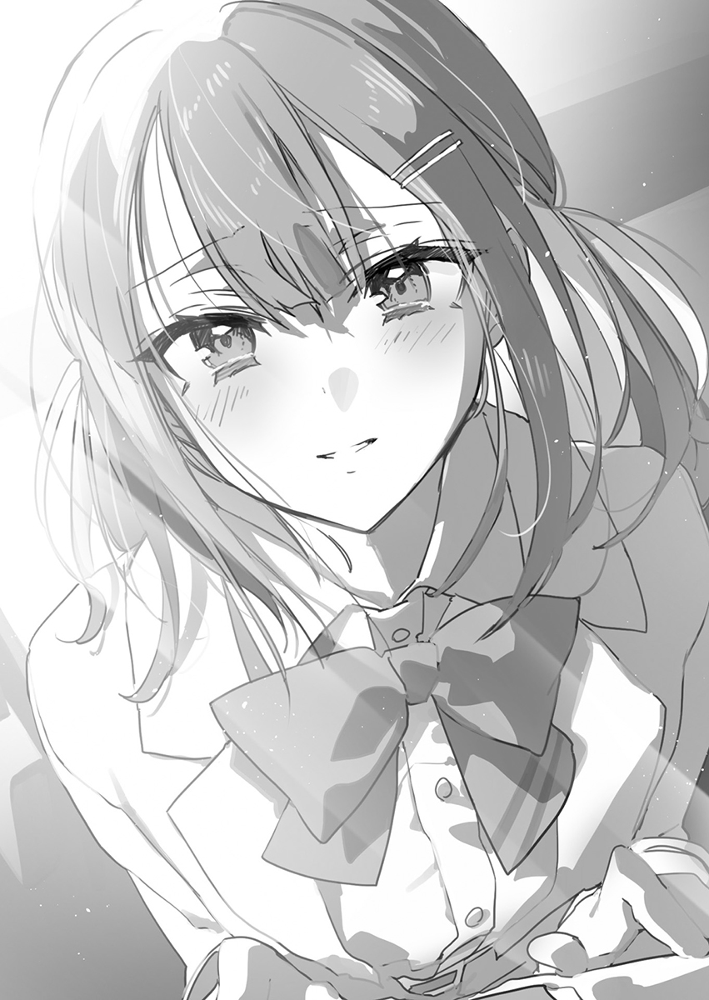

## 第七章 摇曳的灯火

「我明白了，原来悠璃小姐她是个碧池啊！」

我现在终于想通了。其实我为了搞明白老姐她为什么要吻我这个问题已经在昨晚进行了彻夜的思考，可惜的是直到天亮都没想明白。之后在学校里继续进行昨天未完的思考后，我现在终于得出了最终答案，那就是九重悠璃碧池说。

虽说到目前为止还没听说老姐有跟什么人交往过，不过毕竟她这种大美女肯定是很有异性缘的才对。别说有一两个男朋友，就算有十个二十个男朋友也不足为奇，这好像就是所谓的清纯碧池吧。虽然意外了解到了老姐的底细，不过请放心我不会因为这种事情就看不起她的！

「这次的考试结果，就只有咱们班的平均分高的吓人，所以我都来不及骄傲，首先感到的是害怕啊。」

小百合老师一脸困扰地说道。时间临近黄金周，考试的结果也下来了。

这么高的平均分也是理所当然的事。盛况空前的学习会的参加者一天比一天多，就连神代在这次考试中的发挥也还挺不错的。不过考试这种东西对我来说不过是小菜一碟。抱歉，忽悠你的。我只是想说出小菜一碟这句成语而已，因为你不觉得这么说很酷吗？

令人震惊的是，我这次考了全年级第三。事先声明，我可不是什么脑子特别灵光的人。能取得现在的成绩只是因为没有兴趣爱好的我也只剩下在家里读书学习这么一条路可走了，作为学生而言还真是个悲伤的独狼啊。

「没想到你这家伙学习也这么厉害啊」

「别跟我搭茬啊爽朗帅哥」

不是，为什么这家伙能一脸平静的跑来找我搭茬啊？那之前比赛上打的赌就不算数了吗？这不就白忙活一场吗，我又不是什么慈善义工。

「别说得这么冷淡嘛。你很厉害啊雪兔，我才考了个年级第十」

「你不也挺厉害的嘛。」

「我怎么听不出你是在夸我呢？」

「你要真是闲得无聊的话与其在这跟我掰扯还不如去跟神代她聊聊啊。」

「你再这么说的话我可要生气咯？」

「你是不是血清素摄入不足啊？那我建议你还是多吃点大豆或者豆制品之类的比较好。」

「我说美纪，这就是所谓的天龙人在凡尔赛吗……」

「这俩人也太过分了吧！？我明明考得差点亮红灯啊……」

「算了别惦记什么考试了！我说啊，大家要不要在Golden Week的时候一起出去玩呢？」

伊丽莎白她满脸堆笑的跑来搭话了。Golden Week是啥？哦，原来说的是黄金周啊，我可不是想要复读一遍，关键就在于是个大长假嘛。按照我的行动规律而言，每年的这段时间我都会被强行带到雪华小姐的家里。没办法，毕竟我不去的话她又会哭哭啼啼的。于是我就如同被邀请到龙宫的浦岛太郎一般在雪华小姐的家中备受款待。

「喂，光喜，她在邀请你呢。你们这帮现充可真是的。」

「我怎么感觉她也一样是在邀请你呢。」

「啥？怎么可能会有同学邀请我这么个阴暗角色一起出去玩呢？你这家伙少在这胡说八道了。」

「九重君也一起来吧！」

「我靠你别逗我玩啊……？」

「这是什么天崩地裂般的事情值得让你这么吃惊的吗？而且就算我想排挤你也不会当着大庭广众这么做啊！」

「啊，原来如此！排挤别人确实是应该背着别人做的事啊！不愧是伊丽莎白，啊哈哈哈。」

「我才不会做这种事情啊！？」

「没事的没事的，反正我都已经习惯了！请你随意的排挤我，没问题的！」

听到这话后伊丽莎白一脸的扫兴。奇了怪了，我这明明是在照顾别人的感受啊，到底有哪里做得不对呢？现在这般情形再次证明了只要我有这个人在的话就连身边的空气质量都会连带一起下降。只要我说上两句，周围的气氛就会变得这么凝重。我懂了，如果说污染空气的是PM2.5的话那我就是PM九重雪兔了，不夸张的说，我就是这个班上的总悬浮颗粒物了。那就不止得要空气净化器了，还得在我面前摆上高效滤网才行呢。

「难道说九重你很讨厌跟我们一起出去玩吗？」

「也不是这么回事，不过说到出去玩，到底是去干嘛啊？」

「没错，就是想想该怎么玩也很开心的啊！」‍‍‍‍‌‍‍‌‌‍‍‌‍‌‌

峯田美纪是一位辣妹，不管是外表还是言行举止都是辣妹那一路的，那她说不定就也是个碧池了。那这样的话，说不定她就跟老姐有着一些共同思维的吧。我是个单身狗而不是碧池，那肯定是完全搞不懂碧池那些行为原理的。不过峯田大概会明白她到底为什么会这么做的原因吧。

「峯田，你是碧池吗？」

「哈，哈啊！？你真过分啊九重，我才不是那种轻浮的女人呢！」

「啊，我搞错了吗？抱歉，我不该对你说这些不得体的话。」

「那，那个……你道歉道得这么诚恳的话我反而有点难办啊……我说，你突然问我这个干嘛啊？」

「因为我有个问题想要问你。」

「你，难道说……」

虽然面红耳赤的峯田在那小声的喃喃自语道「他问我是不是碧池来着，难道是想？」，不过我还是听得一清二楚。不是，她说的这个难道说到底指的是什么事情啊！就算我听清楚了她在说什么我也没办法回答她，毕竟我不明白她在说什么啊。

「昨天，悠璃小姐——老姐她突然吻了我一下，我觉得峯田你可能知道点头绪，所以想问问你这到底是怎么回事。」

在短暂的沉默后，班上同学们的鬼哭狼嚎充满了整个教室。

诶，怎么了！发生什么事了啊！？

&emsp;

我现在被人直勾勾地盯着。动物园里那些被圈养的动物也会跟我是一般心情的吗？

在下正是那个身处高二教室被当成宠物对待的男人——九重雪兔。

中午的时候，悠璃姐命令我到她的教室去。虽然近乎是被强制叫出来的，但我没有拒绝她的权利。因为悠璃小姐是常任理事国，而我则是非常任理事国。这个世界就是这么不公平。

悠璃姐让我坐在旁边的座位上，面对着两个女生——大概是老姐的朋友吧。

然而，教室中似乎还有几个人在偷听。啊，这不跟我的班上一样吗！

「你就是传说中悠璃的弟弟吗——一点都不像呢。」

「我也这么想，所以一直都在怀疑。」

「我说你啊，上次提出这种说法的时候都已经把妈妈她给急哭了，为什么还要老调重弹啊？」

「没错啊学姐，请不要说这么没有礼节的话！」

不妙，这是真的把老姐给整得动怒了。反正我一向不怎么坚持自我所以临阵倒戈换个说法也无所谓的吧。

「你这翻脸比翻书还快啊……算了，要问的事情还有不少。首先是那个啊那个。学生会长那档子事到底有多少是真的？」

没准这是我洗清流言影响的大好机会？

升到了二年级之后，就会对一年级学生产生相当的影响力。尤其是在悠璃姐在场的情况下发言的话，就足以让人相信说出来的内容是事实了。这可是千载难逢的机会。

「这是彻头彻尾的诽谤与中伤，而这些不实信息正对本人造成了巨大的困扰。我郑重声明，祁堂会长她并没有向我跪下并希望自己成为我的炮友，而是在向我下跪之后，提出来想要当我的炮友——」

「哈啊啊！？」

悠璃姐的愤怒值一下子到达了顶峰。这是鬼面吗？

【译注：这里是个PM梗（用恐怖的脸瞪着对手使其害怕，从而大幅降低对手的速度）】

「那个，小老弟啊。你说的这俩件事之间……有什么区别吗？」

「当然有啊。嗯，你看……主要是在顺序上有所不同，吧。」

「那这不基本都是事实嘛！」

这个教室里是不是有点嘈杂啊？遍地都发出「原来是真的……」这般声音。

「那个女人！我要罢免她。现在就准备提起不信任投票……」

「但稍等一下，照你的说法看来，学生会长她就没有亲口说过类似的话了吧？」

「可，可不是吗！虽然一直都让人挺担心的，不过那位学生会长应该不会说出这种了不得的话来吧。说到底大家还是放下心吧，都是以讹传讹罢了！」

「对对我也想起来了。会长说要我上了她。」

「这根本就不是谣传吧！这不是说得一清二楚连让人误解的余地都不存在了吗！」

「大中午的就确定了如此冲击性的事实……这个气氛可怎么办啊……」

不少学长和学姐都把座位调成指向我们的方向了，也不知道是不是在偷听。各位听众，大家中午好。

「然后，老弟你是怎么想的？」

「平心而论，战胜那个会长的概率也就只有一半吧。毕竟人家是个大美人嘛。」

「哈？」

「我是不会输给她的诱惑的。」

「你身边不是有我吗？」

「是是。」

我根本没有发言的自由权利。哪怕连宪法也不能庇护我了。

「对啊，说起来。悠璃在家里是什么样子？你知不知道？她现在可是相当有人气啊。」

「这一点我深有感触。」

「……你这么说我可高兴不起来。」

「又来了，又开始说自己对这些事情没兴趣了，好讨厌哦。」

悠璃姐的朋友们正微笑着煽风点火。

「悠璃姐因为被人喜欢又很有人气可是相当开心的哦？」

「——！对。我可是很有人气的。接下来你们就期待我好了。」

「我说……小老弟你就是悠璃的软肋吗？」

虽然学姐们一脸惊诧，但老姐怎么可能有什么弱点啊。

「然后，她在家里是什么样子啊？」

「悠璃姐在家里的样子吗？对了，经常就只穿着内衣。」

「你再不闭嘴的话我今晚就跑到你床上去睡，如果你不想这样的话就——」

「还经常穿着内衣就拿牛奶喝。」

「！？」

悠璃姐为我的发言而惊愕着——一脸难以置信的表情。

既然悠璃姐想睡我的床的话，我就只能去客厅睡沙发了。怎么可能拒绝的了她嘛。偶尔我也要体会一下新鲜的感觉嘛。

「啊哈哈哈哈！悠璃波涛汹涌的理由就是这个吗？老弟你可够有意思的！」

我想其实应该是遗传自我老妈吧。

「没想到你居然会想和我一起睡……我知道了。准备好了就去你那。」

「嗯？」

总觉得微妙地有些对不上，但这也算是常有的事。

「就算这么讲，这样一来SNS上估计又要闹一阵子了吧。光是最近老弟的话题就已经够多的了。」

「是这样的吗？」

「你都不知道吗？你在各种意义上可都相当引人注意啊。」

「SNS也好，群聊也好，自搜也好，我一个都不搞的。」

「因为这孩子基本都不看手机啊。」

「唉——现在这样的人还真不多了吧？不过，这样一来说不准也是个好事，万一看到了内容的话说不准精神会受到冲击。嘛，老弟的神经比较粗，所以应该问题不大才对。」

「那种东西不论从好的意义上还是坏的意义上都只是讲些自己想讲的话吧。还挺有意思的，之后再问你行不？」

「说起来你啊，喜欢我穿睡衣的样子？如果不喜欢也行。」

「我完全不懂这个问题要问什么。」

人类就是喜欢传闲话。这大概是一种自远古时期就存在的娱乐活动吧。

随着流言的传播，不断有人添油加醋，内容也逐渐变成了和之前完全不同的样子。

那到最后哪些是事实，哪些又是谎言呢？然而，流言还是不断蔓延，丝毫留不出供人辩解的余地。

这样想来，所谓的谣言就是这样一种失控的怪物吧。

是因为好奇心？抑或是纯粹的恶意？而无论是哪种情绪，本身都恐怖至极。

——恐怖到会让被卷入谣言的人最后遍体鳞伤的程度。

&emsp;

◇

&emsp;

现实中的学校出乎意外地让人觉得无聊。拥有莫大权力的学生会、以周刊一般的频率刊登新闻报道的新闻部、为维护校规而费尽心血的戴着臂章的风纪委员——这些统统都不存在。也没有什么黑幕担当的教导主任。风评被害也太可怕了，这算什么黑幕嘛。

然而，不该有这类事件发生的日常，却在这一天出现了变化。

揉着眼睛走进学校的我，发现教室内各处都嘈杂不堪。

在压抑的气氛中，所有人的视线都指向了我。总觉得好吓人啊！

「啊，九重你来了啊。早上好。」

「雪兔，你让我好等啊！」

爽朗帅哥少见地露出了踌躇的表情。

峯田、樱井和高桥等几个学生也全都挤到了我的书桌周围。

「九重你和砚川是一个初中的吧？所以我们觉得你应该知道点什么。」

「砚川同学几乎都不怎么细说自己的事呢。所以我们才在等你。」

「出什么事了吗？」

「果然雪兔你不知道吗？先给你看下这个。」

光喜把手机屏幕对着我然后划了一下。上面的内容让我不禁皱起了眉头。

「这是校园层级的底层在造反吗？」

「昨天一下子就传开了。」

上面显示的都是指向砚川灯凪的诽谤内容，文字令人难以直视。连初中时代的事情都被曝光了。恐怕对于砚川而言，这是绝不想再触碰的过去吧。虽然里面也有一看就知道是无根无据的谣言，但被大规模传播的信息中也有我不知道的部分。

「砚川脚踩两条船？我记得她说自己和学长已经分了……」

「你知道什么详情吗？」

「她自己是这么对我讲的。我也不觉得她在说谎。」

「果然是无凭无据的诽谤啊。」

里面还包含着让人能感觉到直截了当的私怨的幼稚内容。是故意造假，还是存在某些真实内容——目前的真相只有本人知道，但至少写了这些内容的那个人对砚川心怀恨意。唯独这一点我可以确定。

「……砚川同学没关系吗？」

「明明这种老土的搞法现在都不流行了啊。」

「这种搞法真是无聊。要怎么办，九重？」

「你们问我『怎么办』……这事情该砚川自己决定吧。」

你们是不是问错人了？就算找我问砚川的事也只会让我觉得难办……

虽然手法很下作，但泼脏水的水平还是太幼稚了。我不知道砚川是何想法，不过只要对方不直接动手的话直接无视掉也是一种应对方式来着。

虽然这不能确保事情就能够告一段落，不过对方也要冒着巨大的风险才能更进一步的做些什么。而一旦犯人的身份得到曝光，那么就有可能会遭到学校的处分。到底是不是真的有做到这个地步也要陷害砚川的人，这个人又是认真到什么份上，光凭目前的信息还看不出来。

然而——

「犯人就在我们之中！」

【译注：这里是金田一的梗】

随着我的高声宣言，班上的所有人都起了反应。原来是这样啊，抱歉。

「啊，啊？真的吗，阿雪！？」

「我只是想亲口说出这句话来着，但原来如此，犯人应该不在这个班上吧。」

「哈啊？怎么一回事——」

要说的话嫌疑人最可能就是砚川的同班同学。然而砚川并不是会成为霸凌目标的那种类型，也并没有什么小团体和她为敌。

而且以爽朗帅哥为首聚集而来的可是位于这个班中心位置的天敌开朗角色军团。要是做了什么不当的事，搞不好犯人的那一边会被排挤。

「嘛，也只能直接问砚川了吗？」

「也是呢……拜托你了，九重。」

「——嗯？所以为什么拜托我？啊，那个事要我来干吗？」

一头雾水的我被他们拍了拍背。所以为什么要挑上我啊！

然而，我的这一疑问最终还是徒劳地消失了。

砚川由于身体不适，没有前来上学。

&emsp;

「拜托你了九重。」

「真不行。」

我被班主任老师给叫到了办公室里还被塞了一手的作业复印本。不过这可不是要给我的，是要给砚川的。

「反正你放学之后也闲着没事做就帮老师干点活吧。而且你们以前是一个初中的关系肯定不错吧？」

由于砚川已经两天没来上学，作业的量不能算少。然而，这并不是我被叫过来的理由。

「拜托你了。虽然我对状况有一定程度的把握，但整个班上砚川会积极接近的人也就只有你了，再这么下去的话也很难办。当然，如果那个人还在继续投稿的话，我们这边也会采取对策。」

虽然小百合老师说得也没什么问题，不过我还是没有点头答应。

「就算您这么说，这件事我还是办不了。」

「为什么你要这么顽固地拒绝我的请求？我不知道你们什么关系，莫非其中还有什么理由吗？」

「我被砚川的家人禁止上门了。」

「禁止上门！？」

没错，正是这样。我在初中二年级的时候，被砚川灯凪的母亲——茜阿姨禁止上门了。过去我们两家之间的交流还算多，但如今却被她干脆利落地说「别再来了」。即使如此，我也曾在圣诞的时候被叫过去，事到如今这还算是我相当怀念的回忆。正因如此，接受老师的委托从现实意义上就难得要死。真的哦？

「你到底干了什么好事……」

「两边在见解上不一致。」

被禁止上门的理由，是我没有按照茜阿姨的期待行事。

而这件事不论灯凪还是她的妹妹灯织都不知道，而是我和茜阿姨两个人之间的秘密。

「啊，真是的！都说了只有你才能办这件事。我不管你干了啥才被禁止上门，但这次给我道歉去。还有好好听砚川讲话。哦对，请她喝杯咖啡。」

老师把作业硬塞进了我的手里，还丢给我一个一百块的硬币。老师啊，还差十块钱呢。

&emsp;

◆

&emsp;

最后我还是一肚子不情愿地过来了。那个任性的老师真是混账。

「说起来我两年没来了。」

我停在了挂有『砚川』字样牌子的正门前。上次我走到这就拐回去了。

真是烦啊……怎么办呢。平心而论，我一点往前走的想法都没有。干脆丢进信箱里然后回去算了。好像不行啊？于是我一边在心里不断拜托是由灯凪或是灯织妹妹来开门一边按响了门铃。

「……来了。请问哪位？」

「非常抱歉——！！！！」

我一看到开门的人就赶紧张口道歉跪了下去。这样一来就达成了先声夺人的效果，靠这个势头压过去！

「真是好久不见了啊茜阿姨！您今天也是相当的光彩照人哦。嗯，事情不是你所想象的那样。这是因为班主任老师她一直拜托我所以我才无可奈何的答应了下来。我绝没有任何藐视与您之间的约定的意思。您别担心，我保证之后绝对不会再出现类似的情况了。所以希望您这次可以通融一下下。您还是跟以前一样漂亮呢。对了，这是学校布置的作业还有混合装的软糖。同学们都很担心她哦。那乌鸦也差不要开始叫唤所以我就先走一步了。」

「雪兔君。」

奇怪啊，怎么没法往前走了？我打了个招呼想赶紧跑路，但却被从后面咔的一下抓住了制服领子。我战战兢兢地回过头，发现茜阿姨虽然笑着，但脸上却浮起了青筋。

「你·到·底·在·干·什·么·呢？」

「我想着呆太久了是不是打扰到您……」

看她这副生气的模样，就知道我刚才那套溜须拍马是没有起到作用了。

茜阿姨年轻到一眼看上去完全像是砚川三姐妹的大姐一般。作为一个为女儿着想的好母亲，禁止我上她家来也是理所当然的。

「我说你啊……哎。总之谢谢你能把东西给带过来。不过话是这么说——我本以为你不会再来了」。」

「我也想着只限今天一次。真的非常抱歉。」

我又一次深深低下了头。大概是对我的做法觉得讨厌吧，茜阿姨的眼神一下子锐利了起来。

「是你自己想要到这来的吗？」

「不是。刚才我也说过，班主任无论如何都要我过来，我也好好拒绝过了，所以原本并没有过来的打算，因为这是我和您约定好的。」

「…………这样吗。果然你其实不想来的吗。」

「是的。」

「……为什么你要这样！……没什么，什么事都没有。我想那孩子明天大概就会好起来吧。如果之后还请假的话，也不用再带过来了。」

「对不起打扰到您了。」

「拜拜，雪兔君。」

茜阿姨的表情歪扭了一下，但马上就恢复了。这样就好。终究不能把约定当成废纸。

她甚至没有送我，就这样静静地关上了正门。

&emsp;

我脑中满是想要发泄的愤怒情绪，不过还好，他也并没有那种令我生憎的情绪。

蠢死了，我们之间从来没有说好不准做什么，他应该是很清楚的才对。

明明他只要说一句「是为了我女儿才来的」或者「因为担心她所以才来的」，我就会欢喜地将他接进家里，然后留他一块吃顿晚餐，然后大家一起开开心心的聊天才对。

其实我为他今天过来而感到非常开心。那孩子一定也会好起来的吧。

明明是这样。什么叫我自己并不这么想？你真的是这么想的吗？你们之间明明那么融洽，却一点想法都没有的吗？我搞不懂，我既搞不懂他到底在想些什么，也搞不懂他真正的目的。

没错，这确实是我女儿自己的错，从结果而言落得现在这个下场也是她咎由自取。

所以我才希望他能够说些什么，比方说「下次我来帮你啊」，「就由我来保护你啊」，「我不会再离开你了啊」之类的。

纵使这只是我身为人母的自私想法，也希望能听他亲口说出来。我只是想要求个安心。然而在听到我试探性的表达后他竟然没有提出任何异议就这么接受了，也就放弃了一切。

从那之后他就再也没到这个家里面来过，就如同我所要求的那般。

也不知在学校发生了什么，最近开朗了不少的灯凪身体又出了状况，把自己关在了房间里。之前好不容易才看到了她的笑脸，还以为已经过去了，可偏偏就在这个时候出了这样的事。

「——啊，等一下，灯织！」

大概是发现他了吧，从边上绕过去的灯织冲出了家。

糟了。要是灯织知道我说过「雪兔君你别来这里了」的话，她只会大动肝火。

我想灯凪知道了的话大概也是一样的反应，但她们姐妹之间的争吵好不容易才有所缓和，现在这个样子只会火上浇油。那个时候的灯织相当吓人，就连我老公也是从一开始想要安抚她到最后也只能摆出大概是一副随你们好了的狼狈态度，一阵钝痛袭来，我按住了额头。真是麻烦死了。

包括我自己在内的我家所有人，都对那个从小看着长大的他在意到无法释怀。

&emsp;

「哥哥！」

「嗯，是灯织吗？」

其实在回头的那一瞬间，我所看到的那个人影像是砚川灯凪一般。

不过这是不可能的，因为在这世上会叫我哥哥的就只有一个人。

灯凪的妹妹，砚川灯织跑过来然后一把抱住了我。虽说她跟自己那个大美女姐姐灯凪一样都能看出跟茜阿姨颇有几分相似，不过姐俩并不是单纯的复制粘贴，灯织自己浑身也散发着自己独有的魅力。不过话虽如此，在她身上还留有一股初中生独有的稚气。

「我想死你了，哥哥！」

「许久不见了啊，请你吃糖吧。」

「好耶！」

我切换到了街坊婆婆模式，从口袋里掏出糖果塞到了灯织的手中。

「你是一路追过来的吗？」

「嗯，因为察觉到附近有哥哥的气息。」

「你这是哪门子的大师吗？」

她这说的就跟是自己什么功夫宗师一般。……说起来气息到底是个啥玩意啊。

「你是来探望姐姐的吗？那为什么不到房间里来坐会呢？」

「可不能随随便便出入女孩子的房间啊。而且我就只是把学校的作业带过来而已。」

为了不让灯织动怒，还是不要提被禁止入内的话题为妙吧。

「我可是随时都欢迎哥哥你大驾光临的哦？」

虽说行人稀稀拉拉的但这好歹是大马路上面，我说咱们能不能别抱住就不撒手了啊。

「啊对了，我问你啊灯织，你是不是跟灯凪吵架了啊？」

「那个……嗯，没错……。啊哈哈，是姐姐告诉你的吗？」

「她好像对此很困扰啊。」

「都是姐姐的错，是她咎由自取的。我到现在也没办法原谅她。」

刚才还笑容满面的灯织表情突然就变得很阴沉。

「而且还不只是这样。现在的姐姐她好像又变得很痛苦了。」

「有这么严重吗？」

「嗯，从昨天开始就把自己关在房间里面了。哥哥你是不是知道些什么呢？」

「我能猜个八九不离十吧，大概。」

说完，灯织就把我抱得更紧了。

「那个，我知道姐姐她真的很差劲。说真的她确实是个笨蛋。但是哥哥，你能不能帮一下姐姐啊？姐姐她能够信任的也就只有哥哥你而已了。所以我希望你能再重新审视一下姐姐。」

「我觉得她并不希望如此。」

「为什么呢？不会的啊，姐姐她一直一直都在等着哥哥的，因为姐姐她一直一直都对哥哥你……」

她那诚挚的目光击沉了我。说起来，她也说过同样的话。

然后我否定了那些说辞，把它们当做是耳旁风。

「当然，我自己也是这么想的哦？」

真是个小妖精啊。如此直率的灯织妹妹搞不好要比她的姐姐难对付得多。

&emsp;

啊啊啊没办法了！这可是灯织她拜托我的，而我可是个体贴的哥哥啊。

我在洗完澡后结束了今晚的学习。看了下离睡觉的时间也还早，那砚川她应该还没有睡吧。

打定主意后我拨通了电话。真没想到在如此之短的时间内就跟她联系了两次啊

『……雪兔？』

之前有听说她心情很郁闷，没想到电话立马就接通了。

可光是从声音听起来就知道她现在心力交瘁。虽说我本人的心理素质有如精金一般坚不可摧，不过这也并不意味着世上所有人都能做到我这般地步。像她那样被赤裸裸地恶意所攻击后遭受打击而变得身心俱疲说不定才是普遍的现象。

「你现在希望我能帮你。我应该没说错吧？」

『……啊？帮什么……』

「我说得直截了当一点好了。一周之内我就会解决。所以你明天开始必须来学校。」

『为什么……雪兔要……到底为什么……？』

「我说砚川啊，之前我就告诉过你了。在你遇到困难需要别人帮助的时候就说出来，不然我是无法了解情况的。不要什么事情都一个人默默承受。你有自己的家人，还有朋友们，大家都很担心你。」

听完，她的声调变低，开始呜咽了起来。

『为什么事情会变成这样呢……。我明明已经下定了决心，我已经决心不再犯下类似的过错了啊……』

我只是默默听着她这样支离破碎地诉说着。

『就是在之前，有人向我表白了。……可是，我已经很明确的拒绝了啊……。因为我不想要再背叛自己的心意……。我也想要变得坚强。不用再伪装自己也能站在你的身边，然后相互扶持。我想要跟你在一起。可即便如此……』

砚川向我吐露出她一直以来的想法

我面对这些真情实感的表露，开始了思考。

『我能问你一个问题吗？』

「嗯嗯。」

『如果……我是说假如，我真的如传闻中所说的那样，雪兔你也会对我伸出援手吗？』

「你说的跟我做的有关联吗？」

希望到头来会变成失望，期待最终也都会落空。

我在这样的循环往复中，放弃了自己所有的诉求。

可即便如此，若是有人向我做出索求的话，那稍微回应一下子也无妨。

因为我相信哪怕是我自己也有着这样的，这样些许的价值存在。

『可我不想这样啊。我不想再被这种目光审视了。我不想要被过去束缚……我不想离开雪兔你。我不想再伪装自己了！我一定会变得更加坚强的，我会做给你看。所以说，求求你。这是我最后的请求……那个软弱的我已经不存在了。所以说，小雪你可不可以再一次……』

她深吸了一口气，就仿佛是要说给自己听一般地大声喊道：

『——救救我！』

「好好休养身体，快睡觉吧。」

我挂断了电话，明天开始好像有得忙了啊。

真是奇妙，我明明一直都以为我俩不会再有任何交集了。

从那天，我的手被她甩开的那一瞬开始，我就如此认为。

&emsp;

◇

&emsp;

「怎么可能会有这种事！」

「太过分了……连阿雪都被牵连进去了……」

巳芳光喜已然出离愤怒。不，出离愤怒的并不止他一人。

班上的学生们都一样紧皱眉头，身为当事人的砚川灯凪更是面无血色。

这篇检举文是在昨晚出现的。

巳芳慌忙联系雪兔，却没有收到回应。虽然砚川的那件事也是如此，但这实在是难以原谅，因为其恶劣的程度已经超过了可以容忍的底线。无论如何都要帮助那家伙把犯人揪出来。

当巳芳正如此发誓时，却发现那个事件中心的人物跟往常一样飘飘然地上学来了。从他那面无表情的样子，看不出他到底对这件事是否知情。

「雪兔！快看这个。」

九重雪兔的身旁聚了好几个人，他看到同学们展示的屏幕画面一下子绷住了。

「这个是昨天传出来的。居然说是九重干的，这个人绝对不可原谅！」

「怎么办啊雪兔？要和老师商量下吗？」

没有人会相信这篇检举是真的——因为实在太侮辱智商了。

&emsp;

——它说，诽谤砚川灯凪的人正是九重雪兔。

&emsp;

这是条相当有冲击性的检举内容。因为自己在初中的时候被砚川灯凪给甩了，所以才捏造散播了这些毫无根据的诽谤内容，而所有对青梅竹马进行诽谤中伤的行为都是九重雪兔干的。

而且还不止如此。——九重雪兔因为对姐姐九重悠璃出手而被断绝了家人关系。

它绘声绘色的讲述着耸人听闻的内容，已经是纯粹的露恶了。

仅仅是为了诬陷九重雪兔这名学生，就用上如此卑劣的手段。

这种毫无可信度的言论根本不值一提，因为它单纯是个粗制滥造的谎言，就只是个露骨到没遮没掩的桃色八卦而已。

「雪兔……住手吧……你为什么……要这样，这样的话你也——！」

不知是不是哭肿了双眼的砚川灯凪瞪着红彤彤的眼睛，摇摇晃晃的走到了九重雪兔的身边。

显然，她现在正被极度的愤怒和悲伤煎熬着。

这个班里所有人都知道砚川灯凪她对九重雪兔抱有好感，所以她才无法容忍这种会破坏二人关系的谣言扩散开来。

九重雪兔才不是个会吃哑巴亏的人，他肯定会立即有所行动才对。

正是有着这样一个大致上的共识存在，所以才基本没有人会把这个检举当一回事。

「为，为什么会这样……不对！才不是我干的！」

「怎，怎么了，雪兔？」

在雪兔少有的狼狈样子之下，窃窃私语声如涟漪般在教室内开始扩散。

「不行啊雪兔！我不想要这种——！」

「砚川你相信我！真不是我干的！」

九重雪兔打断了砚川，逃也似的窜出了教室。

他在穿过走廊中那几个隔得远远想看热闹的围观者后，消失的无影无踪。

看到他这个样子，巳芳带着挥之不去的违和感坐立不安。

「那个笨蛋……这次他打算干什么？」

「从来没见过阿雪那个样子……」

「九重大概是震惊过度了吧。」

「没错啊峰田！就是这么一回事啊！」

在察觉到哪里不对劲之后，巳芳又转头向砚川问道：

「那个从来没看过网络社区一眼的铁石心肠的家伙，压根就不可能陷入那种震惊状态才对，更不可能会演些一眼就能被看穿的假戏出来。我没说错吧砚川？」

听完巳芳的询问，砚川的身子哆嗦了一下。

此时此刻只有砚川灯凪一个人明白了，她懂得了九重雪兔真正的目的。

她攥紧了拳头。仔细想来，自己一直都是被他保护的那一方才对。

（雪兔，你说过的吧。不要什么事情都一个人默默承受——要去拜托别人啊。对不起。都是我的错，让你受了这样的苦。所以我也没法让雪兔你一个人……默默承受这些。）

那个恳求雪兔想要他伸出援手的人也是自己才对。砚川讨厌这样软弱的自己，这就只是单方面的利用了他，让自己委身于他的温柔罢了。她对自己窝囊到只会被人所拯救感到愤懑不已。

虽然现在的砚川灯凪对此也并没有彻底了解通透，但她多少已经明了了几分。

那些流言之中，包含着一些只有砚川灯凪和九重雪兔才了解的真相。

她有些犹豫，因为这会让九重雪兔为自己所做的那些事沦为徒劳。

如果自己无所作为的话就是在否定他所做出的觉悟，可即便如此——

（……我也会变得坚强起来的。因为不管是被过去所束缚，还是无法伴你身边，这些惩罚都已经降临到我身上了）

所以我才要告诉他。一定会没事的。因为他很受大家的热爱啊。

「不好意思啊大伙，能我说两句吗？」

「砚川同学？」

这便是砚川灯凪的决心。

这位接连犯下过错的少女意志坚定，正为夺回自己所失去的一切而努力着。

一直在懊恼，不断地悔恨，这都让自己始终盼望着回到过去。

但现在的她终于意识到了，自己应该做的不是回溯，而是必须迈步向前。

而砚川所讲述的真相，让全班都陷入了沉默之中。

&emsp;

九重雪兔在校内是个知名度远超砚川灯凪的大名人。

光是最近一段时间他的名头就已无人不晓，因而事态也在一瞬间升级扩散。

&emsp;

◇

&emsp;

「呼哈哈哈哈哈！」

「你别板着张脸放声大笑啊，怪恶心的」

虽然爽朗帅哥丢来了相当无礼的吐槽，不过我心情不错所以就原谅他了。

在那之后的一周内，我每天都在传播着对九重雪兔的差评。

没错，一切的始作俑者都是我自己。不过话是这么说，到最后也没啥好写的了我就随便编了些内容敷衍了事。毕竟我的想象力也是有极限的。

类似『让学生会长当自己的炮友』『把同学当成宠物和母狗看待』『被大妈包养的小奶狗』之类的内容的话倒还好，『贴海报却不许钉图钉的人渣』『喜欢甜食的人渣』『在便利店买东西的时候一定会在柜台要个袋子』这种就捏他的有点多了。不过在如此不懈的努力之下，如今我已经成了学校里的第一人渣了。

我就跟让油箱里随时加满97

表面上看来我因为罪行暴露而从学校早退这个说法是可信的，但事实上我是去到保健室之后就早退离校了。我把自己所有的时间都投入到了自演工作之中。

可能是被我那人渣样给吓到了，班里的同学们这一周内基本都没有跟我说过话了。虽说爽朗帅哥还是老样子，但现在可算是回归了我本该的独狼生活。

你们都能明白的吧，我就是借着匿名这个优点窃取了属于犯人的胜利果实。

我的目的就是通过不断地发布新的流言，从而让诽谤砚川的那些话变成说不清楚的糊涂账。

不过这件事今天也该结束了。昨晚，我发送了最后的流言。

&emsp;

内容是——**九重雪兔正在威胁佐藤小春**。

&emsp;

「九重！」

隔壁班的男生怒吼着冲进了教室，一把抓住我的领口。

只要我在这挨上他一拳，那一切都可以圆满结束了。

九重雪兔这个邪恶的存在被正义击败。【完】←此处打字幕。

这简直就是无懈可击的惩恶扬善之举，任谁看完都会神清气爽心情舒畅吧。

他叫宫原秀一——也就是佐藤小春的青梅竹马。

&emsp;

事实上问题早在第二天的时候就已经被解决了。

一开始在网络社区中散布那些诽谤砚川灯凪的谣言的人，就是这位叫佐藤小春的女生。

她自首后一边哭一边道歉。她从头到尾的目标都只有砚川灯凪一个人，但在某个不知名者的干涉之下，突然之间完全无关的我却变成了犯人，之后大概是对那些激烈抨击我的言论感到害怕了吧。

就算她再次对砚川进行攻击，可只要是匿名发送的内容的话一切都会算到我的头上来。

更何况佐藤小春对此也颇为后悔，除了第一次以外就没有发布过别的内容了。在负罪感的煎熬之下她想要找到砚川坦白一切并且道歉。这就是这场骚动的来龙去脉。

听到她的话后，我陷入了苦恼——这样结束真的好吗。

虽然佐藤小春和宫原秀一是青梅竹马，但宫原秀一的心却已经不在佐藤小春身上了。

初中时，还参加着田径部的宫原秀一感觉自己才能有限，以受伤为理由退出了田径部。

佐藤小春却对此心生不满。对她而言，身为青梅竹马的宫原秀一一直都是自己视线的中心。哪怕他不能成为顶尖的选手也没关系，她就这样一直憧憬着宫原那努力奔跑着的身影，而这份憧憬在不知不觉中升华成了恋爱的感情。她想要看到一个帅气的宫原秀一。

然而，被佐藤小春不断催促回到田径部的宫原秀一产生了和她疏远的想法，并慢慢地开始跟她保持距离。然后他有了新的邂逅。而为了寻找新的邂逅，宫原秀一向砚川灯凪告白了。

在我跟女神学姐一块偷看的那天，向砚川告白的人就是宫原秀一。

而调查了砚川相关的信息，得知她过去发生了些什么的佐藤小春，也为了宫原秀一不被人给抢走开始了行动。

可这样做的代价也太大了，就连她自己也受到了伤害。

于是我选择了起手散布关于自己的恶评的这个跨时代的解决方案。虽说从途中开始就觉得很有趣于是干得很彻底来着，但这些都是马后炮。

然后趁着那些关于我的恶评正广为传播之际，趁机再放出我在威胁佐藤小春的传言。

效果立竿见影。担心佐藤小春的宫原秀一，为了拯救佐藤小春挺身站在我面前。

果然他们两人是青梅竹马。即使曾经错身而过，但两边都从心底珍视着另一边。宫原秀一绝不会对此撒手不管。

这场闹剧不需要什么真相。因为宫原秀一还**为时未晚**。

一股我尚不习惯的愉悦涌上心头，用那些丑恶的话语在宫原秀一的耳边轻声煽动着。

这样就好。这样才是对的。接下来只要身为万恶之源的我来承受这份报应就平安解决了才对——

「阿秀，助手！果然我做不到这种事！」

以悲痛的声音拼命阻止激怒的宫原秀一的——是佐藤小春。

&emsp;

◆

&emsp;

「九重，抱歉！我知道就算道歉你也不会原谅我，但是真的很抱歉！」

「砚川同学，九重同学，真的很对不起！」

嗯——？为什么会变成这样？

我简单勾勒出的计划已经破产了，目标也落了空。

大致上目标还是达成了。我就是为了这个瞬间，才制止了佐藤小春继续向砚川道歉。不管怎么样都得把宫原秀一给扯进来才行。

如果当时让事件仅限于在砚川和佐藤小春之间解决的话，那么无法承受压力的佐藤小春也就再也无法面对宫原秀一了。如果对宫原秀一隐瞒自己的所作所为，她大概会一辈子陷在后悔的情绪中出不来吧。

「然后，嗯。终于结束了吗？从头开始说明一切吧，雪兔。」

一切都只是九重雪兔对砚川灯凪的复仇。

「这样难道不好吗？」

「怎么可能好啊。我们可都从砚川那听说了。」

「砚川说的？」

「我们就这么不值得信任吗？就这么派不上用场吗？你还真觉得不论什么时候光凭你一个人就什么都搞得定啊。」

「毕竟对我也有好处的啊。」

不过是蛮横而傲慢的任性妄为罢了。大概这是光喜等人无法容忍的手段吧，但即使如此，我也打算将其活用到最大限度。

如果我是因为被甩了不爽才散播对砚川的诽谤的话，这些内容的可信度就消失了，也不会有人知道哪些才是真的。过去发生的事变得暧昧不清，也再也没有人想要去探查真相。

砚川灯凪的过去，就会变成只有她自己才了解的禁区。

然而，我做的事还不止如此。这个计划其实是有着相当大的好处的。

「宫原，我只想拜托你一件事。」

「什，什么？说什么都行！只要我能做到的话，什么都可以做！」

「加入田径部吧。」

「我说……你到底要为别人操心到什么地步……！」

呜啊……虽说对这个正用闪亮眼神看着我的宫原同学不太好意思，不过这可不是什么善意的表达。

目前为止有不少运动社团过来拉我了，不过这其中唯独田径部的那帮家伙最让人心烦。

所以我就决定让有真材实料的宫原秀一来当我的替死鬼！

诶？爽朗帅哥和神代怎么办？我才不管。那种事情让他们自己解决去。

这样一来不光砚川，连佐藤小春和整个人都像在冒烟的宫原秀一都得到了良好的结局。

最重要的是，背负恶评的我不会再有人靠近了，这样一来我终于可以回归理想中平静又安宁的阴暗角色生活了。终于可以和最近吵个没完的学校生活说再见了。

即使如此，要安抚气个够呛的悠璃小姐可是个难办的事。事到如今就算撕开我的嘴，我也不会说整件事是我的自导自演。

虽然到头来整件事情变成了一团乱麻，但最终还是完成了从一石二鸟变成一石五鸟的超级计划。

当然这也是因为我的精神强度已经达到了山铜（orichalcum）的级别才可能做到的。没有任何人受到损害，可以说一切都以应有的样子结束了。完美。喵哈哈哈哈哈哈哈！

事情到此结束——然而，她却不容许我这样做。

&emsp;

「砚亲，为什么还不回去呀？」

「别用这种奇怪的称呼！……我在等人。」

放学后，我被小百合老师叫去询问整件事的经纬并且接受了她令人感激的说教，回到教室时发现里面就只剩下了砚川一人。

教室被从窗边射入的夕阳光照染成一片茜色，而砚川的双眼映照出绯红色的光辉。

这让我顿生怀念之情。说起来，以前似乎也看到过同样的光景。

没错。那一天，她的确也是向这个样子——

头嘎吱嘎吱地疼。看来积累了不少疲惫啊，这让我想要补给点糖分。

「嗯——你在等人吗。趁着天色还没完赶紧回去吧。」

「为什么？我等的就是雪兔你啊。」

「——等我？」

「那个——谢谢你。」

「不过我只做了会让你讨厌的事吧。」

「呵呵。也对呢。真的是这样。最讨厌雪兔了。」

教室中陷入了沉默。不知从何时开始，我俩就没有再这样相处过了。

不，也许这只是我的舞会，这样的时间从来就不曾存在过。

「我对你做了很过分的事。对不起。」

「……嗯。」

「已经不会再有人去探查你的过往了。」

「……嗯。」

我不知道砚川她到底害怕自己过往中的什么东西。

在我一心一意地打着篮球的时候，从没有向她看过一眼。

如果砚川那时正痛苦着的话，我并不是没有注意到的机会。然而，到头来我却抛弃了她。

我和宫原秀一不一样。正因如此，身为砚川的母亲，茜阿姨才原谅不了我。我想这也是理所当然的。

「以后你也能找到出色的对象吧。能入得了茜阿姨的法眼的人。」

「……」

砚川已经不要紧了。今后她也能挺起胸膛在阳光中不断前进。

她不该再接近像我这样被人讨厌的家伙。因为，她有自己所相称的归处。

「——嗯——！？」

视线突然被黑暗笼罩，一下子让我大脑陷入了空白之中。

砚川的脸庞出现在了我能够感受到她呼吸的咫尺之间。

纵使我想出声，却发不出声音——嘴唇被堵住了。

「——……好远。我明明从前就一直在你的身边，现在却无论如何都传达不到了。」

嘴唇缓缓地分开。肺脏为了吸入新鲜空气不断往复着收缩。

「……你做了……什么……」

「——那一天，我心中的灯火熄灭了，我走进了一片漆黑的路上，只觉得好冷好冷，想要追随你那温暖的身影。你觉得我为什么会选这所高中？其实是雪兔的妈妈告诉我的。——如果是悠璃姐的话，大概不会告诉我吧。」

砚川一边苦笑，一边滔滔不绝的诉说着。她那绯红色的双眼摇曳生辉。

「拜托你了。接下来，请到我的家里。」

——站在我面前的，是我所不熟悉的砚川灯凪。

&emsp;

◆

&emsp;

「姐姐，不抓紧的话可就没时间了，你知道吗？」

「嗯，嗯。」

「哥哥的话一定没关系的。我和他约好了。」

这已经是我妹妹灯织不知道第几次催促我为我出谋划策了，而在之前有段时间我俩之间的关系真的闹得很僵。不止是妹妹，就连我的父母也对于我背叛了雪兔这件事非常地生气。

我的父母不仅是认识雪兔，而且还很宠他。我家只有我和灯织两个女儿，而爸爸他好像很想要一个儿子，所以对于爸爸而言雪兔就像是他的亲生儿子一样，他俩之间的关系亲密到还玩过接抛球这种亲子之间常玩的游戏。当时我们之间的关系非常融洽，一有时间就会黏在一起。

我家里所有人都知道我喜欢雪兔这件事。

所以，他们更无法原谅我对他的背叛。而之后所引发的一系列事件，更是让我如同坠落到地狱一般饱受折磨。

我从来没见过爸爸妈妈他们能这么生气。不过这对我来说说不定是一件好事，如果没有人对我动怒的话，连我自己都无法释怀。

「哥哥他在我们初中都成为话题人物了呢，说是高一那边出现了个怪咖来着。」

「那肯定指的就是雪兔呢。」

灯织比我要小两岁现在正在读初二，她之后也想跟我就读同一所高中。

要说连灯织他们都知道的怪咖高一新生的话，那就只有可能是雪兔了。虽然从我们入学到现在仅仅只过了一个月左右，但九重雪兔这个名字在校内已经是无人不晓了，他的名气大到甚至专门有人跑到我们班的教室来一探究竟。

「姐姐，你真的没做过吧？」

「没做过啊！我怎么可能做这种事啊！」

「要是让我知道你是在说谎的话那我马上就跟绝交。要是你真的背叛了哥哥，出卖了自己，跟那种莫名其妙的人渣做了的话，那真是又脏又让我恶心。」

「这一点我自己是再清楚不过了！」

「都怪姐姐你伤害到了哥哥，哥哥现在也没有再到我们家里来了。我明明想让哥哥教我功课来着但哥哥他跟以前不一样了，总感觉他跟我之间的距离比起以前要更加遥远了。要是再这样下去的话我跟哥哥就变要形同陌路了。」

「灯织啊，青梅竹马，到底是怎样的一种关系呢……」

我真的很讨厌自己。对自己的愚蠢和任性妄为恶心到想吐。老是这样给他添麻烦，让他不省心，伤害了他，又背叛了他。然而，他却还是愿意来救我。

然后——奇迹发生了。我简直不敢相信。

只用了一瞬间他就拯救了我——就如同魔法一般。

因为他所说的谎，我的过去变得模糊不清，消失在了时间之中。

然而，我却看不下去他那讲着口不对心的台词，伤害自己的样子。

围绕雪兔的恶评不断扩散，在一般人看来简直如坐针毡。

剥开自己的内心，再在上面刻下伤痕。

一般人根本承受不住这样的行为，而做出这件事的，恰恰又是他自己。

他对自己进行诽谤中伤的贬低行为——我完全弄不明白他这样做到底有何意义。

……一定只有他自己知道。

我在之前都只顾着自私地考虑自己，既不知道也不想知道雪兔他的感受。

当我从樱花阿姨那里听说他要上的高中时，也曾听她讲过一些事情。

这让我泪流不止——我们在一起的漫长时间里，我竟对此一无所知。

雪兔他会变成现在这般模样并不只是我一个人的错。但这也并不是我的免罪金牌，我沉重的心情也不会因此而轻松一分。

不如说反而加重了我对伤害到他这件事的负罪感，每当看到快要坏掉的他的时候，我都会觉得害怕。这明明就是我有生以来做过的最后悔的一件事，但现在我比之前还要更加地痛苦。我是伤害他的其中一人，也是让他更痛苦的其中一人。

无论最终结果如何我都必须要亲自跟他好好说清楚才行，如果不这么做的话我是无法向未来迈进的。就算我会被他讨厌也好被他拒绝也好，我都必须要告诉他。

「——我会改变的。不是别人，而是我期望中的自己。这次由我来拯救你。」

我并没有背叛他，不管是我的灵魂还是肉体都是属于他一个人的。

他的行为简直就是自我惩罚。这样下去，总有一天他一定会从别人的面前消失的。

我就这样喃喃自语着。不要再逃避了，不要用害怕被他讨厌为借口继续逃避下去了‍‍‍‍‌‍‍‌‌‍‍‌‍‌‌。

——这就是砚川灯凪真正的样子。

「直率一点吧，砚川灯凪。不要再心怀那些会伤害到别人的恶意了，所以就算青梅竹马注定会沦为败犬，我也一定要——」

就算这样，我还是深爱着他。

这就是我再也无法压抑住的心意——

&emsp;

「等你好久了，雪兔。」

「之前我一直惹你生气呢……」

「怎么了？」

「……没什么。」

我又来了。短时间内的再度访问。这下可是触了茜阿姨的逆鳞。

我来这是因为砚川之前在学校的时候恳求我来她家里一趟，所以也没办法对吧？

这还是我第一次见砚川那么拼命的拜托别人，所以也无法坐到无视。

严守回家部准则的我在放学之后是绝对的自由时间。可就算这么说我平时在放学以后也无事可做。

嘛，今天可真是遭罪啊，肚子又饿脑袋还疼。

以前我经常跟她一起玩，所以也经常到这个家里来做客。我们家在搬到现在所住的公寓之前也是住在这附近的，所以两家人也经常来往。

现在想来，那既是一段令人怀念的记忆，也是一段无可挽回的时光。

砚川说要准备一下，让我稍等片刻。不过等到我收到联络通知的时候已经等了半个小时，这时已经过了晚上七点了。

「真对不起，把你叫到我家来。」

「拿着，这个给你。」

我将之前在游戏厅消磨时间的时候发现的大号糙熊（命名者：九重雪兔）交给她。灯织妹妹和茜阿姨的份也在一起。这就是所谓的溜须拍马。

「谢、谢谢你！……以前你就很擅长这种事呢。」

「你只要叫来店员让他调整一下位置的话马上就可以抓到了。」

「这，这样吗？灯织也会很开心的。」

砚川把我迎进门，穿过了玄关。

她那僵硬的表情，让我感觉状态似乎不是很好。

「如果你不舒服的话那我就下次再来叨扰吧？」

「没事，我没事的，你不用担心。」

她带着我穿过客厅，走进了她自己的房间——相比我记忆中的样子，已经发生了相当大的变化。接着我就在她准备好的坐垫上坐了下来。

「我有多久没来过你的房间了啊？」

「大概有三年左右了吧。」

「真怀念啊，我还留有印象来着。」

「这样吗？我倒觉得变了不少，不过雪兔你这样说的话就这样吧。呵呵。」

不知是因为在家里放松了下来，还是因为问题依然解决，砚川露出了许久不见的自然笑容。

她长叹一口气后把身子坐直。

「三年的话，好像也没多久嘛。伯父伯母今天不在家吗？」

……尤其是茜阿姨。她应该不在吧？

「他们都在的，不过他们说仅限今天的话可以交给我一个人来处理」

「这不是在家吗！」

完蛋啦！不过交给她的话也行吧。……等等，把什么事情交给她啊？

虽然我很想开口问这是什么意思，不过这也跟砚川把我叫到她家来有关。

那还是等她自己开口比较好，这样也能稍微轻松点。

「……真的就像那个时候一样呢。」

真是难得，我想要说的话跟我脑中所想的事情是对上的。

这对我来说已经是一种非常罕见的情况了。可能是因为看到以前的东西念旧所以才让我的内心稍微诚实了一些吧。

「非常感谢你今天能到我家来」

「毕竟你都这么求我了。那你找我到底是有什么事呢？」

「我有些话想要告诉你，然后就是想让你看看我的样子——」

砚川仿佛下定了决心一般开始脱起衣服来。

我还没来得及阻止，她就已经脱掉了制服，连内衣都已经脱下，变得一丝不挂了。萦绕在房间内的甜蜜气息，刺激着我的大脑。

我只能就这么目瞪口呆的看着这一切发生——看着砚川这如同精神错乱一般的行动。

不过我还是能看出，砚川的身体正在微微颤抖。

「你疯了吗砚川？」

又是脱口而出说出了这种傻话。疯了的人明明是我才对，崩溃的人明明也是我才对。我刚才说的话大概是很有问题的，虽然我不知道为什么说错了，但我心里明白肯定是说错了。

有女性赤身裸体的站在我的面前，她想要听到的肯定不会是我所说出来的毫无情趣的粗鄙之语。可是，这种情况下我到底该怎么说才——

「我没疯，那时的我才是真的疯了！而现在的我很正常。」

「你在说什么啊？」

「从那之后我每天都重复着以泪洗面再哭到累得睡着的日子。因为这件事我不仅被妹妹讨厌了，还让家人给臭骂了一顿，最后——还伤害到了你。」

「我不太明白，你是做了什么错事吗？不过这也跟我没什么关系啊，毕竟从那天之后我跟砚川你就没有什么交集了。」

「不是的，这一切都是我的错。因为我无法坦率面对我自己的心意，却想要知道雪兔你对我的感情，我就这样一言不发的逼迫着你，这就是我犯下的，让我后悔至极的错误。」

她在说什么啊？她这说了些什么乱七八糟啊，虽然每个字都认识，但是我完全不知道她到底想要表达什么，明明这两年来我都和砚川再无瓜葛了。

可别小瞧我，我可是能熟练使用英语进行对话的通晓双语的人，不管是英语还是日语我都考了95分以上的。就连我都无法理解她在说什么的话，那这就肯定已经超过学生能够理解的范畴了。

但是砚川的眼神中完全没有疯癫的痕迹，这就是我跟砚川之间最根本的区别，而砚川就用她那如同黑曜石般深邃的眼睛就这么直勾勾的盯着我说：

「雪兔，我没有跟学长发生过关系哦。」

&emsp;

「雪兔，我没有跟学长发生过关系哦。」

我把自己的身心都暴露在了他的面前，因为已经没有什么要遮遮掩掩的东西了，那个不坦率的我已经死了。

绕了这么大的弯，多走了这么远的路。

我现在只想缩短距离，把自己的一切都告诉他。

在连同羞耻都已经感觉不到一丝一毫的状态之下。

「请你好好的看着我，眼神不要躲躲闪闪的了。我就在这里，就在你的眼前。」

「你为什么要这么做呢？」

「我不想再让你产生误会了。」

「误会？」

「从一开始我喜欢的人就是你，雪兔。」

为什么之前我就连这么简单的一句话都说不出口呢？

只是做出这样的事，就让我别扭到了这种地步。

那时的我心中充满了焦虑，因为我明明屡次向他示好。

然而，雪兔还是一脸冷淡毫无反应。他会不会根本就不喜欢我呢？因为跟他在一起的时候我从来都没看到过他的笑的样子啊。

一想到他跟我在一起的时候会不会感觉很无趣这个问题，我就会变得非常不安。

胆小又懦弱的我不敢向他表白，却又只想要知道他对我到底是何样的感情。

而正在这时学长他向我告白了。我自认为可以利用这一点，于是告诉了雪兔他学长向我告白的这件事，但他却还是如同往常一般波澜不惊的回答了我一句「是吗」。

我只想喊出声来。难道说哪怕我跟学长交往了他也无所谓的吗？他心里到底是怎么想的？雪兔的意思是哪怕我被别人抢走他也无所谓的吗？于是备受打击的我，在悲伤情绪的驱动下，想要抓住最后一根救命稻草。我想如果自己跟学长真的交往的话，他一定是会心生嫉妒的。

我就这样思考着这种可能性，丝毫没有发觉愚蠢的自己已经走上了错路。

如果那个时候的我能像现在这样坦率的话，事情就不会变成今天这副模样了。如果那时候自己能跟他坦诚相对，用自己的真心去打动雪兔的话就好了。

但最后我却选择了利用学长而不是自己亲口告诉他的这条最差劲的路。明明自己对学长并没有任何的感情，甚至不知道他是个什么样的人，就把他当成了一个查探雪兔对自己是什么样感情的工具人。

而这个错误的选择很快就让我追悔莫及。在我告诉雪兔自己已经跟学长交往了之后，他也告诉我他准备向我表白的事。听到这件事后我目瞪口呆。

为什么，为什么他就不能早一点告诉我呢？

此时的我想要抛下一切，来回应我一直想听到他说出的话。

但事到如今除非我彻底跟学长撇清了关系，否则是无法回应他的。

而这件事，让雪兔的眼神变得更加阴郁浑浊了。

在跟学长交往的两周时间当中，我跟他并没有做过任何恋人之间做的事情。

这是理所当然的，因为我对学长他并没有好感可言，可以说完全没有任何兴趣。

对我来说他就是个可有可无的人罢了。我已经知晓了雪兔对我的感情，事到如今学长对我来说就只是个麻烦而已。如果我之前稍微上点心对他进行一些调查了解的话是绝对不可能想要跟这种人交往的。一切都是我自作自受。

在某一天也许是被我的态度感到不耐烦了，学长他试图要强吻我。

好恶心啊！滚啊！我不想跟这种人接吻啊！我只想跟雪兔他！一想到这我浑身就不寒而栗，等回过神来才发觉自己已经在心中那强烈的不想被他所玷污的想法驱使下把他给狠狠的推开了。受到惊吓的我，赶紧逃离了现场。

回到家中之后，我发了一条短信给学长提出了分手。

也是在这件事之后，那个我跟学长已经做过了的谣言开始传播了。

学长他为了泄愤，开始到处宣扬他已经跟我做过了。

而这个谣言也很快就散播了开来，因为对于身处青春期的初中生来说这就是他们最津津乐道的事情。虽然我坚决否认了这件事，但这种辟谣也只能影响到自己周围的交际圈。

因为我的脸皮还没有厚到能去跟陌生人说什么我没有跟他发生过关系这种话，而大多数人在传播小道消息时，也并不在意事情到底是真还是假。

之后的谣言更加过分，而我和学长之间本不存在的关系也越来越深。

男生们每天都打量着我的身体，那淫邪的目光如同舔舐着我一样。

交往是一种契约，只有双方都认可才能成立。分手作为破坏契约的形式，自然也遵循相同的道理。

接受了学长的告白，却没有做出任何像是恋人一样的事情，也没有承认过他是自己的恋人，最后单方面地提出分手。全都是我的肆意妄为，遭到报应也是我活该吧。

学长也有他的自尊，这才没有立刻向我提出分手吧。

虽然俗话说什么谣言不过月，但是在两个月后，这个谣言却反被人认定为了事实。我不停的咒骂着学长，咒骂他为什么要散布这种过分的谎言。

可在这一点上我也一样，我也是一个为了利用被人而接受了自己并不喜欢的对象的告白的混蛋女人。

也许对于差劲的学长和同样差劲的我来说，这才是最恰当的结果吧。

而且不仅是我的妹妹听说了这个传闻，最后甚至还传到了我父母的耳朵里。我的妹妹她非常喜欢雪兔，也正因如此她才会用一种陌生的，就像是看着什么垃圾一样的眼神看着我，用一种看见了脏东西的轻蔑的眼神看着我。

之后我还被父母叫去询问，而我当然也坚决否认了这件事，否认了跟学长发生过肉体关系这件事。

但不管是妹妹还是父母仍然对我的所作所为乃至整件事情感到非常地愤怒。

——接着他们问道：

「雪兔君他知道这件事吗？」

我绝对不想让我最喜欢的那个人知道这件事，而且我希望他并不会相信这个谣言。

然而这不过是我一厢情愿的妄想。这件事流传得实在是太广整个学校已经无人不知了，所以雪兔肯定也已经听说了。

而且哪怕只是被我利用的工具人，那在名义上我和学长之间也是情侣关系，所以哪怕真的发生过关系也不足为奇。这样一个事实也大大加深了这个谣言的可信度。

我必须得赶紧跟他解释清楚才行！但与心中的这股焦虑所不同的是，我也害怕看到雪兔他也跟我妹妹一样用那种眼神看着我。这种恐惧使得我不敢去找他搭话。

因为我实在是无法承受不了，这种眼神中的压力。

如果他也用这种轻蔑的眼神看着我的话，我就——‍‍‍‍‌‍‍‌‌‍‍‌‍‌‌

我开始亦步亦趋地跟在他的身后，可他却一脸毫不在意的开始沉浸在了社团活动中。这件事让我倍加地痛苦。

难道你的心中已经没有我这个人了吗！？——求求你，救救我吧！

可这些悲痛的呐喊最后还是没能从嘴里说出来，我的心就这样在那时碎了一地。

十分珍惜雪兔的悠璃姐也在震怒之下不许我再接近他。

当我注意到自己背叛了各种各样的人时，一切都已经太晚了。

不知何时，谣言已经变成了公认的事实，我和雪兔之间的关系也自然湮灭。他如同去了更远的地方一般，和我成了互相隔绝的存在。

「这都是我的错……是我想要利用别人，都是我任性妄为。你一定在笑话我吧。真是个无可救药的渣滓。一切都是我的错……」

然而，如今我明白。就算没有学长那档事，当时傲慢的我也总有一天会伤害到他。就如同无法坦诚面对他的我，一直做出的事情一般。

他就这样一言不发默默地听着我的忏悔。如果在那时候我就这样马上告诉他的话，事情也肯定不会沦落到现在这个地步。他一直都在认真地聆听着我说的每一句话，错的是没能够直面他的我才对。

带着不甘的心情，我一直追逐着他，直到这所高中。因为我在茫然之间有着确乎其实的预感。

这一定就是最后的机会了。如果放过的话，我们之间的关系就彻底结束了。

决意改变的我，却又一次被过去的亡灵拖住了脚步。

虽然我不知道该怎样才好，但雪兔却还在那里。他露出一如既往的表情，如同什么都没有发生过一般向我伸出了手。

纵使夏祭的那天，我曾挥开了他的手。

已经够了吧，砚川灯凪。该让这份后悔结束了。

所以——

「——我会证明给你的。将我的一切都交给你。」

&emsp;

抱着我的砚川，就这样倒在了床上。

我和砚川如今正面对着面，就像是我将她压倒了一般。

被囚禁在砚川眼中的我，如同被锁链缠绕一般连手指尖都动不了。

「砚川……？」

「——我一直等待着这一天的到来。虽然我其实做着更加浪漫的梦，不过对不起了哦？因为在我看来，已经没有这样的时间了。」

——啊，你如今已经能笑得这么漂亮了吗？

既不是小时候天真无邪的笑容，也不是那时不高兴的表情。

「……不用这么着急的。冷静下来。……用不着你证明，我……」

「正因为是不论何时都会成为我的同伴的你，我才想和你做的。不是和其他人，而是和你——雪兔相互触碰。这不是我在说谎。我已经不想再说谎了。所以来确认吧——感受我的全部吧。」

对砚川而言，这应该是相当宝贵的事物吧。

光是她为了证明自己什么都没做过这一点，就让我做不出她希望我做的事。

“——不，不是哦。来碰碰吧。光是这个瞬间做这样的事，我就已经很高兴了。”

她将我的手与她的手交叠，放在胸口。身体越来越热，心跳的速度也越来越快。

“是这样吗，终于想起来了……为什么我会忘掉呢——明明我们小时候，总是像这样牵着手的……”

泪水从砚川的双眼中不断涌出。

我也想起来了。幼年时的我们从来都是心灵相通，根本不需要用话语来传达各自的想法。如同将断掉的线再系成绳结一般，我们正这样脆弱的连接着对方。

虽然砚川所说的这些让我大吃了一惊，不过在听完之后也确实能够接受。

在当时我一厢情愿的认为事实就是如此，所以也错过了很多机会来察觉到她那奇怪态度背后的原因。砚川说她不想让我知道这件事。所以如果在她不愿意贴近我的情况下由我来主动关心她的话，说不定这件事在当时就得以解决掉了。

可惜的是，当时我的眼中没有她的存在。

但是也正因为听她说了这些事情我才会想着。

为什么，为什么呢——

「你……为什么，事到如今才……？」

「因为我是个胆小鬼，因为我不够坦率才会……」

「为什么直到现在才告诉我呢？」

「因为我感觉现在还为时不晚啊。」

为什么啊！为什么事到如今才！

「如果是在当时的话我肯定会接受你的告白，不过，现在的我已经——」

我回忆起来的景色，不论何时都是一片绯红。

我在那一天就已经领悟到，付出也并不会有回报。

想要索求某物，却得知自己无法得到它，于是选择了放弃——然后也就失去了它。

哪怕我被她追求到这种地步嘛，还是无法接受她的心情。

如此美丽的她，和「不幸」并不相配。

此时我的脑中传来了前所未有的剧烈疼痛。

不行啊，不要坏掉啊，不要让它坏掉啊。现在无数的思绪在我脑中复杂的交错着，如果任由它像往常那样坏掉的话，那我什么都不需要再想了。这样的话，这股剧烈的疼痛也就会消失不见了吧。

那还是让它坏掉好了，让我做回那个哪怕魔王下令说让我毁灭半个世界也会毫不犹豫答应的九重雪兔吧。如果就这样坏掉的话，我就没有什么需要在意的了。我是，我要，我该……

原来九重雪兔是这样的吗？他是什么时候变成这样的呢？

还是坏掉吧，快点坏掉吧。我能感到心中的空虚变得越来越大。

所以我才总是会这样坏掉。可是如果我一直以来当做只是误会了别人的那些感情并不是误会的话，那我到底在做些何等残忍的事啊……不可能的。

这一切都是我的幻想，都是假的。我已经不想再思考了，赶紧放弃吧，就这样坏掉就好了。

我长期无视掉他人对我的感情说不定就只是我的一种防卫本能罢了，因为我不想面对所以才一直这样发生着误会。但是事情真的是这样吗？

砚川的心情、想法、感情，化为巨浪流入了我的心中。

这种感情虽然摇摇欲坠，却温暖到让我不想丢掉。

「雪兔，你没事吧！？你现在脸色很难看哦！」‍‍‍‍‌‍‍‌‌‍‍‌‍‌‌

她不再遮掩自己的身体，毫不在意自己的裸露开始关心起我来。

为什么，她为什么要这么做呢？

对她而言赤身裸体是这么无所谓的事情吗？

为什么事到如今了她才跟我说这些？

是想让我难受吗？如果是这样的话她现在为什么又会这么心痛地关心我呢？

就在我即将崩溃之时，脑中却有什么保险给我踩了一脚急刹车。

有什么在强迫着我，让我无法舍弃这段纠葛。

我不想坏掉，我不想再误会其他人了，再这样下去的话我一定会追悔莫及的。

不对，说不定现在其实已经为时已晚了。但即便如此，我还是不想要伤害到别人也不想被其他人所伤害。两股大相径庭的思绪在我的心中翻腾着。为什么我会因为命犯桃花这种蠢事而变得现在这么的痛苦啊。

我完全无法理解，什么叫无法面对？我到底是不知道还是不想知道呢？这世间的万物都没有意义，而这股空虚也想要让我融入其中。而我也被这股能够蛊惑人心的欲望所支配，是啊，说不定让自己融入空虚的话就可以轻松一些，这样的冲动实在是太甜美，又太迷人了。

是啊，如果我死掉的话就能——

有人轻轻的吻住了我的嘴唇，这已经是我第二次体会到这种感觉了。

但这跟那时候又是有着些许不同的味道。甜美而令人心醉的刺激不断吞噬着我的思考。

「已经没事了！我是绝对不会再伤害你的！」

砚川哭着说出了这句话。她为什么会哭呢？有什么伤心事吗？

还是说身上有哪里觉得痛呢？或者说是因为砚川的泪腺出了什么问题吗——

哈哈，我懂了，肯定是因为没穿衣服所以肚子着凉了吧？

我想着这么些有的没的，可当我理清自己的思绪后才发现不对劲。

不是这样的……不对啊，应该不是这样的啊。

我为什么会想要发生误会呢？我为什么要曲解她的意思，她现在明明为了我在……

我是从什么时候开始变成这样的？我是从什么时候开始被人诱导成这种思维模式的？被谁？为什么要这么做？我就是九重雪兔，九重雪兔就是我……

「砚，砚川……不对，灯凪……？」

「嘿嘿，你终于用名字叫我了呢。太好了，我的初吻对象是你。」

真的要抹消掉她的这张笑脸吗？要抹消掉刚才还梨花带雨的她吗？如果把这些都抹消掉的话那我就可以继续扮演那个平时的九重雪兔了，这样的话——

我的头痛变得愈发激烈，我想要抹消它，但我又不想抹消它。

她突然紧紧地抱住了我，我们就这样肌肤相亲了。

我想知道她为什么要这么做，但硬要说的话她刚才就已经把这么做的原因都告诉我了。

有股恶意一直试图使我崩溃，一直试图让我的境遇变得更加糟糕，而我也一直就这样在失去着什么东西。这样就好，这样的话我也能接受，我也并没有在介意什么。

不过我肯定也有着那一定不能失去的东西，应该也有着那些不得不去在意的事情。就算我并不知道那到底是什么东西，就算现在已经为时已晚了，但也一定有这种我所不可或缺的东西——

「……灯凪，我怎么不记得你是这种性格的啊？」

「我可是你的青梅竹马哦，而且那个不坦率的我已经死了。我不想就这么输给别人，我不想就这么在伤痛中让一切都结束。」

好像有一种说法，说青梅竹马都不过只是败犬。

「因为我就是这么深爱着你啊——！」

我想要相信，她笑着说出来的这句话并没有在骗我。

&emsp;

◆

&emsp;

「——！」

我好像听到有谁在叫我。但我并没有去管它，自己反而被眼前的景象所深深的吸引住了。我眺望着远方那美丽的景色，眺望着那似乎吞噬了万物的天空和地面。我的身体也不自觉地被其所吸引。只要向前走一步，只要踏出这么一小步就可以，我就能化为其中的一部分融入其中了。

反正我已经有消失的打算了，因为这世上没有一处可供我安身。就算我现在并没有遇到什么问题，但我终归是不被他人所需要的无用之人。那这样的话，就算顺从这股冲动不也是挺好的吗？这件事既不会给谁添麻烦，也不会让谁感到伤心的吧。这股冲动就是这么着魔般的吸引着我。

所以，我想要——

&emsp;

被冰冷的雨滴拍打后，我慢慢冷静了下来，呆呆地看着黑色柏油路上的那一个个水洼。在离开砚川家时太阳就完全落山了，天色也已经暗了下来，只有路灯孤零零地晾着。

我就这样独自一人彷徨地走在这夜路上。

那时砚川的身体让我感到很温暖，话虽如此，我们可没有死死地互相抱住或是做出更进一步的动作。

我和砚川就仅仅是安静地坐在一起而已。现在的我没办法去接受她的感情。

正因为我自己没有办法以同样的感情回应，所以我们两个人什么都没做。

我们只是紧握着对方的手，想着要填补上迄今为止的这段时间促膝长谈着。

我们是青梅竹马，却为了追求变化而错过了

灯凪犯下了错误，而我也失去了她。我们之间的关系只能到此为止。

然而在那个瞬间，我们的心却的确连在了一起。

这就是现在的我和砚川之间的距离。我在心中不断重复着自问自答。

这样子真的好吗？我到底是从何时开始变成现在这样的？

在砚川家就有过的这些疑问现在仍在我脑中翻腾着。

那个一出局就毫不犹豫跑向一垒的进行打带跑战术的跑垒员就是我，九重雪兔。没错，我现在所疑惑的就是这个，九重雪兔到底是什么时候变成这样的？

我开始疑惑于自己的想法，它就好像是哪里被人歪曲了一般发生了偏折和偏转，我对这种被扭曲之处感觉到了不对。

为什么我一直以来都没能发觉呢？那为什么我又突然会产生这样的疑问呢？

这种奇怪的思维偏差也让我感到非常的困惑。没错，我的心理承受能力就如同凯夫拉纤维一般坚韧，但我却完全想不起来到底是从何时开始，又是怎样变成这样的了。

我是……不对，九重雪兔到底是谁呢？

&emsp;

「呼……」

站在老姐房间门前我的长吁了一口气。

如果不找出这个问题的答案的话，我大概还会就这样子裹足不前的吧，就这样不停地崩溃不断地停滞。

我自己倒是觉得这样也无所谓，对此我完全不在意，也早就已经放弃了思考。

但如果我再这样下去的话，肯定又会有让其他人伤心的吧。事到如今就算我自己再怎么受到伤害其实都无所谓了，但我并不想因此而伤害到任何人。

而且，恐怕我已经就这样伤害过别人了。

我敲了敲门，虽然现在已经是晚上十点了，不过她大概还没睡的吧。

我不禁自嘲道：这样不也挺好吗？反正已经被她所讨厌了，那就算她会变得更讨厌我也没什么吧。如今我已经成了校园有名的人渣。别想些有的没的了。我必须得找到那个真正的我才行，必须找到那个已经迷失了的真正的九重雪兔才行。

为此我必须要采用跟之前截然不同的方法才行。

这样反其道而行之的话，也许就能找到那个我一直以来所逃避的问题的答案。

所以不管自己会受到什么样的伤害，我都必须要向前迈进。因为，虽然我已经习惯了被别人伤害——

但我已经不想让任何人哭泣了。

「怎么了？已经这么晚了。」

穿着睡衣的老姐出来应门了，从她的脸上也看不出有什么睡意。说不定是在预习功课吧，老姐她跟我不一样就是这么一个特别优秀的人。

我真是想不明白，为什么我们明明身为姐弟却又有着如此巨大的差距呢？这真是个可怕的差异性社会。

不过这可能是因为只有老姐遗传了老妈的优秀基因吧，特别是她们那引以为傲的惊人上围，呵呵呵。

「我有些事想找你聊聊，没打搅到你吧，老姐？」

「你找我聊天？真稀奇啊，那进来吧。」

说完老姐就把我迎进了屋。话说我多久没进过老姐的房间了来着？

差不多有十多年了吧，因为从那天之后我俩之间就一直保持着现在这样的状态。不仅是互不干涉，就连看到对方也会当做没看见，我就这样一直躲着老姐。

但回想了一下就觉得不对劲，老姐她也是这样对我的吗？而且她为什么要吻我呢？她不是很讨厌我才对吗？我也为了不去推导出错误的答案强行中断了自己的思考。这时我发现老姐她突然停下了手上的动作。

「——诶？不对劲，等会啊，你刚才说什么来着？」

「老姐？啊，我有事想找你聊聊。」

「雪兔……？雪兔！雪兔——！」

老姐唰的一下抱住了我。今天这是怎么了啊！我今天都被人来来回回地抱了一整天了。今天是免费拥抱日还是怎么了吗？如果我的理性不是像有着不沉之舰之称的战列舰大和那般坚韧的话，估计早就做出糊涂事了啊。不对，大和号好像已经被击沉了啊？我那跳跃的思考，还是一如既往地开始继续加速跳跃了。尽管这样我还是不能就驻足于此，还是让我继续向前迈进吧！
